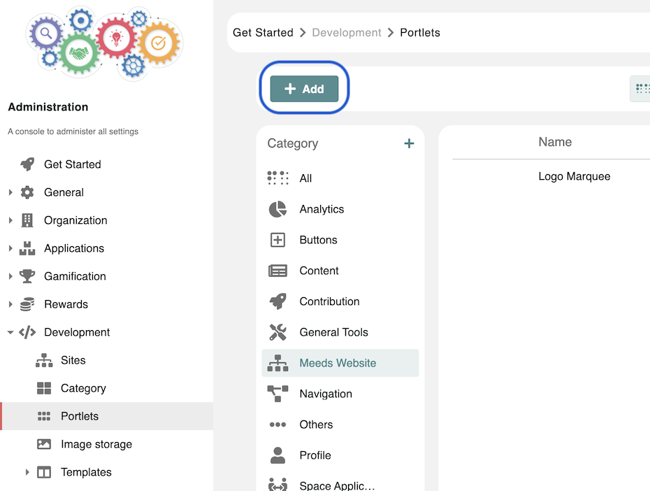
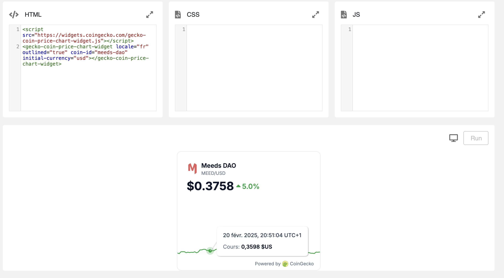
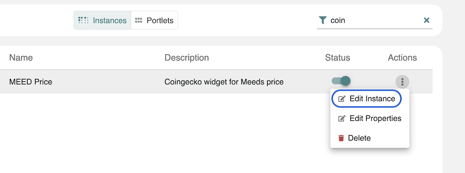
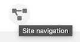
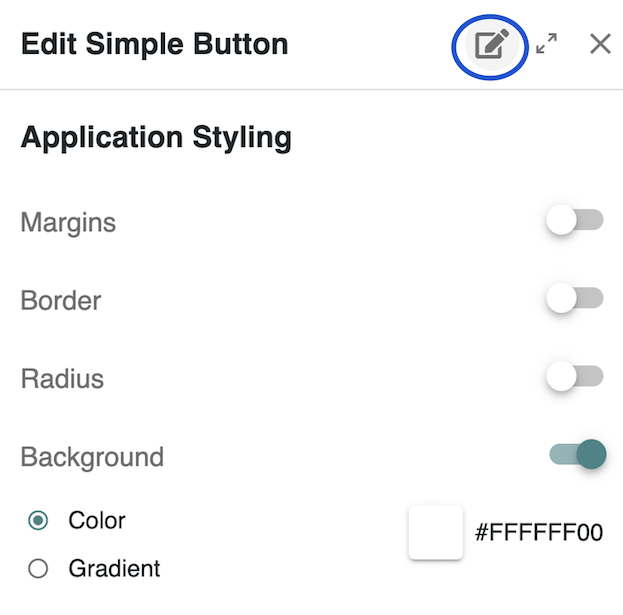

# Creating Gadgets

They give you full flexibility to integrate interactive elements such as **animated marquees, token price widgets, third-party scripts, and dynamic user interactions**. These blocks can be **created, edited, and managed** directly within the platform, enabling a seamless customization experience.\
\
Check this quick video intro 👇



### Creating a Gadget

<figure><figcaption></figcaption></figure>

To create a new **Gadget** in Meeds, follow these steps:

1. Open the **Admin Interface**.
2. Navigate to **Development → Portlet**.
3. Pick any category and click on the **Add** button.
4. Provide a **name** and a **description**.
5. Select **New Portlet** as the type.
6. Select the permissions and **Save**

👉 The [code editor](creating-gadgets.md#the-code-editor) opens in a new tab

### The Code Editor

When you create or edit a Gadget, the Gadget Editor opens, which consists of three main sections:

* **HTML** : Enter the structure of your block.
* **CSS** : Define styles for your block.
* **JS**: Add Javascript code for interactivity and dynamic behavior.

The panels all  have **syntax highlighting,** **line numbers** for better readability and includecan **expand icon** that allows you to enlarge the editor for a more comfortable coding experience.

<figure><figcaption></figcaption></figure>

#### Running & Previewing

* **Run button** : Executes the HTML, CSS, and JavaScript, allowing you to preview the result instantly.
* **Mobile & Desktop icon**: You can switch between different views to test responsiveness.
* **View/Edit toggle** : Allows you to see the gadget in the middle of the page, simulating its final appearance.

#### Saving & Applying Changes

* **Save Button**: Becomes active when changes are made and saves updates across all pages using the block.

💡 Once saved, the editor tab closes, and the changes are immediately applied where the block is used. If further modifications are needed, reopen the editor and manually update the content.

### Editing a Gadget

Gadgets can be edited in two ways:

#### Editing from the Admin Interface

<figure><figcaption></figcaption></figure>

* All created gadgets can be found in **Administration → Development → Portlets**.
* To edit an existing gadget, browse in the category or search for it in the list and select **Edit Instance** to open the code editor.

💡 Changes made at the admin level are **reflected globally** across all pages using the gadget.

#### Editing from the Page Layout

Once a Gadget is added to a page, it can be edited **directly from the page layout**:

1.  **Enable Edit Mode**

    * Navigate to the page where the block is used and click **Edit Navigation icon** 
    * In the page tree, on the current page, click on **Edit Layout**&#x20;
    * **Hover** over the block you want to edit, then click the Edit application

    <figure><figcaption></figcaption></figure>

    * In the drawer, click the Edit icon in the header 👉 a new tab will open with the gadget loaded in the  [code editor](creating-gadgets.md#the-code-editor)&#x20;
    * Make necessary changes and **preview** instantly.
    * Once satisfied, save your changes.

💡 Updates are applied **instantly across all pages** where the block is used.

***

This feature allows you to **design and integrate custom components** easily, giving you greater control over your Meeds-powered pages. Start experimenting and bring your pages to life with dynamic content!
