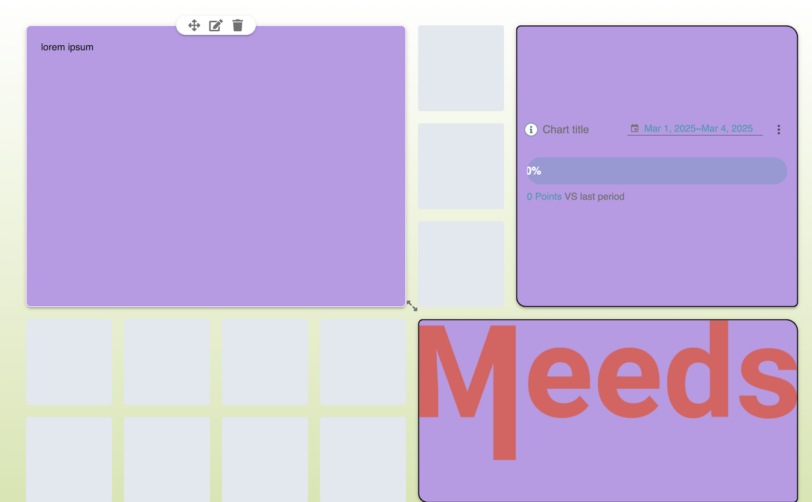
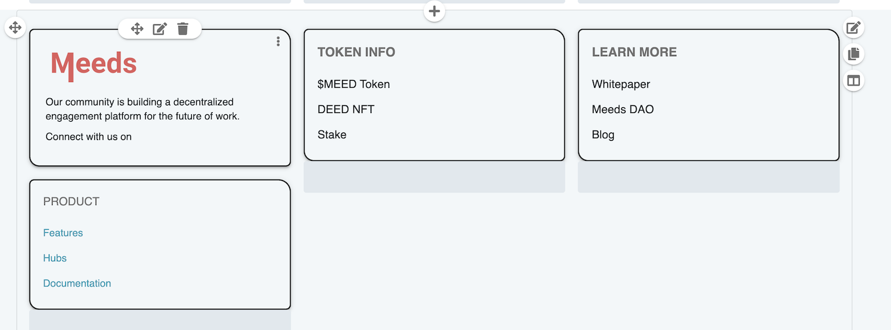

# Editing Page Layout

The Page Builder in Meeds allows administrators and authorized users to fully customize the layout of a page by arranging content, structuring sections, and applying styles. This guide provides a comprehensive walkthrough of how to modify the page layout, including managing sections, adding content blocks, configuring design settings, and ensuring mobile responsiveness.

### :busts\_in\_silhouette: Who can edit the layout of a page?

* Administrators can edit any page
* Space Administrators can edit pages of their space

### &#x20;:tools: How to edit the layout of a page?

To edit a page layout, users with the appropriate permissions can access the Page Builder in two ways:

1. **From Any Page:**
   * Click on the [**Edit Site Navigation**](./) icon in the top bar.
   * This opens the **Site Navigation panel**, where you can select a page to edit.
   * Click on the page name, then choose **Edit Page Layout**.
2. **From the Administration Interface:**
   * Click on the **Administration** icon in the top bar (red icon).
   * Navigate to [**Development > Sites**](../customizing-sites.md).
   * Find the site you want to modify, then click the **Edit Page Layout** icon in the Navigation column.

### 🎨 **Choosing a Page Template**

When creating or modifying a page, you can choose among **page templates**, which define the initial structure of the page. There are two default blank templates:

* **Empty Column** – Uses the **Column Layout**, providing a structured format with stacked sections.
* **Empty Grid** – Uses the **Grid Layout**, allowing flexible, dashboard-style design.

Both templates create a page containing only **one empty section** to start from. In addition to these two blank templates, users can select from **other preconfigured templates**, which are managed by the administration in a [dedicated section](../managing-templates/managing-page-templates.md).

**💡 Good to Know** : All [**section templates**](../managing-templates/managing-section-templates.md) in are derived from one of these two layout models and all [**page templates**](../managing-templates/managing-page-templates.md) are a combination of preconfigured sections.

Each layout model offers a different editing experience:

#### **Grid Layout**

<figure><figcaption>
A Grid Section in the Page Builder
</figcaption></figure>

* Displays a **12-column grid** where you can manually define content zones.
* Users can **draw zones** by selecting and dragging across the grid.
* Once a zone is created, a **side panel opens**, allowing you to select content blocks (applications or static content).
* Supports full **drag-and-drop customization** for flexible arrangements.
* Ideal for **dashboard-style pages** requiring more **complex layouts**.

#### **Column Layout**

<figure><figcaption>
A 3-column section in the Page Builder
</figcaption></figure>

* Provides a **predefined number of stacked columns** for structured layouts.
* Content can only be positioned within these columns and expands vertically.
* Suitable for **uniform, streamlined page layouts** where precise positioning isn’t necessary.
* Particularly useful for **building traditional web pages**.

***

### 🔲 **Adding and Managing Content Blocks**

Meeds pages are built using **blocks**, which can be content-based or application-based.&#x20;

#### **Adding a Block**

1. Select an area within the grid or column layout.
2. A **side panel appears**, and invites you to select a category &#x20;
3. Within a block you can either insert&#x20;
   * **Content** : Text, images, links, or rich media.
   * **Application** : Interactive widgets like charts, analytics, or dynamic feeds.
4. After picking a category its block types (aka applications) are displayed and you can preview them or insert them by clicking on the Add (+) button
5. Click to insert the block into the selected area.

**💡Good to Know** : the categories as well as the list of blocks available can be managed in Administration (see [**Managing Applications**](../managing-applications/))

#### **Managing Blocks**

* **Move**: Drag blocks to reposition them within the grid.
* **Resize**: Adjust the block’s dimensions to fit your layout.
* **Edit**: Modify content, settings, or styles of individual blocks.
* **Delete**: Remove a block from the page.

Each block may include **individual configuration settings**, allowing application-specific customization.  The Page Builder tries to apply these params so what you see while editing is as close as possible to the final result.

### 🎨 **Customizing Page Design**

In addition to structuring layout, Meeds allows users to customize page design elements.

#### **Layout Adjustments**

* **Page Width:** Define a fixed width (e.g., 800px) or enable **Full Window mode**.
* **Margins & Padding:** Adjust spacing **above, below, and around** content.
* **Background Customization:** Apply a **solid color, gradient, or background image**.

#### **Styling Individual Blocks**

Each block on the page can be styled using:

* **Borders:** Customize color, thickness, and shadows.
* **Corner Radius:** Adjust how rounded block corners appear.
* **Background Colors & Images:** Set a unique style for each block.
* **Text Styles:** Control typography settings for titles, subtitles, and body text.

#### **Mobile Optimization**

* Enable **Mobile Preview Mode** to test responsiveness.
* Certain blocks can be **hidden on mobile devices** for a streamlined experience.

### 🏗️ **Managing Sections and Templates**

Pages are structured as a stack of **sections**, each customizable.

#### **Editing Sections**

* Each section includes options for **margins, background, and layout settings**.
* Sections can be **modified, cloned, or saved as templates**.
* **Grid-based sections** allow specifying the number of rows and columns.
* **Dynamic sections** automatically organize content into pre-set columns.

#### **Adding New Sections**

1. Hover above or below an existing section to reveal the **Add Section (+) button**.
2. Choose a section type:
   * **Grid Section**
   * **Dynamic Section** (aka[ Column model](editing-page-layout.md#column-layout) section)
   * **Saved Templates** (predefined sections previously created)

#### **Dynamic Sections**

* Unlike  grid sections, **dynamic sections auto-adjust content placement**.
* Users can drag and drop applications between columns.
* Controls include **number of columns, alignment, and scroll behavior (sticky or floating)**.

### ✅ **Finalizing and Publishing Changes**

#### **Previewing the Page**

* Click the **Eye Icon** to see a live preview of the page.
* Ensure the layout appears correctly across different screen sizes.

#### **Saving and Publishing**

* **Save Draft:** The page remains unpublished and only visible to editors.
* **Publish:** Pushes the changes live, making them accessible to all users.
* **Save as Template**, to save and reuse the entire page setup as a template for creating new pages (both will be detached and editable separately after creation)
