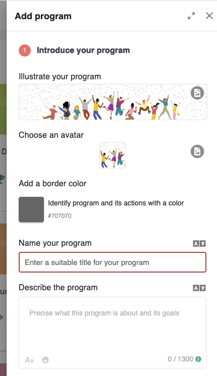
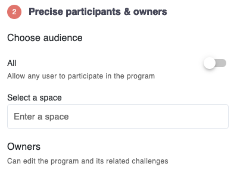

# 💝 Designing Incentives

Meeds lets you drive work through incentives. As a community leader, you have complete control over building a menu of actions your contributors can participate in.

### Create an Engagement Program

To get started, you need to create an engagement program in the  _Contribution Center_ through  `Contribute > Programs` then click `Add Program`, and fill in the requested information :

<figure><figcaption></figcaption></figure>

Take the time to name your space and make it stand out by choosing a color, an icon, and a banner. Also, make sure you provide the goals and purpose of your program so that your participants are clear on your intent.

In step 2, you need to choose an audience and owners.&#x20;

**Audience**

<figure><figcaption></figcaption></figure>

💡 If you're just getting started, the easiest is to select `All`This means that all the actions you create will be immediately accessible to all the members of your hub and even visible to non-members (if you have enabled the[ public site](../set-up-your-hub/managing-a-public-site.md) feature).

**Owners**&#x20;

Owners are the people who will be able to administrate your engagement program and the various incentives it contains.

If you already have spaces in your hub, you can choose which space members can participate in this program.&#x20;

By default, all space hosts will be granted ownership of the program, but you can add individual owners. If your **Audience** is All, the rewarding administrator will be the program's default owner.

### Start adding actions

To start designing incentives in your engagement program, click `Add Action`. A list of scenarios will then be offered.

<figure><figcaption></figcaption></figure>

* **Boost Collaboration**: will let you capture and value activity happening on your Hub
* [**Reward Development Work**](fostering-open-collaboration-on-github.md): will let you design incentives related to GitHub
* [**Grow your Audience**:](growing-your-audience-on-x.md) will let you design incentives related to X
* **EVM Blockchain**: will let you incentivize people to use your dApps and smart contracts
* [**Reward Translators & Proofreaders**](building-a-translation-program-on-crowdin.md): will let you design a Translation program with Crowdin
* **Let them submit their contribution:** This will allow you to design any other incentive in which participants submit proofs of contribution that reviewers can validate manually.

If you do not see your use case on the list, let us know by [filing a request](https://github.com/Meeds-io/meeds/issues/new?assignees=\&labels=\&projects=\&template=feature\_request.md\&title=).
