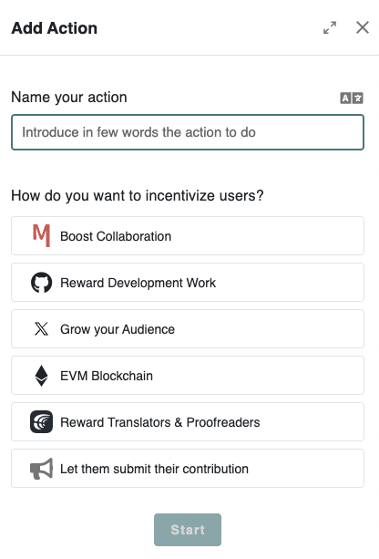

# 💝 Designing Incentives

Meeds lets you drive work through incentives. As a community leader, you have complete control over building a menu of actions your contributors can participate in.

To start designing incentives, create a new engagement program and click Add Action. A list of scenarios will then be offered.

<figure><figcaption></figcaption></figure>

* **Boost Collaboration**: will let you capture and value activity happening on your Hub
* [**Reward Development Work**](fostering-open-collaboration-on-github.md): will let you design incentives related to GitHub
* [**Grow your Audience**:](growing-your-audience-on-x.md) will let you design incentives related to X
* **EVM Blockchain**: will let you incentivize people to use your dApps and smart contracts
* [**Reward Translators & Proofreaders**](building-a-translation-program-on-crowdin.md): will let you design a Translation program with Crowdin
* **Let them submit their contribution:** This will let you design any other incentive in which participants can submit proofs of contribution that reviewers can validate manually.

If you're not seeing your usecase in the list, let us know by [filing a request](https://github.com/Meeds-io/meeds/issues/new?assignees=\&labels=\&projects=\&template=feature\_request.md\&title=).
