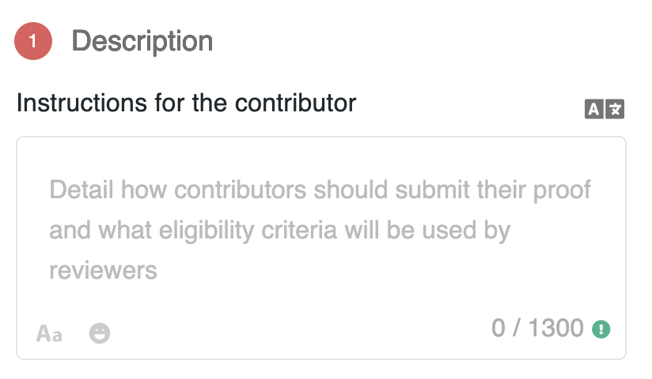
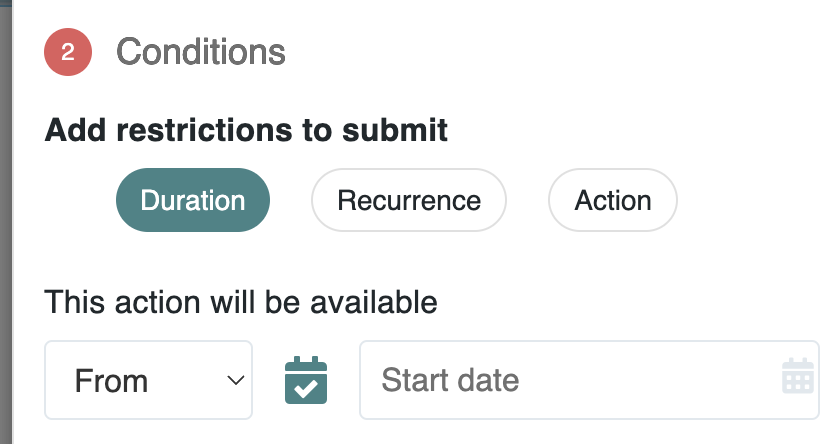
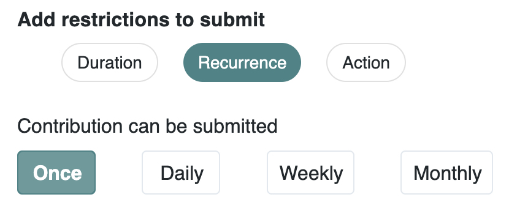
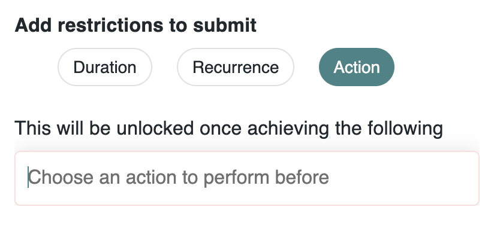
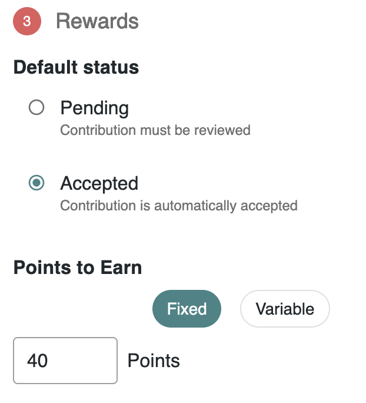
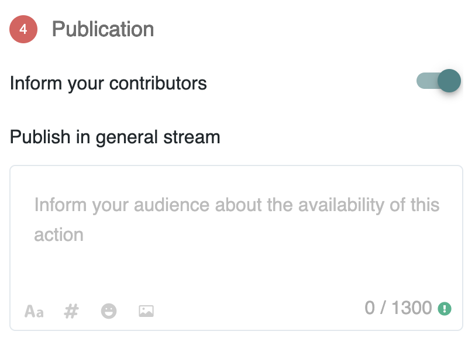
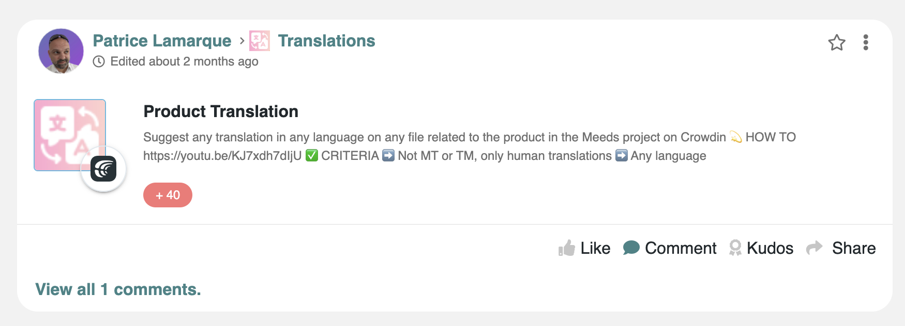

# 💝 Designing Incentives

Meeds lets you drive work through incentives. As a community leader, you have complete control over building a menu of actions your contributors can participate in.

### Create an Engagement Program

To get started, you need to create an engagement program in the  _Contribution Center_ through  `Contribute > Programs` then click `Add Program`, and fill in the requested information :

<figure><figcaption></figcaption></figure>

Take the time to name your space and make it stand out by choosing a color, an icon, and a banner. Also, make sure you provide the goals and purpose of your program so that your participants are clear on your intent.

In step 2, you need to choose an audience and owners.&#x20;

**Audience**

<figure><figcaption></figcaption></figure>

💡 If you're just getting started, the easiest is to select `All`

This means that all the actions you create will be immediately accessible to all the members of your hub and even visible to non-members (if you have enabled the[ public site](../set-up-your-hub/managing-a-public-site.md) feature).

**Owners**&#x20;

Owners are the people who will be able to administrate your engagement program and the various incentives it contains.

If you already have spaces in your hub, you can choose which space members can participate in this program.&#x20;

All space hosts will be granted program ownership by default, but you can add individual owners. If your **Audience** is All, the rewarding administrator will be the program's default owner.

### Start adding actions

In Meeds, Actions are the heart of community engagement. They allow leaders to define incentives - missions, quests, tasks, or activities - that communicate a need to be filled by the community. Each Action is crafted to align incentives and mobilize collective efforts toward a shared goal, driving the community forward.

Your programs will expose a menu of Actions to your contributors to pick from. Actions are available to all members of the audience of the program

Click `Add Action` and start by entering  the title of your incentive and picking a scenario based on your main goal :

<figure><figcaption></figcaption></figure>

The scenario you pick will determine which integration and detailed criteria are available:&#x20;

* **Boost Collaboration**: will let you capture and value activity happening on your Hub
* [**Reward Development Work**](fostering-open-collaboration-on-github.md): will let you design incentives related to GitHub
* [**Grow your Audience**:](growing-your-audience-on-x.md) will let you design incentives associated with X (formerly Twitter)
* **EVM Blockchain**: will let you incentivize people to use your dApps and smart contracts
* [**Reward Translators & Proofreaders**](building-a-translation-program-on-crowdin.md): will let you design a Translation program with Crowdin
* **Let them submit their contribution:** This will allow you to design any other incentive in which participants submit proofs of contribution that reviewers can validate manually.

If you do not see your use case on the list, let us know by [filing a request](https://github.com/Meeds-io/meeds/issues/new?assignees=\&labels=\&projects=\&template=feature\_request.md\&title=).

Now, you can complete the design of your incentives in 4 steps:&#x20;

1. In **Step 1. Description**: you need to give instructions on the mission your contributors must perform to complete the action successfully.&#x20;

<figure><figcaption></figcaption></figure>

You have 1300 characters to provide a clear and engaging description. This is where you should spend the most time to present clear instructions. Here are our advice for high-performing action descriptions :&#x20;

* 🎯 MISSION: start with a single short sentence describing the goal
* 💡 HOW TO: give a how-to in a bullet list with step-by-step instruction
* ✅ CRITERIA: be super clear on your criteria for reviewers (objective criteria are always better)
* 🔍 PROOF: explain clearly what proof the contributors should submit
* do not hesitate to embed tutorial videos that demonstrate how to perform the action and written guidelines (e.g., using the notes app)

Translations of the description can be attached using the button if you have a multilingual community.

2. In **Step 2. Conditions:** you can decide when your action starts and ends using a `Duration` condition

<figure><figcaption></figcaption></figure>

Add a `Recurrence` if you need to limit contributors to submit just once, daily, weekly, or monthly

<figure><figcaption></figcaption></figure>

Add another `Action` as a prerequisite to be performed by the contributor before this one to create a sequence of actions in your program.

<figure><figcaption></figcaption></figure>

3. In  **Step 3. Rewards**: you'll be able to define the default status and points to earn

<figure><figcaption></figcaption></figure>

* Choose `Pending` as the default status if you want to perform a manual verification on submitted contributions before attributing the points to the user and `Accepted` otherwise.
* Enter either a `Fixed` amount of points to earn or a `Variable` amount if the event captured allows it&#x20;

4. In step **4. Publication:** you can choose whether to notify your contributors that a new action is available for them.&#x20;

<figure><figcaption></figcaption></figure>

The notification will be sent to all members of the audience and published in the feed :

<figure><figcaption></figcaption></figure>
