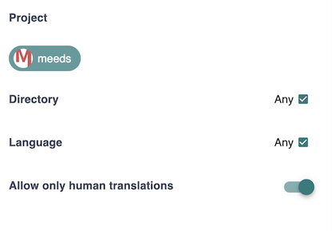

# 🌐 Building a translation program on Crowdin

Thanks to the Crowdin Connector for Meeds, you can incentivize your community to participate in your [Crowdin](https://crowdin.com) translation projects.

✋ Before designing translation incentives, configure the [Crowdin Connector](../integrations/crowdin.md) on your Hub.



Once done, your program owners can select "_Reward Translators & Proofreaders"_ from the _Add Action_ drawer.

<figure><figcaption></figcaption></figure>

### Select Event

Click Start, fill in the Description[^1], and select the event to capture :

<figure><figcaption></figcaption></figure>

Four events are available :

* **Add Translation:** is triggered when the user suggests a translation in Crowdin
* **Approve Translation**: is triggered when a proofreader approves a translation in Crowdin (points for the proofreader)
* **Comment on a String**: is triggered when the user adds a comment or reports an issue on a string in Crowdin
* **Translation Approved**: is triggered when a proofreader approves a translation in Crowdin (points for the translator)

### Set Conditions

Additional criteria are available to refine further when to accept a contribution or not :&#x20;

<figure><figcaption></figcaption></figure>

* **Project**: select the Crowdin projects to track
* **Directory**: restrict to specific folders within the Crowdin project
* **Language**: restrict to specific folders within the Crowdin project
* **Allow only human translations**: exclude Crowdin's [Translation Memory](https://support.crowdin.com/translation-memory/#applying-translation-memory-via-pre-translation)  and [Machine Translation](https://support.crowdin.com/pre-translation-via-machine/)&#x20;

### Set Rewards

Optionally, Crowdin events related to translations allow earning variable points based on the number of words in the source string.

<figure><figcaption>
example of points based rewarding for words
</figcaption></figure>

Translation work is commonly quantified based on the number of words. The connector will dynamically compute the number of points based on the number of words in the source string being translated. &#x20;

For example, setting  200 points for 500 words is a way to design an incentive where each word in a submitted translation will count for 200/500=0.4 points.&#x20;

The exact number of points is rounded to the closest integer.

Say a translator submits a translation for a source string containing 14 words. Then he will get ROUND(14\*0.4)=6 points

### Best Practices

💡 By combining these criteria, you can design fine-grained rewarding incentives where you set different priorities.&#x20;

<figure><figcaption>
Sample translation program in Meeds
</figcaption></figure>

For example, in Meeds, translators could earn 2 points for every translation they made + 1 extra point if their translation was chosen, and 1 point for the proofreader.&#x20;

In parallel, users helping translate our Whitepaper specifically would earn 3 points per translation.

💡 **Tips** :&#x20;

* set basic rewards for all translations
* use variable points for translation and proofreading work
* set lower fixed points to proofreading: proofreaders can earn from others, you only reward the decision they take. If they want they can rewrite and will earn the translators points anyway
* set fixed points for string approved  as a bonus incentive for providing the best translation
* select folders and languages only if you need dedicated incentives. Keep things simple, just add rules for additional incentives. let points cumulate

[^1]: 
