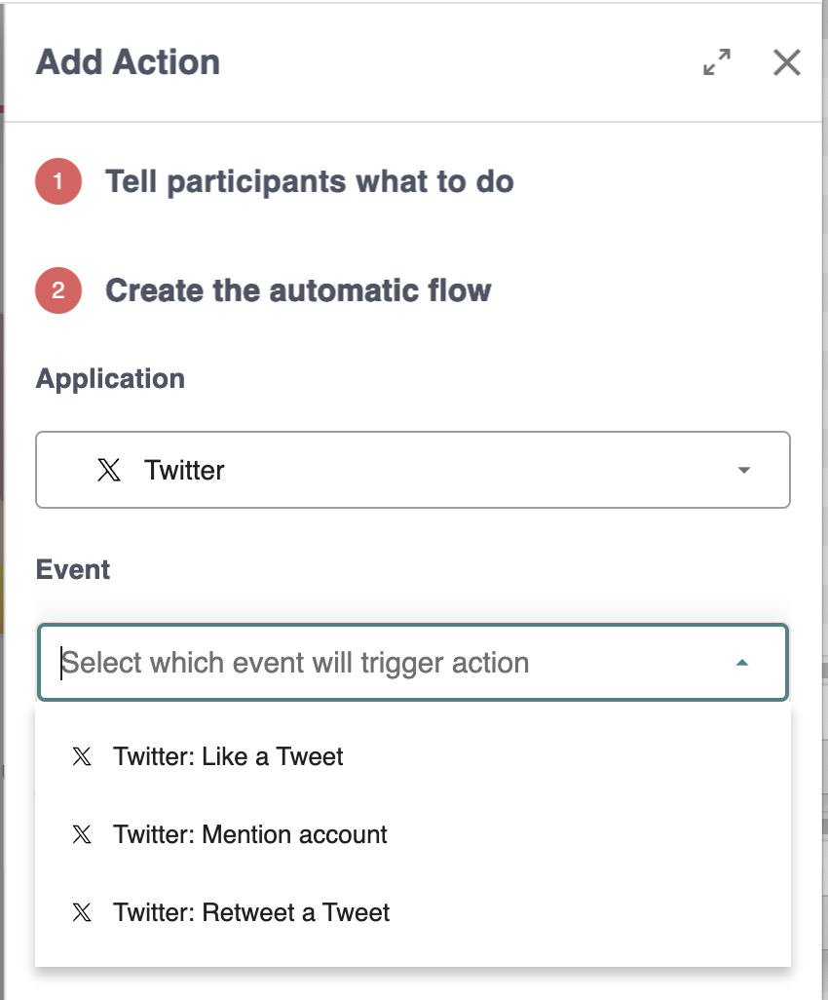
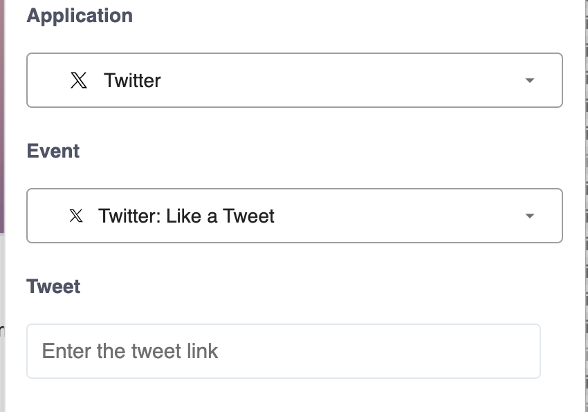
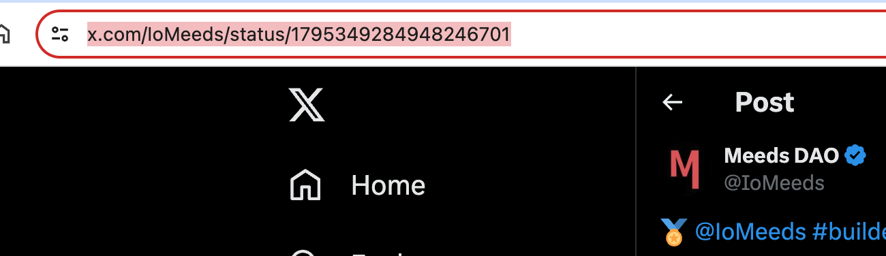
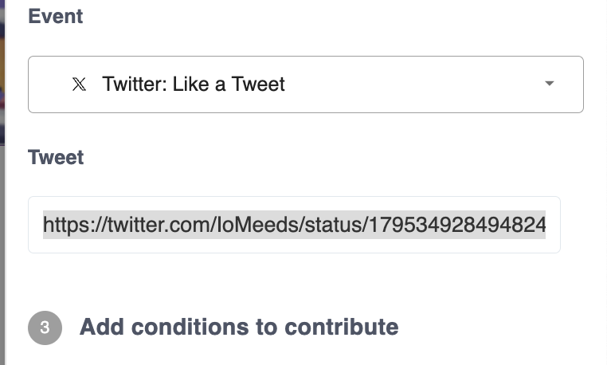
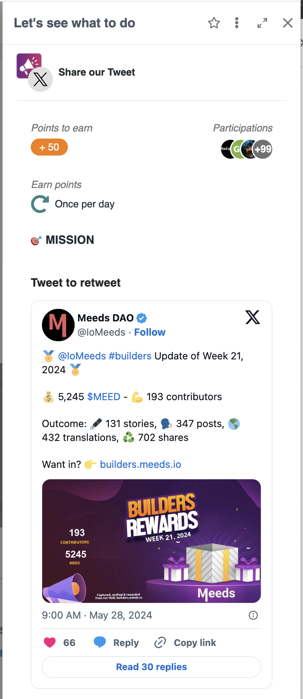
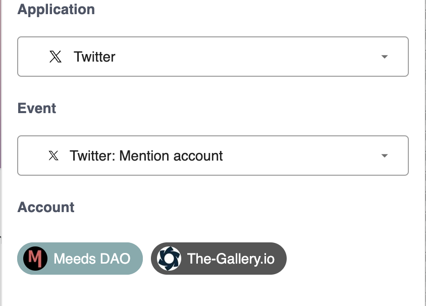
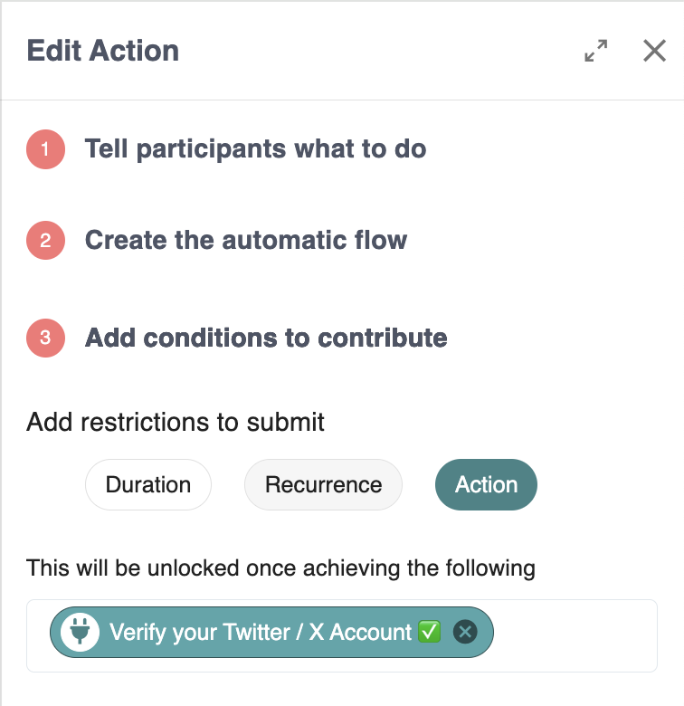
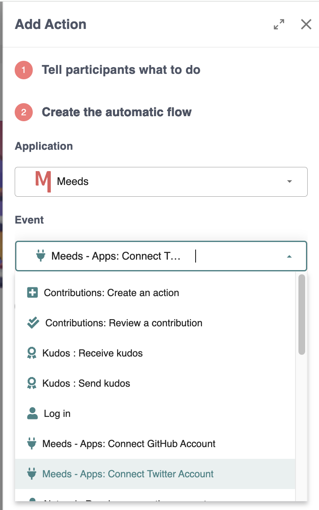
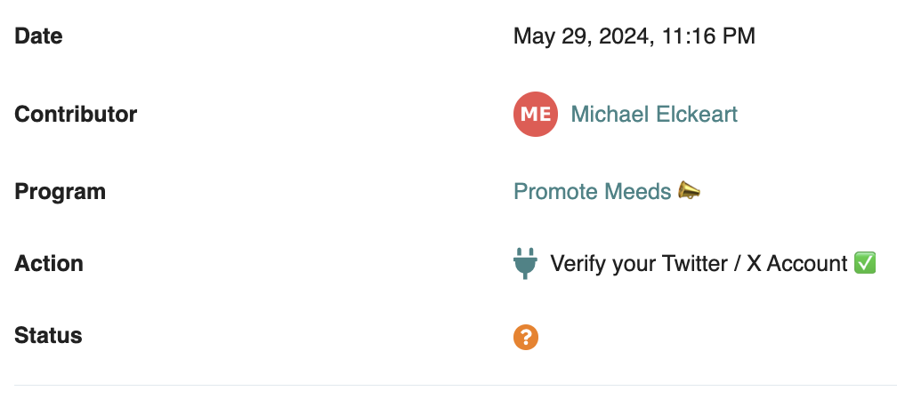
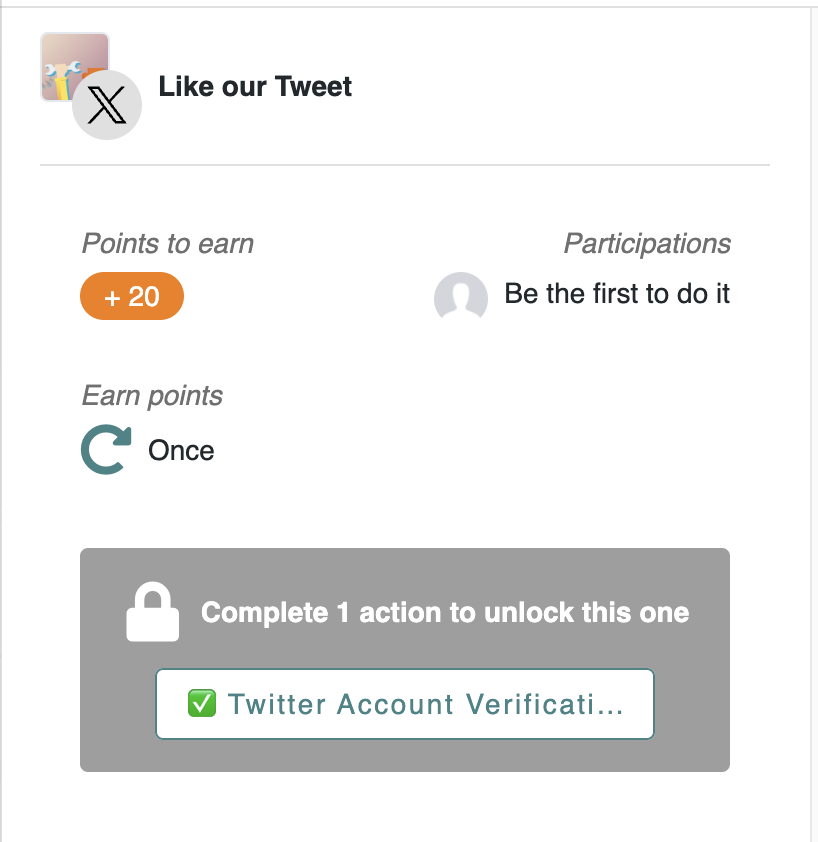

# 🐦 Growing your audience on X

Thanks to the X (Twitter) connector for Meeds, you can incentivize your community to boost your visibility on [X](https://x.com).

✋ Before designing X incentives, configure the [X Connector](../integrations/x-twitter.md) on your Hub.

**👉 Choose the right Incentives**

Once done, your program owners can select "_Twitter"_ from the _Applications_ pulldown when creating automatic actions.

<figure><figcaption></figcaption></figure>

Three events are available :

* **Like a Tweet:** is triggered when a user likes a particular post.&#x20;
* **Mention account**: is triggered when your account is mentioned (aka tagged).
* **Retweet a Tweet**: is triggered when a particular post is reposted

**👉 Boost your reach**

You can ask your users to show some ❤️ love to your posts by liking and resharing them.

Choose _Like a Tweet_ or _Retweet a Tweet_ and enter the link to the post to boost.

<figure><figcaption></figcaption></figure>

&#x20;To grab the link, Go to your X account and click on the timestamp of the post to boost :

<figure><figcaption></figcaption></figure>

Copy the URL from the browser address bar

<figure><figcaption></figcaption></figure>

Paste it into the _Tweet_ field :&#x20;

<figure><figcaption></figcaption></figure>

⚠️ if you see an error that says "_Please enter a TWitter link"_ after pasting the link try to replace 'x' with 'twitter' in the URL.

Once saved, the user will be able to directly preview the tweet to engage with in the action's drawer :&#x20;

<figure><figcaption></figcaption></figure>

**👉 Get more people to tag you**

For Mentions, if you have multiple X accounts configured to be watched (see [Connector configuration](../integrations/x-twitter.md)), you may be requested to choose which account the users must mention to complete the action.

<figure><figcaption></figcaption></figure>

**👉 Validate Participants**

While the capture of participation is automatic, you may not want anyone to participate in your X boosts programs. For instance, verifying that accounts you wish to incentivize should not be bots or throw-away accounts is common.

To do this, you may want to add an account verification action as a prerequisite to all of your X-related incentives:

<figure><figcaption>
Only Verified X acocunts can participate
</figcaption></figure>

To set up such a verification action, create a new automatic action in the same program where your X actions are. Then select _Application > Meeds > Apps : Connect Twitter account_

<figure><figcaption></figcaption></figure>

With it as a condition to your X boost actions, each time a user connects a new pending contribution will need to be manually approved before the user can take part in your X engagement program :&#x20;

<figure><figcaption>
Twitter/ X Account connection requires manual verification
</figcaption></figure>

<figure><figcaption>
Account verification required to participate
</figcaption></figure>
