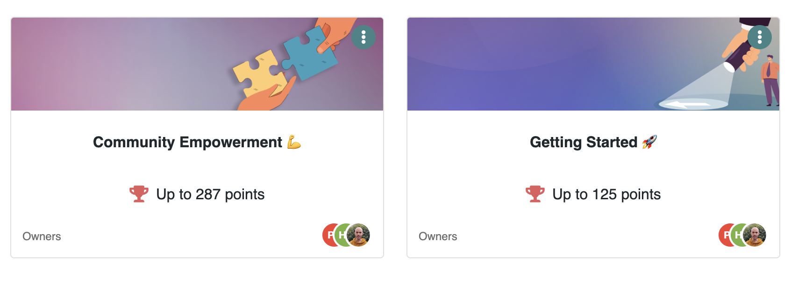

# ☺️ Quick Steps to Design Programs

Two default programs are provided by default: `Getting Started` and `Community Empowerment`

<figure><figcaption></figcaption></figure>

These programs aim to help you **onboard new users** to your hub. Both are designed to help you understand how things work. Each program lists automatic actions with conditions that will let users smoothly familiarize themselves with Meeds.&#x20;

These programs do not require you to verify manually: actions are captured, and points are distributed automatically based on what your members do on the Hub.

Feel free to review which actions are listed in these programs and customize them by disabling/editing/deleting or adding more actions to **design your own member onboarding experience**.

:bulb: Watch this video for an overview of it and to understand how to quickly create a program:


