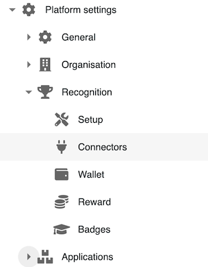
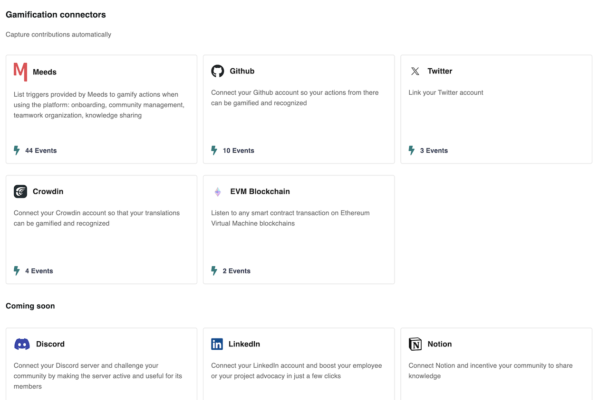

# 🧩 Integrations

⚙️ Go to the Platform Settings  > Recognition > Connectors

<figure><figcaption></figcaption></figure>

### **List Connectors**

Gamification connectors capture signals outside the Meeds hub and let program owners design incentives for participation on 3rd party platforms.&#x20;

Each connector has its configuration, but they all listen to events that can be mapped into valued contributions. The configuration deals with technical integration, such as communication between your Hub and the third-party platform through APIs, and often lets admins define or restrict a broad scope of what program owners can incentivize.

<figure><figcaption></figcaption></figure>

* From the administration site, access connector management
* You will find a list of available connectors
* We have also included a list of upcoming connectors to inform you about our roadmap. If you need an integration that is not listed, please let us know by [filing a request](https://github.com/Meeds-io/meeds/issues/new?assignees=\&labels=\&projects=\&template=feature\_request.md\&title=).

### **The Meeds Connector**

This is the default connector for the Meeds solution. Its goal is to engage your users in using your Hub.

You can add actions to encourage information sharing, mutual recognition, project tracking, and updating a knowledge base, such as:

* Adding posts, reactions to messages
* Sending/receiving kudos
* Task management
* Adding/modifying notes

Also, use this connector to facilitate the integration of new users on the Hub through events like:

* Profile and settings modification
* Wallet initialization

:warning: _It is not possible to deactivate this connector_
