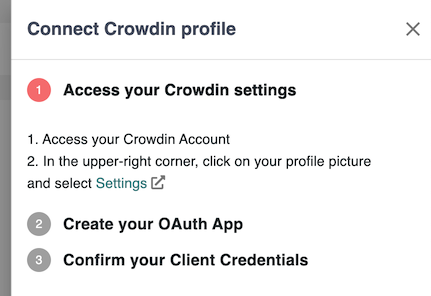

# 🌐 Crowdin

If your organization uses [Crowdin](https://crowdin.com) for translation management, you can seamlessly involve your community and shape incentives to drive your localization programs.

You can activate the Crowdin connector to let contributors earn points based on their participation in your translation project on Crowdin.&#x20;

## Quick Video Tutorial



:bulb: **Note:**&#x20;

_The Crowdin integration requires your account to have high privileges on the Crowdin projects you want to integrate with Meeds. However, you don't need to own a Crowdin Enterprise subscription._

⚙️ Go to the Platform Settings  > Recognition > Connectors

<figure><figcaption>
Crowdin Connector card
</figcaption></figure>

Click the Crowdin card to start configuring the connector :

<figure><figcaption>
Crowdin Gamification Connector
</figcaption></figure>

## :point\_right: **Allow users to connect their Crowdin account**

Click on _Configure > Allow connection_

<figure><figcaption>
Connect Crowdin Profile Config 1/3
</figcaption></figure>

Access your Crowdin account _Settings > oAuth._ Click  _"New Application"_

<figure><figcaption>
oAuth tab on Crowdin
</figcaption></figure>

Fill in the _Name_ and _Description_, and select the _Notifications_ scope.&#x20;

<figure><figcaption>
New oAuth App form on Crowdin
</figcaption></figure>

For the _Authorization callback URL_, open your Meeds tab and copy it from _Step 2_

<figure><figcaption>
Connect Crowdin Profile Config 2/3
</figcaption></figure>

Click _Create_, then _Edit_ in _Action_ to capture the _Client Credentials_.

<figure><figcaption>
Edit the oAuth Application
</figcaption></figure>

<figure><figcaption>
Copy credentials
</figcaption></figure>

Report the Client ID and Client Secret in Step 3 on the Meeds tab

<figure><figcaption>
Connect Crowdin Profile Config 3/3
</figcaption></figure>

_Save_, and your users can now [bind their Crowdin and Meeds accounts](../../user-guide/connecting-your-apps/crowdin.md) from their user settings.

You can temporarily  disable the ability for users to connect, ✏️ edit, or 🗑️ remove the credentials.

<figure><figcaption></figcaption></figure>

## :point\_right: **Add a Crowdin project to watch**

Now, you must connect Crowdin projects that your Meeds Hub will watch.

Click on 'Add Project'

<figure><figcaption>
Configure projects to watch
</figcaption></figure>

<figure><figcaption>
Add a Crowdin project 1/2
</figcaption></figure>

Now go back to your Crowdin _Settings_ > _API_ tab, then click the _New Token_ button and select the scopes:&#x20;

* _Projects (List, Get, Create, Edit)_
* _Project Source Files & Strings_
* &#x20;_Project Webhooks_

<figure><figcaption>
New Personal Access Token form in Crowdin
</figcaption></figure>

Click _Create_. If requested, enter your Crowdin password and confirm, then copy the _Access Token_ string.&#x20;

Back to Meeds,  paste  into the personal access token field:&#x20;

<figure><figcaption>
Persona access token field in Meeds
</figcaption></figure>

Hit the ✅ icon to verify your token is valid

<figure><figcaption>
Step 1 with valid perosnal access token
</figcaption></figure>

Click _Next_ and select the Crowdin project to watch from the dropdown menu and Save

<figure><figcaption>
Select the project from the list
</figcaption></figure>

Once you have selected a project, Meeds will start watching it for events. You can ✏️ edit, 🗑️ delete, or ➕ add another project if needed

<figure><figcaption>
Projects to watch in Meeds
</figcaption></figure>

By clicking on a project you can even fine-tune which events you want to enable on a per-project basis

<figure><figcaption>
Choose Events to enable per project
</figcaption></figure>

**🎉  You're now done with the connector configuration! Your translation program owners can now start** [**designing incentives for your localization program**](../designing-incentives/building-a-translation-program.md)**.**
