# 🐙 GitHub

If your organization uses [GitHub](https://github.com) to manage code or documentation and wants to foster open contributions and collaboration, the GitHub connector for Meeds is for you!

You can activate it to allow contributors to earn points by interacting with your repositories.

Events that the GitHub connector can capture include:

* Issues
* Pull Requests
* Code

To start configuring the GitHub connector for Meeds go to _Administration > Recognition > Connectors > GitHub_

<figure>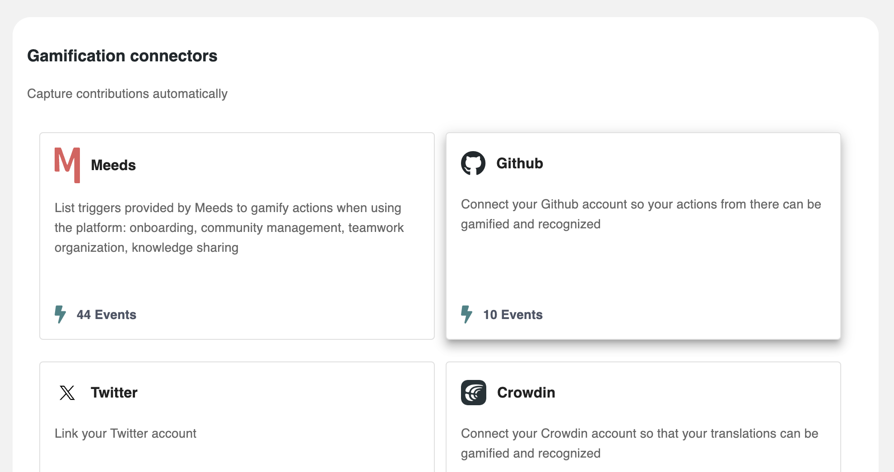<figcaption>
GitHub connector card
</figcaption></figure>

<figure>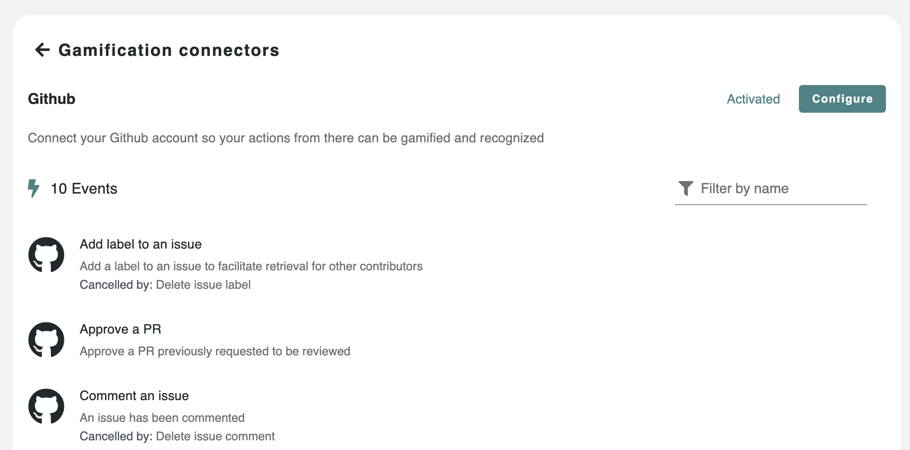<figcaption>
List of events of the GitHub connector
</figcaption></figure>

Next, Click `Configure`&#x20;

<figure>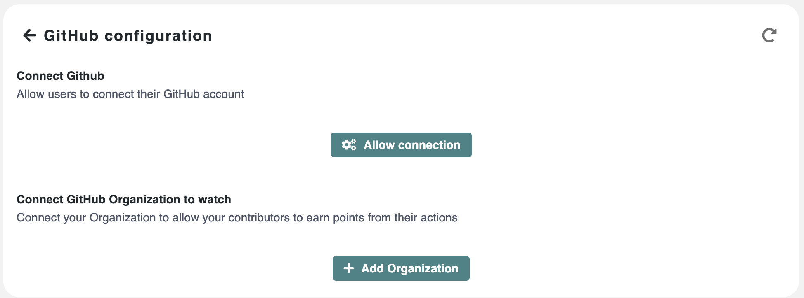<figcaption>
GitHub configuration
</figcaption></figure>

## :point\_right: **Allow users to connect their GitHub account**

Click on _`Allow connection` and_ follow the instructions in the form:&#x20;

<figure>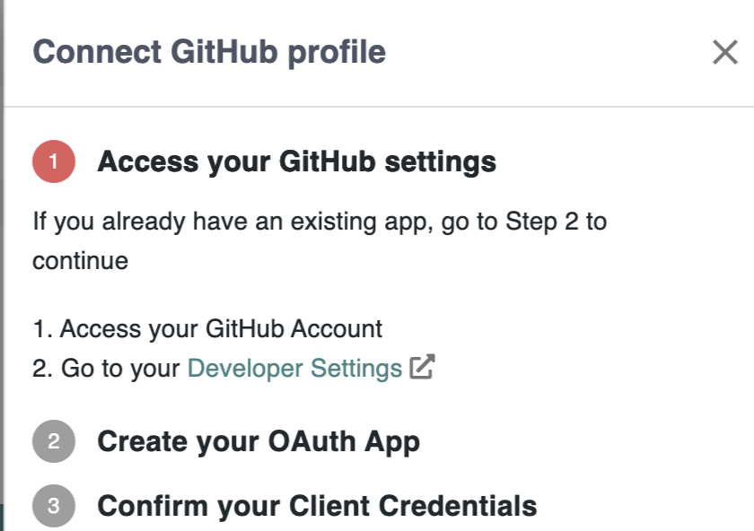<figcaption>
Connect GitHub profile config 1/3
</figcaption></figure>

**Step 1:** Go to your [Developer Settings](https://github.com/settings/apps) in your GitHub account

Click on _OAuthApps >_ `Register new application`

<figure>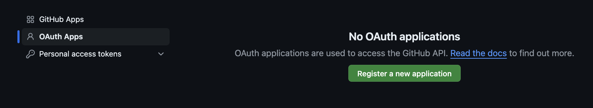<figcaption>
OAuth Apps tab in GitHub's Developer Settings
</figcaption></figure>

Fill in the _Application name_ and _description_,

<figure>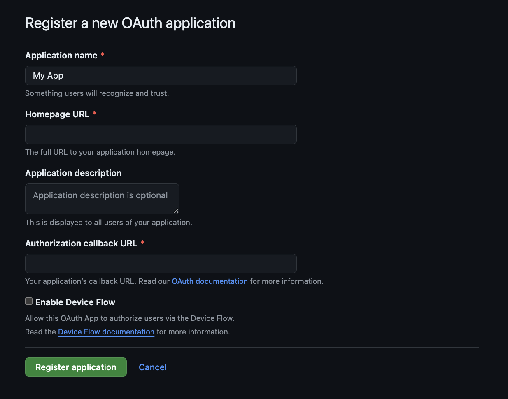<figcaption>
OAuth app form in GitHub
</figcaption></figure>

&#x20;Now head back to Meeds to retrieve the URLs

**Step 2:** Click `Next` and copy the _Homepage URL_ and _Authorization callback URL_ from Meeds

<figure>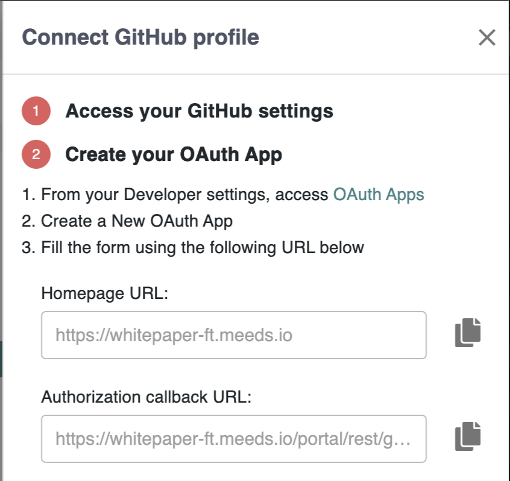<figcaption>
oAuth apps URLs in Meeds
</figcaption></figure>

Now paste the URLs into the oAuth application form on GitHub and create the app.

<figure>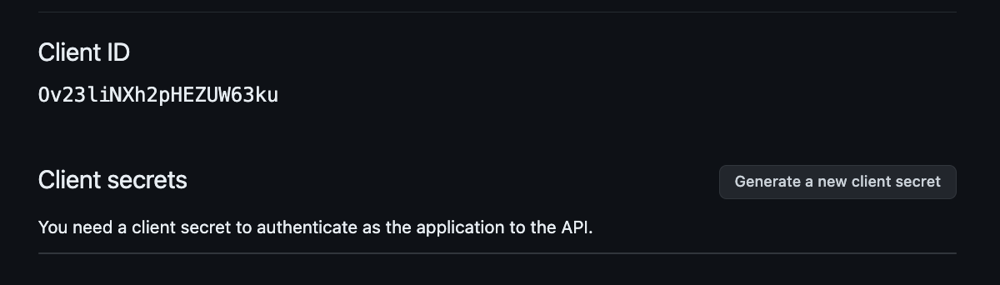<figcaption>
Client ID in GitHub
</figcaption></figure>

Click on `Generate a new client secret` and authenticate

<figure>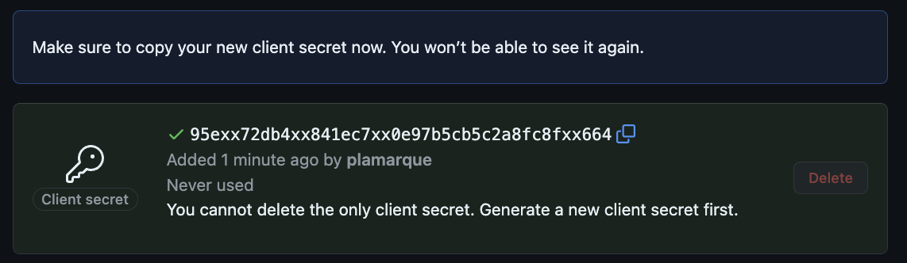<figcaption>
Client secret in GitHub
</figcaption></figure>

Head back to Meeds

**Step 2:** Click `Next` and copy-paste the _Client ID_ and _Client secret_ from GitHub to Meeds&#x20;

<figure>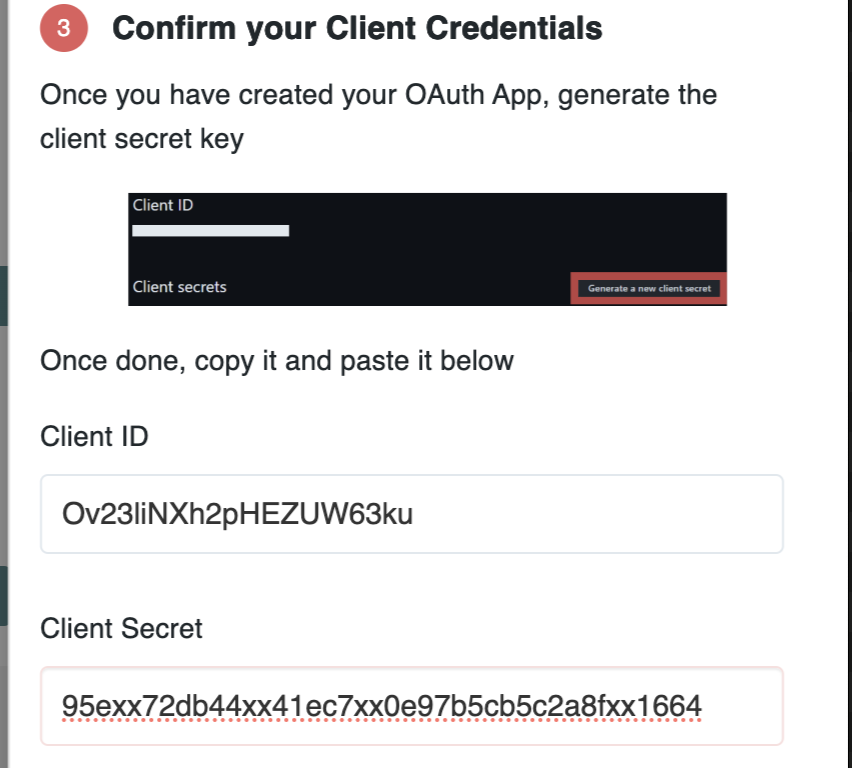<figcaption>
Connect GitHub profile config 3/3
</figcaption></figure>

Click `Save`

<figure>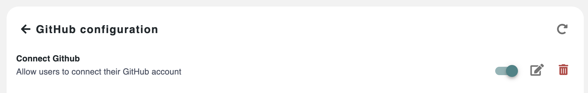<figcaption>
Connect GitHub profile configured in Meeds
</figcaption></figure>

You can click on the toggle button to temporarily disable profile connections, or you can ✏️ _Edit_ or 🗑️ _Delete_ the configuration to start over.

At this stage, your users can [connect their GitHub profile](../../user-guide/connecting-your-apps/github.md).

## :point\_right: **Add a GitHub organization to watch**

Now, you must add one or more organizations that Meeds will watch to track events your contributors perform.

<figure>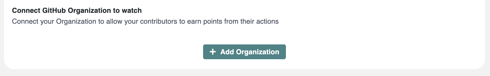<figcaption>
Connect GitHub organizations to watch
</figcaption></figure>

Click on `Add Organization`

<figure>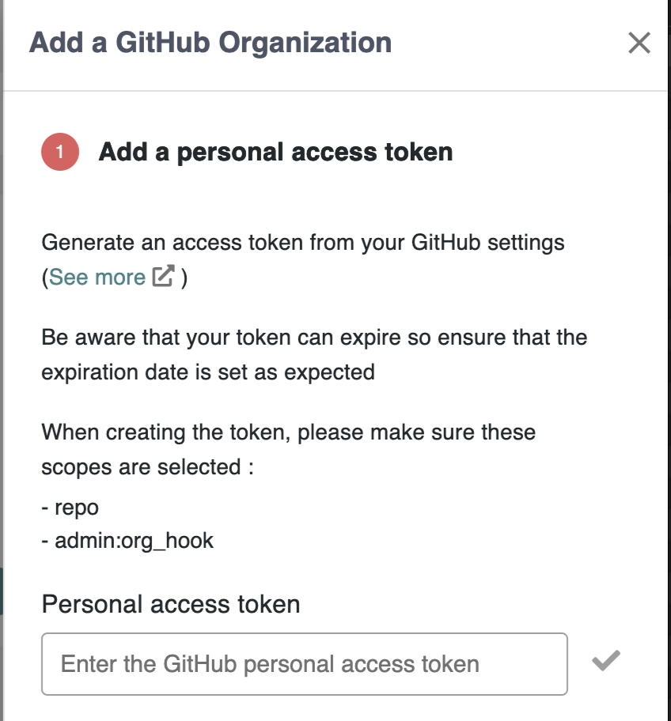<figcaption>
Personal access token field in Meeds
</figcaption></figure>

On GitHub, head back to your [Developer Settings ](https://github.com/settings/developers)_> Personal access tokens (classic)_

<figure>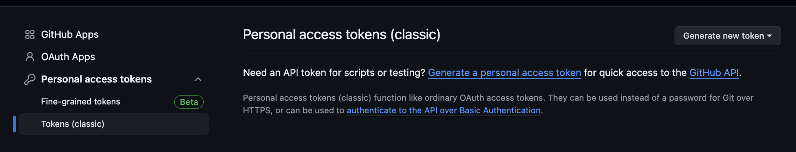<figcaption>
Personal acess tokens in GitHub
</figcaption></figure>

Click _Generate new token >_ `Personal access token (classic)`

<figure>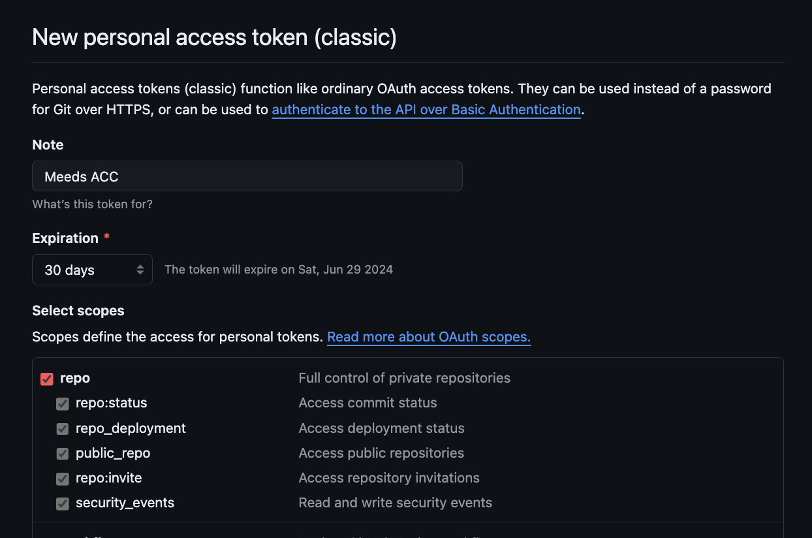<figcaption>
Personal access token form in GitHub
</figcaption></figure>

Fill out the form by selecting scopes :

* `repo`
* `admin:org_hook`

Then click the `Generate token` button

<figure><figcaption>
Copy the personal access token in GitHub
</figcaption></figure>

Copy the token and head back to Meeds to paste it, then click the ✅ checkmark to validate.

<figure>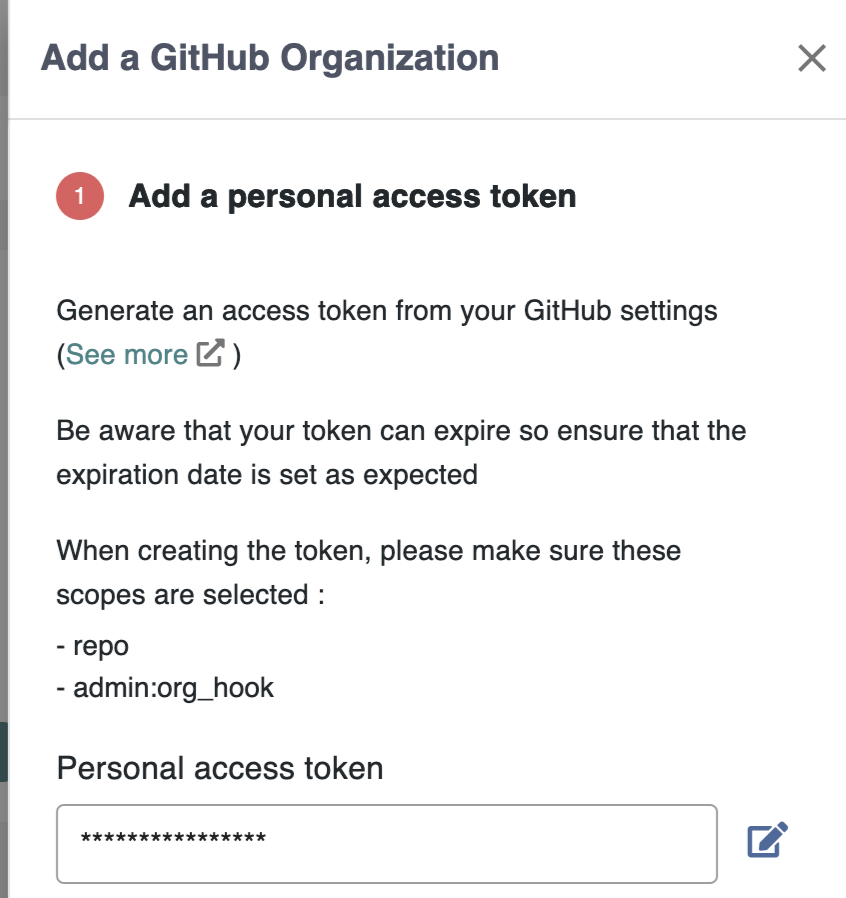<figcaption>
Paste the personal access token in Meeds
</figcaption></figure>

Click `Next` and enter your GitHub organization name.

<figure>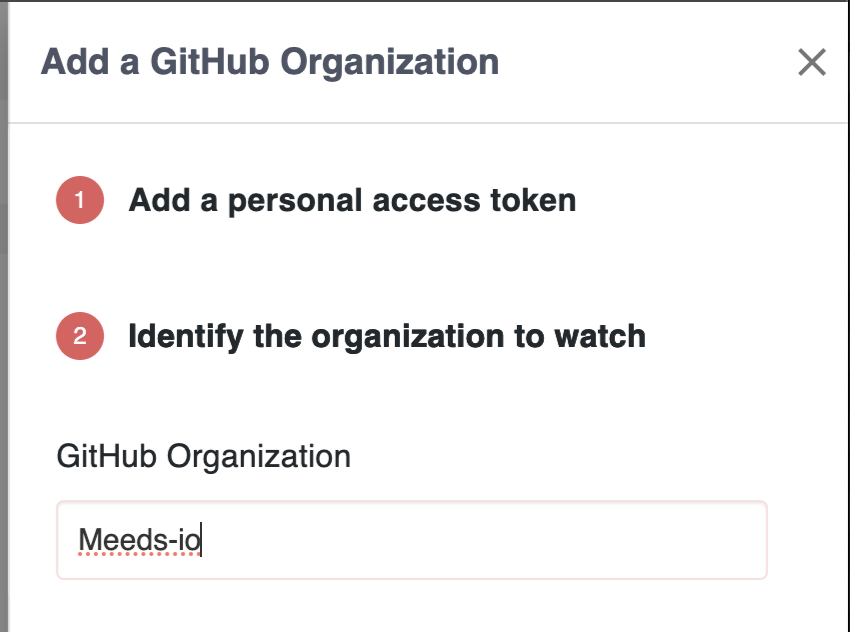<figcaption>
Enter GitHub organization name
</figcaption></figure>

Click `Save`_,_ and the organization should be listed:

<figure>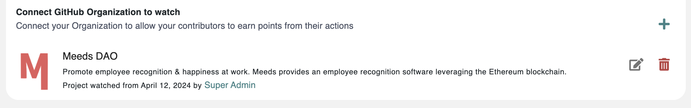<figcaption></figcaption></figure>

You may add  ➕  more organizations to watch, ✏️ Edit, or 🗑️ Delete to start over

Click on the organization's name

<figure><figcaption>
List of events enabled for an organizaton
</figcaption></figure>

In the _Events_ tab, you may restrict what events to watch for that particular organization.

Click on _Repositories_&#x20;

<figure>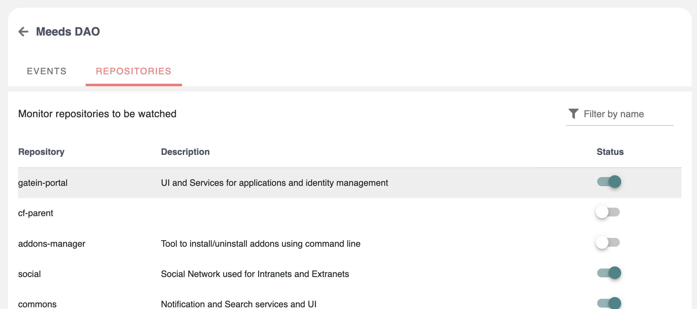<figcaption>
List of repositories to watch
</figcaption></figure>

From there, you can restrict which repositories to watch on that particular organization.

**🎉 Congratulations! Your Meeds Hub is now ready to incentivize contributions on GitHub! Your program owner can now start designing incentives to** [**Foster open collaboration on GitHub**](../designing-incentives/fostering-open-collaboration-on-github.md)**.**
