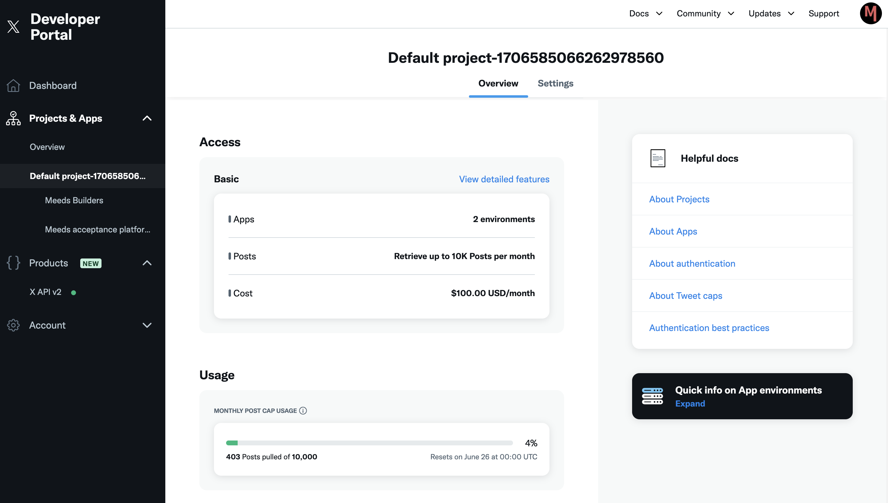

# 🐦 X (Twitter)

If your organization uses X for general communication and wants to boost your audience's engagement, the X connector for Meeds is for you.

You can activate it to allow contributors to earn points by interacting with your accounts on X.

Events that the X connector can capture include:

* Likes
* Mentions
* Reposts

Go to _Administration > Recognition > Connectors > Twitter_

<figure><figcaption>
List of events supported by the X connector
</figcaption></figure>

Next, click `Configure`

<figure><figcaption>
X connector ready to be configured
</figcaption></figure>

## :point\_right: **Allow users to connect their X account**

Click on `Allow connection` _and_ follow the instructions in the form to activate this connection

<figure><figcaption>
Enable Twitter profile (1/3)
</figcaption></figure>

**Step 1:** Create or connect to your account on the X [Developer portal](https://x.developer.com)

<figure><figcaption>
Twitter Developer portal
</figcaption></figure>

Create a project with _X API v2_ access

:bulb: **Note:** _X requires a subscription to access its API, which is not free of charge. Hence, you must acquire at minimum a **Basic** plan to use the connector._&#x20;

**Step 2:** Create a custom app and edit the _User authentication settings:_

<figure><figcaption>
Set Read permission
</figcaption></figure>

<figure><figcaption>
Choose Web App type
</figcaption></figure>

Fill in the _App info's_ _Callback URL_ and _Website URL_ fields by copy-pasting the information from Meeds:

<figure><figcaption>
Copy Callback URI and Website URL in Meeds (2/3)
</figcaption></figure>

<figure><figcaption>
Paste Callback URI and Website URL in X
</figcaption></figure>

**Step 3:** Copy/paste the _Client ID_ and _Client Secret and Save_

<figure><figcaption>
Enter Client credentials in Meeds (3/3)
</figcaption></figure>

Once done, users can [connect their X account](../../user-guide/connecting-your-apps/twitter.md) from their user settings.

<figure><figcaption>
Connect  Twitter profile configured
</figcaption></figure>

You can click on the toggle button to temporarily disable profile connections, or you can ✏️ _Edit_ or 🗑️ _Delete_ the configuration to start over.

## :point\_right: **Add an X account to watch**

Next, tell Meeds which X account to watch for your organization. Click `Add Token`

<figure><figcaption>
Add token field in Meeds
</figcaption></figure>

Go back to your app in the X Developer portal and click _Keys and tokens_

<figure><figcaption>
Keys and tokens in X
</figcaption></figure>

In _Authentication Tokens > Bearer Token,_ click `Regenerate` and confirm

<figure><figcaption>
Copy the bearer token in X 
</figcaption></figure>

Click `Copy`, then paste it into Meeds. Then, click on the  ✔️ green checkmark and `Save`

&#x20;Click on `Add account` and enter the X username of the organization to watch and `Save`

<figure><figcaption>
Enter the X account name
</figcaption></figure>

Meeds is now ready to watch the organization's account.&#x20;

<figure><figcaption>
List of X accounts to watch
</figcaption></figure>

Click on ➕ to add more accounts to watch and 🔑 to update your bearer token.

Optionally, you can click on the organization name and disable some events to watch specifically for that organization.

<figure><figcaption>
List of events enabled for the X account
</figcaption></figure>

_**🎉 Congratulations! Your Meeds Hub is ready to boost your organization on X! Your program owner can now design incentives to**_[ _**Grow your audience on X (Twitter)**_](../designing-incentives/growing-your-audience-on-x.md)_**.**_
