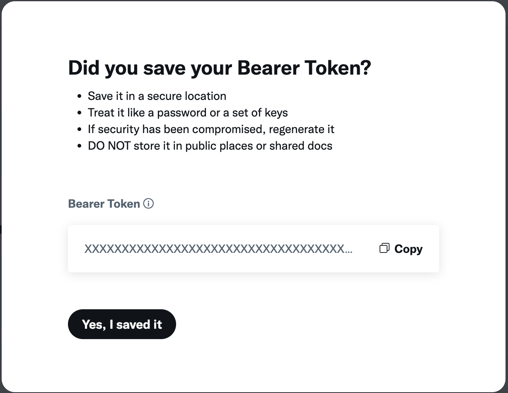

# 🐦 X (Twitter)

If your organization uses X for general communication and wants to boost your audience's engagement, the X connector for Meeds is for you.

You can activate it to allow contributors to earn points by interacting with your accounts on X.

Events that the X connector can capture include:

* Likes
* Mentions
* Reposts

:bulb: **Note:**&#x20;

_Twitter does not allow the free capture of events. You need to acquire at least a Basic plan to have the possibility of registering your application. See_ [_https://developer.x.com/_](https://developer.x.com/)

To start configuring the X connector for Meeds go to _Administration > Recognition > Connectors > Twitter_

<figure><figcaption></figcaption></figure>

Next, Click Configure&#x20;

<figure><figcaption></figcaption></figure>

## :point\_right: **Allow users to connect their X account in Meeds**

Click on _'Allow connection' and_ follow the instructions in the form to activate this connection

**Step 1:** Create or Connect to your X Developer portal

<figure><figcaption></figcaption></figure>

**Step 2:** Create a custom App and edit the _User authentication settings_

<figure><figcaption>
Set Read permission
</figcaption></figure>

<figure><figcaption>
Choose Web App type
</figcaption></figure>

Fill in the _App info's_ _Callback URL_ and _Website URL_ fields by copy-pasting the information from Meeds

<figure><figcaption>
Copy Callback URI and Website URL in Meeds
</figcaption></figure>

<figure><figcaption>
Paste Callback URI and Website URL in X
</figcaption></figure>

**Step 3:** Copy/paste the _Client ID_ and _Client Secret and Save_

<figure><figcaption></figcaption></figure>

Once done, users can [connect their X account](../../user-guide/connecting-your-apps/twitter.md) from their user settings.

<figure><figcaption></figcaption></figure>

You can click on the toggle button to temporarily disable profile connections, or you can ✏️ _Edit_ or 🗑️ _Delete_ the configuration to start over.

## :point\_right: **Add an X account to watch**

Next, tell Meeds which X account to watch for your organization. Click _Add token_

<figure><figcaption></figcaption></figure>

Go back to your App in the X Developer portal and click _Keys and tokens_

<figure><figcaption></figcaption></figure>

In Authentication Tokens > Bearer Token click Regenerate and confirm

<figure><figcaption></figcaption></figure>

Click _Copy_, then paste it into Meeds. Then, click on the  ✔️ green checkmark and _Save_

&#x20;Click on _Add account_ and enter the X username of the organization to watch and _Save_

<figure><figcaption></figcaption></figure>

Meeds is now ready to watch the organization's account.&#x20;

<figure><figcaption></figcaption></figure>

Click on ➕ to add more accounts to watch and 🔑 to update your bearer token.

Optionally, you can click on the organization name and disable some events to watch specifically for that organization.

<figure><figcaption></figcaption></figure>

🎉 Congratulations! Your Meeds Hub is now ready to boost your organization on X! Your program owner can now start designing incentives to[ **Grow your audience on X (Twitter)**](../designing-incentives/growing-your-audience-on-x.md)**.**
