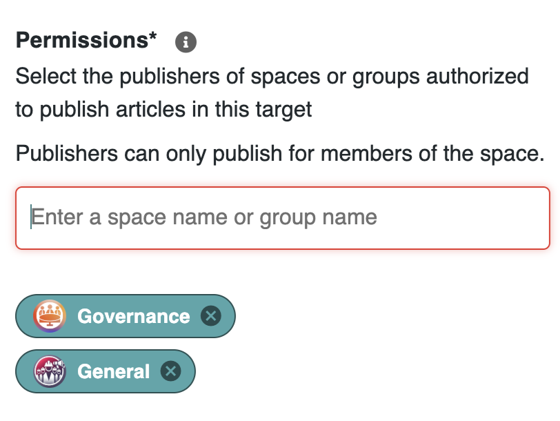
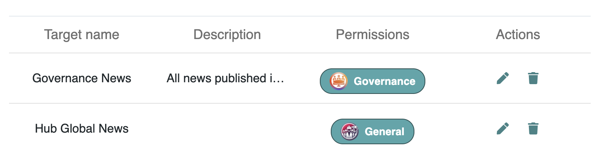

# Managing News


This page applies to the **Business** and **Enterprise** plans.  [👉 Compare all plans](https://www.meeds.io/pricing)


### What Are News Targets?

**News Targets** allow administrators to define where news articles appear across multiple spaces. They enable structured and **cross-space news distribution**, ensuring important updates reach the right audiences.

📌 _Example: A company-wide announcement is published once but appears in multiple relevant spaces through a configured News Target._

***

### Creating and Configuring News Targets

#### Step 1: Access News Target Settings

1. Go to **Admin Console**.
2. Navigate to **Applications > News Settings**.
3. Select **"News Targets"** to view or manage existing targets.

<figure><figcaption>
 <em>News Target settings in the Admin Console.</em>
</figcaption></figure>

#### Step 2: Create a New News Target

1. Click **"Add a Target"**.
2. Enter a **name** and **description** for the target.
3. Set **permissions** for who can publish in this target.
4. Save the configuration.

<figure><figcaption>
<em>News Target creation form</em>
</figcaption></figure>

***

### Managing Permissions for News Targets

#### Who Can Publish to a News Target?

* **Publishers** – Users who have the **Publisher role** in an eligible space or group can submit articles to the selected News Target.
* **Admins** – Can configure and manage targets, control visibility, and set permissions.

&#x20; 💡**Note** If _Content Management_ group is selected, then the news can be published to either the space member only or to any user

#### Assigning Permissions

1. In **News Target Settings**, select a target.
2. In the **Permissions** section, enter and select one or more **spaces** or **groups**.
3. Only users who have the **Publisher role** in the selected spaces or groups will be able to publish in this News Target.
4. Save changes to apply the permissions.

📌 _Spaces represent collaborative environments with multiple applications, whereas Groups are organizational units managed in the admin console under Organization > Groups._

<figure><figcaption>
<em>permissions assignment interface with space and group selection</em>
</figcaption></figure>

***

### Editing or Deleting a News Target

#### Modifying a News Target

* Navigate to **Admin Console > News Settings > News Targets**.
* In the **Actions** column, click the **Edit (✏️) icon** next to the target to update details or adjust visibility.

<figure><figcaption>
Edit and Delete icons at the end of the line
</figcaption></figure>

#### Deleting a News Target

* Navigate to **Admin Console > News Settings > News Targets**.
* In the **Actions** column, click the **Delete (🗑️) icon** next to the target.
* A confirmation prompt will appear:\
  &#xNAN;_"Do you want to remove this news project? It will no longer appear as a choice, but published articles will still be accessible from the news center."_

**Impact:** The target will be removed, meaning new articles cannot be published to it anymore, but existing articles will still be available in the **News Center**. If needed, these articles can be **republished** from the News Center into a different target.

📸 _Placeholder: Screenshot of delete confirmation message._

***

### Related Documentation

🔗 [Managing Space News](../../user-guide/administering-a-space/managing-space-news.md) – Configure the News Block for a specific space.\
🔗 [Sharing News in Spaces](../../user-guide/collaborating-in-spaces/sharing-news-in-spaces.md) – Learn how users create and publish news.\
🔗 [Exploring the News Center](../../user-guide/exploring-a-meeds-hub/news-center.md) – Locate published and drafted news articles.

