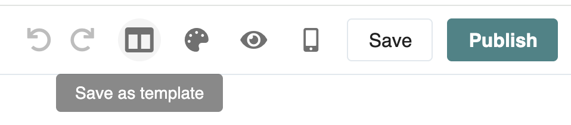
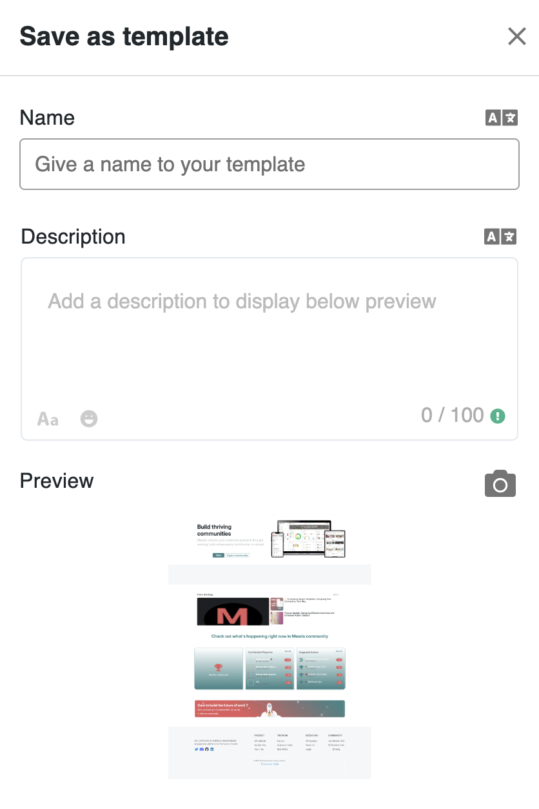
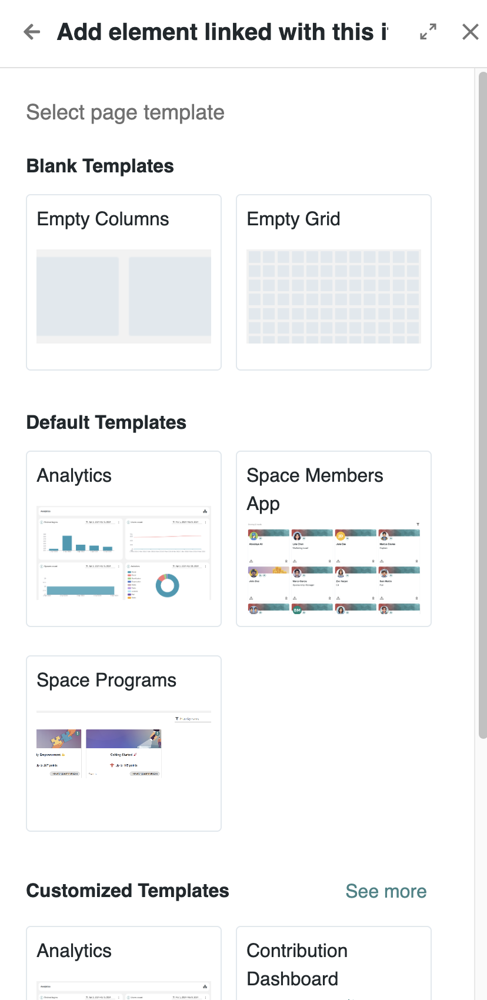
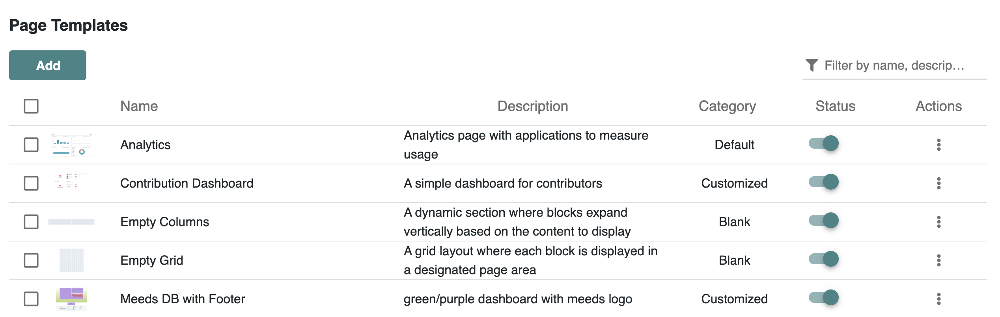
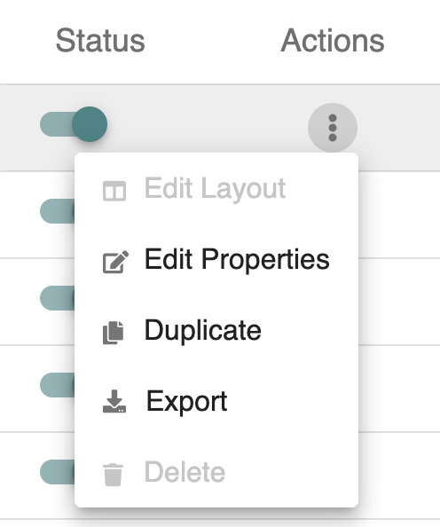
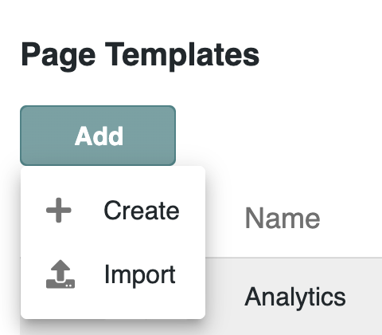
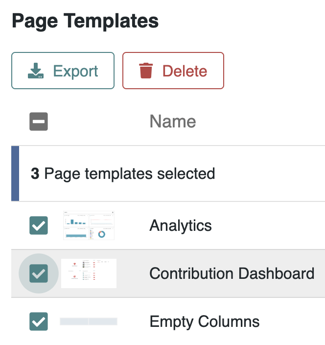

# Managing Page Templates

Page templates in Meeds allow you to save and reuse layouts for consistency across your site. They help accelerate the creation of new pages by reusing existing structures, including content blocks and applications.


Watch this quick tutorial about Page Templates


### 📄 Creating a Template from a Page

To create a page template from any existing page:

1. Open the page in [**Edit Layout**](managing-websites/editing-navigation/editing-pages.md) mode.
2. Adjust the layout and content as needed.
3. Click **Save as Template** in the top bar of the editor.

<figure><figcaption></figcaption></figure>

A Drawer panel opens where you can fill in the  fields:

* **Name** (required)
* **Description** (optional)
* **Thumbnail**: auto-generated screenshot (can be replaced with a custom image)

<figure><figcaption>
<em>Saving a layout as a reusable page template</em>
</figcaption></figure>

### 🔧 Using a Template to Create a Page

In a Navigation panel, when adding a new page, you can select a template:

1. Choose **Add Item > New Page > Next**&#x20;
2. Browse templates:
   * **Blank Templates** (provided by platform)
   * **Default Templates** (provided by platform)
   * **Custom Templates** (created by users)
3. Select and confirm to create a new page from the template.

<figure><figcaption>
<em>Choosing a predefined template to build a new page</em>
</figcaption></figure>

### 📊 Admin Interface for Templates

🛡️ Only **platform administrators** have access to create, update, and delete page templates via the admin panel.

Access the templates list from the admin console through  **Administration** > **Development > Templates > Pages**

<figure><figcaption>
Manage Page Templates Admin Interface
</figcaption></figure>

Each template entry displays:

* **Thumbnail** previe&#x77;**, Name** and **Description**
* **Category** (Empty / Default / Custom)
* **Status** (Active / Inactive)
* **Actions** menu (⋮)

### 🔄 Available Actions

For each template, click the three-dot menu (⋮) to open a dropdown menu :

<figure><figcaption>
<em>Available actions for a selected template</em>
</figcaption></figure>

1. **Edit Layout** – Modify layout and design
2. **Edit Properties** – Update name, description, or thumbnail
3. **Duplicate** – Create a copy of the template
4. **Export** – Download a `.zip` file of the template
5. **Delete** – Remove a custom template (not available for default ones)

### ➕ Adding a Template from Admin

You can create or import templates from the admin interface:

<figure><figcaption>
<em>Starting from scratch or importing a saved model</em>
</figcaption></figure>

1. Click **Add** button.
2. Choose:
   * **Create**: open a blank layout editor
   * **Import**: upload a previously exported `.zip` file

***

### 🛠️ Bulk Operations

<figure><figcaption>
Bulk operations for Page Templates
</figcaption></figure>

* Select multiple templates to **Export** or **Delete** in one operation
* Only custom templates can be deleted

***

### 💡 Best Practices

* Keep templates well-named and categorized
* Use templates to enforce branding
* Regularly audit and clean unused templates
* Create variants for different use cases (e.g. event pages, profiles)

***

Page Templates save time and maintain consistency. Once adopted, they become essential building blocks of an efficient Meeds Hub experience.
