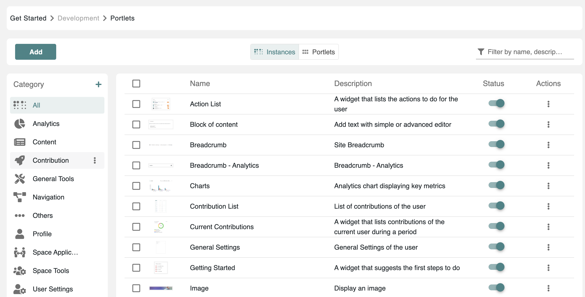
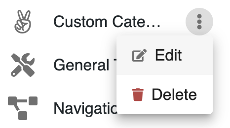
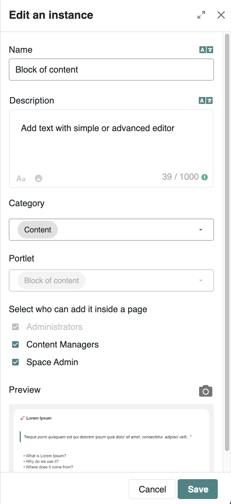
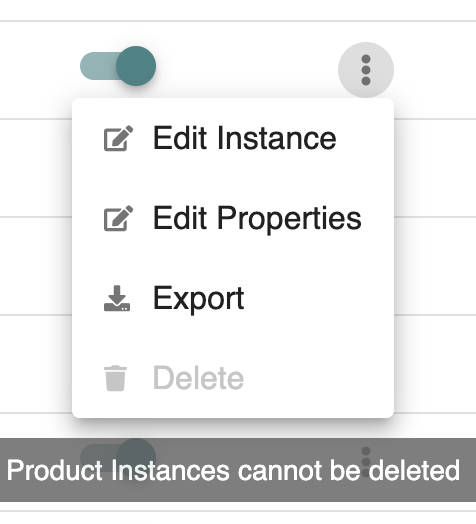
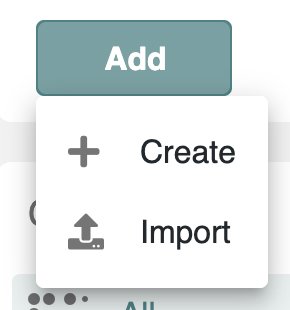
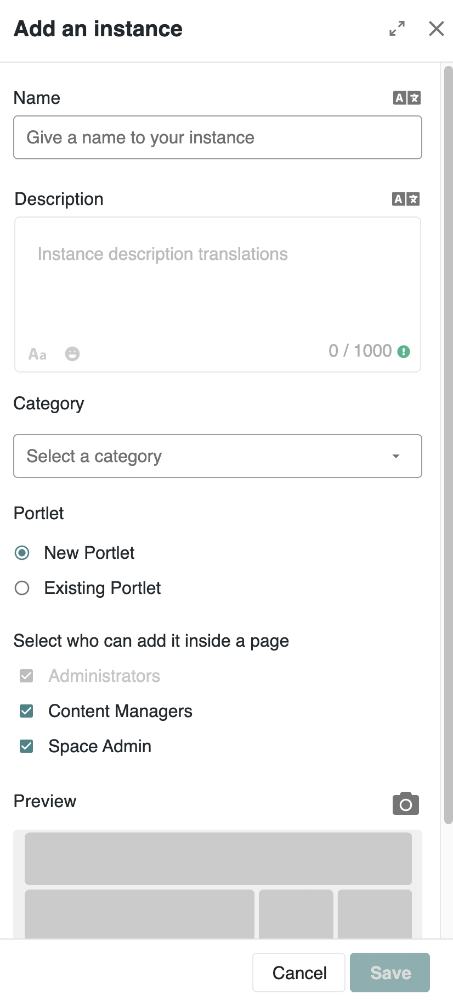
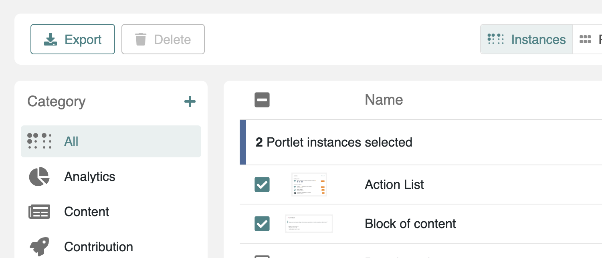
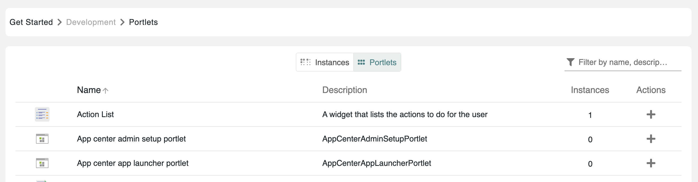

# Managing Portlets

Portlets in Meeds are configurable design blocks used to enrich the layout and functionality of pages created using the Page Editor. This guide explains how administrators can manage these portlets through the administration console.

***

### Accessing Portlet Management

To manage portlets:

1. Navigate to the **Administration Console**.
2. Go to **Development** > **Portlets**.

This opens the Portlet Manager, where all available portlets are displayed and organized into categories.

<figure><figcaption>
Portlet Instances Management
</figcaption></figure>

***

### Portlet Categories

Each portlet is grouped into one of the following default categories:

* **All :** All blocks uncategorized in alphabetic order
* **Analytics**: Blocks like charts, reports, and metrics boards.
* **Content**: Includes content blocks, rich text, images, links, and user-defined blocks.
* **Contributions**: For contribution-related components like quests, badges, leaderboards, and contribution lists.
* **General Tools**: Utility blocks for tasks, people, shortcuts, spaces, and feeds.
* **Navigation**: Tools for building menus like breadcrumbs, site navigation, and vertical menus.
* **Profile**: Blocks for user profile pages (e.g., About Me, Contact, Experience).
* **User Settings**: Blocks for configuring personal settings like language, notifications, security, wallet.
* **Space Applications**: Blocks that appear in the space menu (e.g., members list, space settings, notes).
* **Space Tools**: Components used on space-specific pages like welcome pages (e.g., admin list, space feed, banners).
* **Others**: Miscellaneous blocks that do not fit any defined category.

#### Customizing Categories

Admins can:

* Rename existing categories.
* Assign icons and localized names.
* Add or delete custom categories.

<figure><figcaption>
Actions on Custom Categories
</figcaption></figure>

***

### Managing Portlet Instances

Within each category, you find **portlet instances** – preconfigured blocks ready to use in the [Page Builder](../managing-websites/editing-navigation/adding-a-page.md).

Each instance includes:

* **Name and description :** in any language
* **Active/Inactive** toggle
* **Permissions** : only Administrator, Content Managers, or Space Admin are possible
* **Preview :** preview thumbnail or custom image
* **Portlet :** Linked portlet application  (cannot be changed)

<figure><figcaption>
Edit Portlet Instance Drawer
</figcaption></figure>

#### Actions on Instances

<figure><figcaption></figcaption></figure>

You can:

* **Edit Properties** : Modify name, description, category, permissions, and Preview image.&#x20;
* **Edit Instance** : opens the portlet instance editor fullpage giving you preview and if the portlet application allows it, access to the settings. Otherwise a readonly preview is displayed. If the instance is of type `WidgetPortlet`, then the [Gadget Editor](creating-gadgets.md) is open
* **Export**: Generate a `.zip` file with all instance data for reimport.
* **Delete**: Only for user-created instances, not system-required ones.

#### Adding Instances

<figure><figcaption>
Dropdown menu on Add button
</figcaption></figure>

Click **Add** button to either:

* **Import** an existing instance from a `.zip` file.
* **Create** a new instance:
  * Enter name, description, category, permissions, and icon.
  * Choose to use an existing application or create a new one.
  * Creating a new app initiates the [**Gadget Editor**](creating-gadgets.md) (for `WidgetPortlet` type apps).

<figure><figcaption></figcaption></figure>

#### Bulk Actions

Select multiple instances to apply:

* **Export**: Batch export selected instances.
* **Delete**: Remove user-created instances (only unused instances can be removed)

<figure><figcaption></figcaption></figure>

***

### Portlet Applications

Under the **Portlet** tab, view all portlet applications :

* Each app includes a name, icon, description, and count of created instances.
* Clicking opens a drawer with:
  * All linked instances.
  * Options to add new instances to the app.

<figure><figcaption></figcaption></figure>

***

This functionality empowers platform administrators to tailor the visual and functional layout of Meeds pages while ensuring consistent access controls and reusability across environments.
