# Managing Section Templates

Section templates are reusable layout components that help you build consistent, efficient, and visually appealing pages within your Meeds hub. This guide explains how to create, manage, and reuse section templates using the admin interface and the page builder.


Video guide to creating and customizing section templates.


### What is a Section Template?

A section template defines the layout and structure of a content block that can be reused across multiple pages. Sections can represent headers, footers, dashboards, or any functional block of content. They are created from individual cells that can contain applications, text, images, and other content. Sections are sued in the Page builder when you [edit a page layout](managing-websites/editing-navigation/editing-pages.md).

Each section can be based on:

* **Dynamic layout**: Responsive, flexible structure for variable content.
* **Fixed layout**: Static structure with predefined dimensions.
* **Custom template**: A previously saved section layout.

<figure>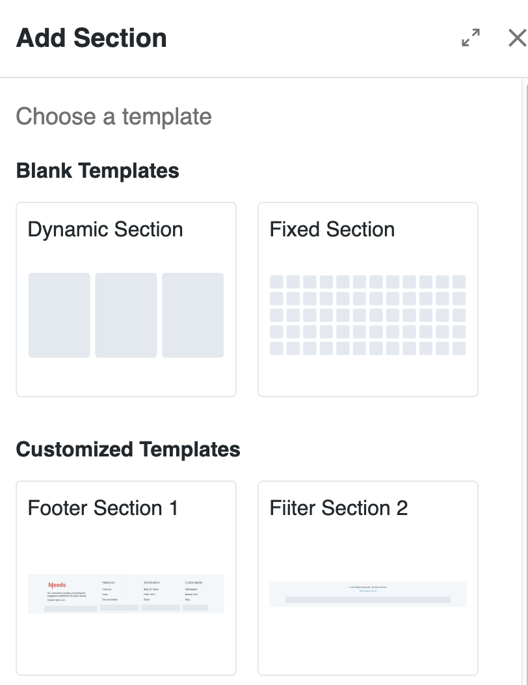<figcaption>
Choosing a section type when adding a new section
</figcaption></figure>

### Creating a New Section Template

You can create section templates directly within the Page Builder:

1. Open a page and click **Add Section**.
2. Select a base layout: _Dynamic,_ _Fixed_ or any of your custom templates
3. Customize your layout by adding and configuring cells.
4. When satisfied, click **Save As Template** on the section's right hand side.

<figure>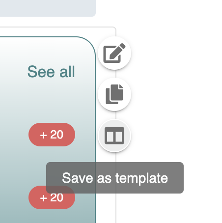<figcaption></figcaption></figure>

A drawer is opened:

<figure>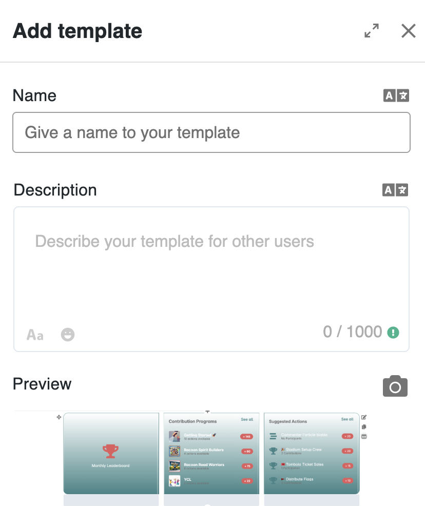<figcaption>
Saving a customized section as a new template
</figcaption></figure>

1. Provide a **name** and **description**.
2. A **thumbnail preview** is automatically generated.

💡 _Tip: Use clear naming and add helpful descriptions to make templates easy to find later._

***

### Managing Templates in the Admin Interface

As an administrator, go to **Administration > Development > Templates > Sections** to manage all saved templates.

This interface displays a list of all section templates with the following columns:

* Preview thumbnail
* Name and description
* Section type (Dynamic or Fixed)
* Status (Active / Inactive)
* Action menu (⋮)

<figure>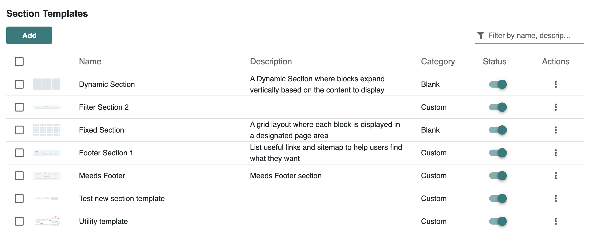<figcaption>
Overview of all section templates in the administration interface.
</figcaption></figure>

### Available Actions

<figure>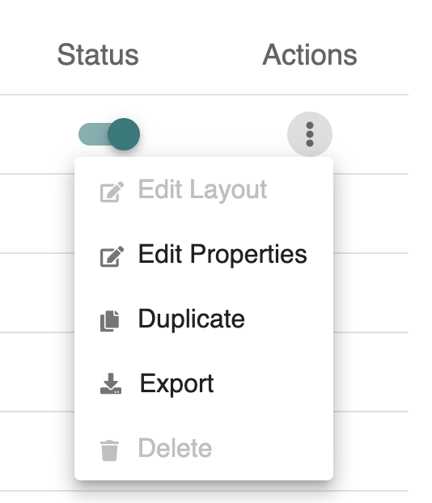<figcaption>
Managing individual templates via the action menu.
</figcaption></figure>

From the action menu (⋮), you can:

* **Edit Layout**: Open the template in the Section Editor and adjust its layout. (disabled for default blank templates)

<figure>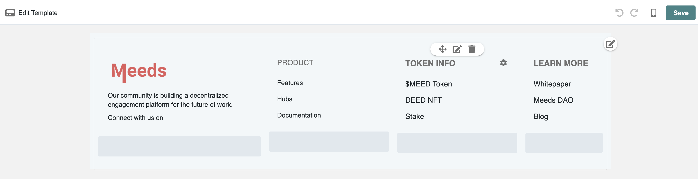<figcaption></figcaption></figure>

* **Edit Properties**: Rename the template, update its description, or replace the thumbnail.

<figure>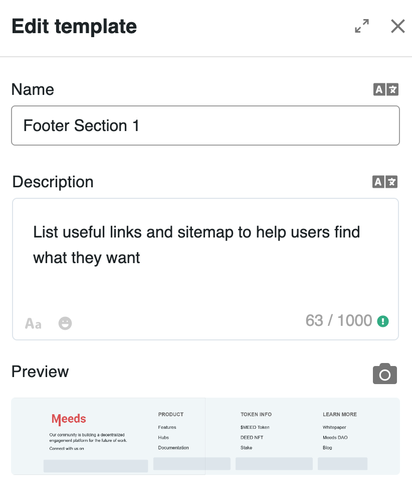<figcaption></figcaption></figure>

* **Duplicate**: Clone the template to create a new variation.
* **Export**: Download the section template as a zip file.
* **Delete**: Permanently remove the template (disabled for default blank templates).

### Bulk Operations

Use checkboxes to select multiple templates and perform bulk actions:

<figure>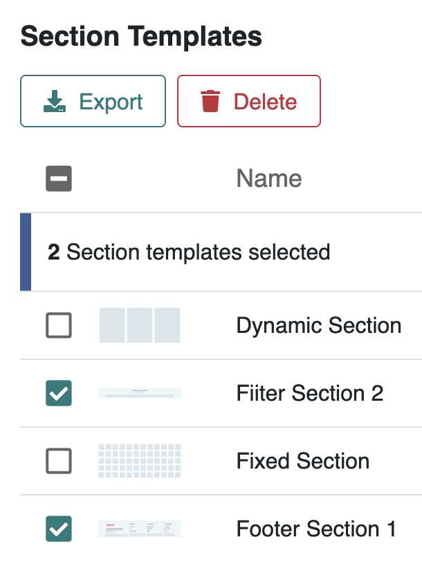<figcaption>
Performing bulk operations on multiple section templates
</figcaption></figure>

* **Export**: Download selected templates.
* **Delete**: Remove several templates at once.

### Creating Templates from the Admin Panel

Click **Add** button in the admin interface to create a section without going through the Page Builder.

<figure>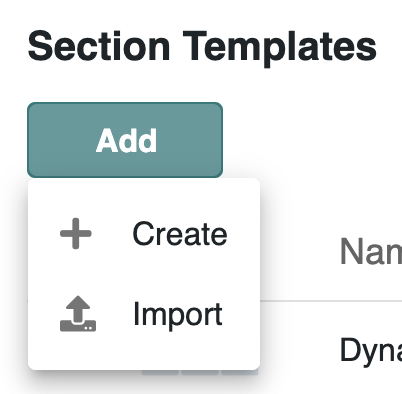<figcaption></figcaption></figure>

* Choose **Import** to upload a previously exported seciton template.
* Choose Create to create a new section from scratch and save it as template

1. Choose a layout type (Dynamic or Fixed).
2. Set the number of columns and/or rows.

<figure>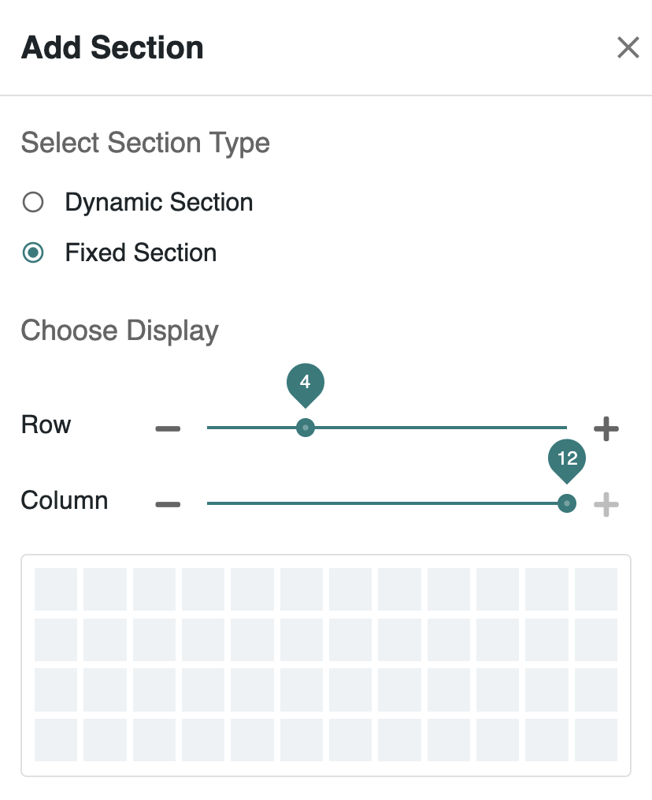<figcaption></figcaption></figure>

Click **Next** and the Section editor opens

<figure>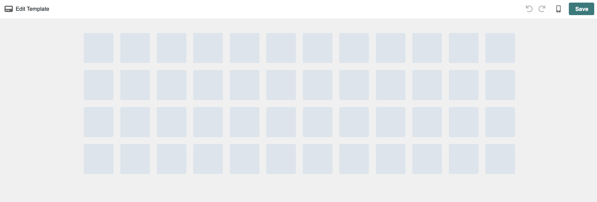<figcaption>
Creating a new section template directly from the admin interface.
</figcaption></figure>

1. Customize the section's layout, and tune it to looks as you want including by adding applications and content if you need
2. Click **Save** and then enter a name and description                                                                                                                                                                                                                                                                                                                                                                                                                                                                                           &#x20;

***

### 💡 Best Practices

* Use consistent naming conventions.
* Keep descriptions meaningful.
* Regularly clean unused or duplicate templates.
* Test responsiveness for mobile layouts.
* Export templates for backup or sharing across hubs.
