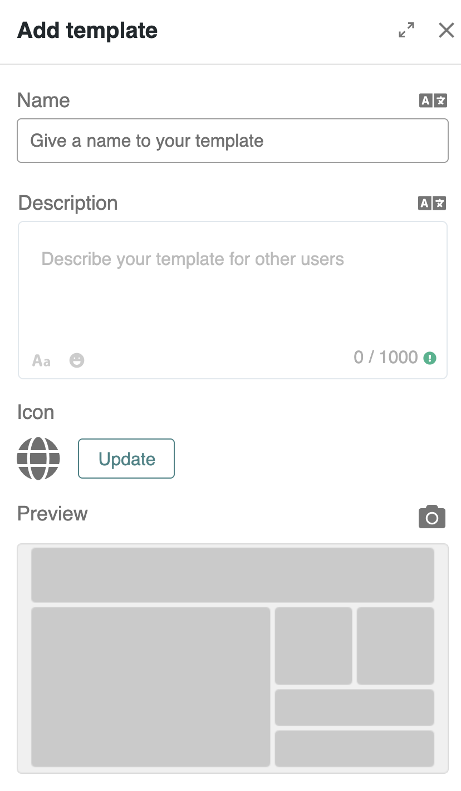
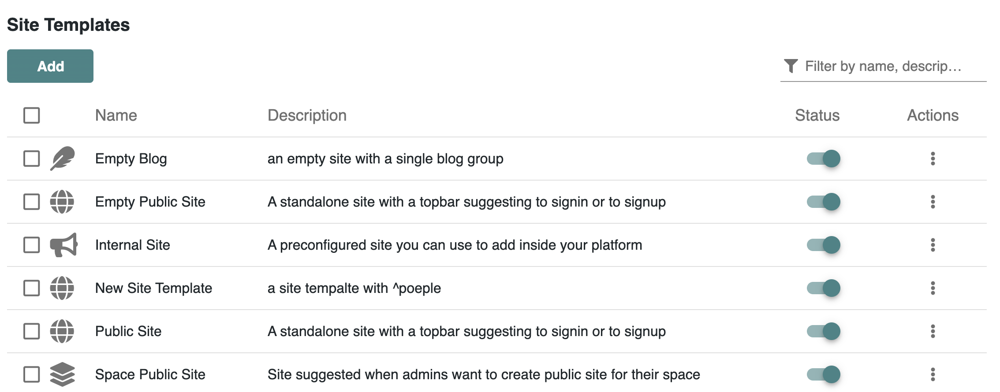
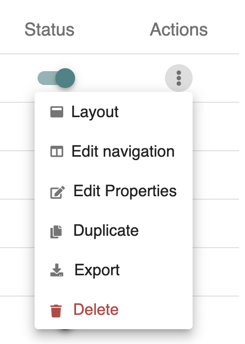
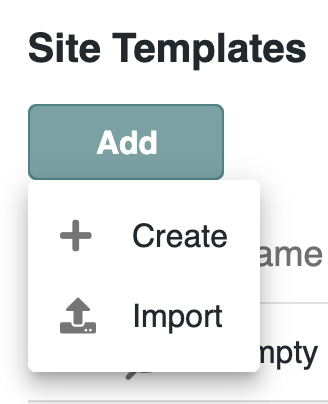
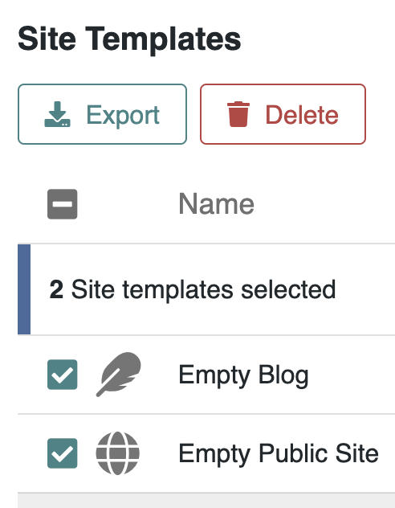

# Managing Site Templates

**Site Templates** allow administrators to quickly launch new [webites](managing-websites/) with consistent branding and functionality, saving time and ensuring coherence across the platform. Use them as reusable blueprints that encapsulate a full website layout—including design, structure, and navigation.

### 📄\` Creating a Site Template

Site Templates can be easily created by Administrators from existing sites. To create a custom site template, navigate to **Administration > Development > Sites** :

1. Click the **⋮ menu** on a site.
2. Select **Save as Template**.

<figure><figcaption>
<em>Creating a site template from an existing site</em>
</figcaption></figure>

A drawer panel opens and invites you to enter :

* **Name**
* **Description**
* **Icon**
* **Preview Image**

<figure><figcaption>
Drawer to identify your Site template
</figcaption></figure>

### 🌐 Admin Interface for Site Templates

Navigate to **Administration > Development > Templates > Sites** to access all available site templates.&#x20;

<figure><figcaption>
<em>Managing all site templates from the admin panel</em>
</figcaption></figure>

Each entry displays:

* Icon and name
* Description
* Template status (Active/Inactive)
* Actions menu (⋮)

### 🔄 Available Actions&#x20;

From the template list, use the ⋮ menu to access the following dropdown menu :

<figure><figcaption>
<em>Available actions for a selected site template</em>
</figcaption></figure>

Available actions on the site template include:

1. **Edit Layout** – Change global design: header, background, margins, etc.
2. **Edit Navigation** – Configure the default navigation menu for new sites based on this template.
   * Add items, assign permissions, and link or create pages.
   * Changes only affect newly created sites.
3. **Edit Properties** – Update the name, description, or preview.
4. **Duplicate** – Create a copy of the template.
5. **Export** – Download the template as a `.zip` file.
6. **Delete** – Remove the template (only for custom templates).

### ✍️ Adding or Importing Templates

To add a new site template manually, click **Add** button in the templates interface:

<figure><figcaption>
<em>Options to import or create a new site template manually</em>
</figcaption></figure>

Choose between:

* **Import** – Upload a `.zip` file of an existing template.
* **Create** – Define name, description, and customize layout and navigation.

### 🚀 Bulk Operations

Select multiple templates to:

* **Export** – Download several templates at once
* **Delete** – Remove selected templates (custom templates only)

<figure><figcaption>
Bulk operations on Site Templates
</figcaption></figure>

### 💡 Best Practices

* Use site templates for seasonal campaigns, microsites, or team portals.
* Name templates clearly to reflect their purpose.
* Keep navigation lean and relevant.
* ⚠️ Remember: Navigation edits on a template do not apply retroactively to already-created sites.

***

Site templates are the most comprehensive reusable elements in Meeds. They let you encapsulate entire blueprints—from design to layout and navigation—so your team can launch new sites faster and more consistently.
