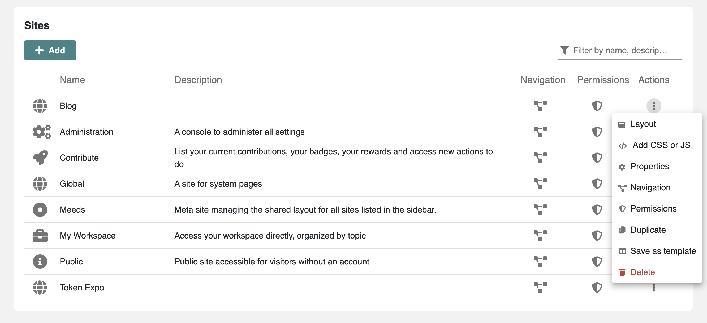
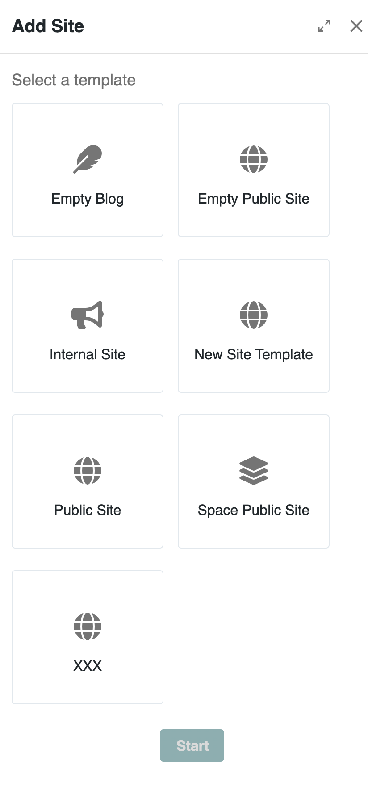

# Managing Websites

In Meeds, a **Site** is a collection of pages that share a unified design, navigation, and access control. Sites allow you to organize content around your organization, events, or working groups, each with its own visual identity and navigation.

***

### 🔧 Accessing Sites Management

To view and manage all sites on your hub:

1. Go to the **Admin Console > Development > Sites**.
2. The interface displays all existing sites, their status, and available actions.

<figure><figcaption>
<em>List of existing sites in the Meeds admin panel</em>
</figcaption></figure>

***

### ➕ Creating a New Site

To create a new site:

1. Click **Add** in the top right corner.
2. Choose a **template** to start with:
   * Meeds includes default templates.
   * You can also [create and reuse custom templates](../managing-site-templates.md).

<figure><figcaption>
<em>Starting a new site from a predefined template</em>
</figcaption></figure>

Customize the content, layout, and navigation based on your needs.

