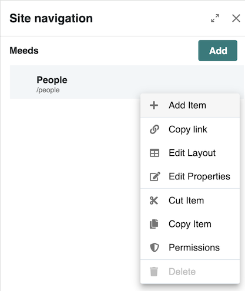
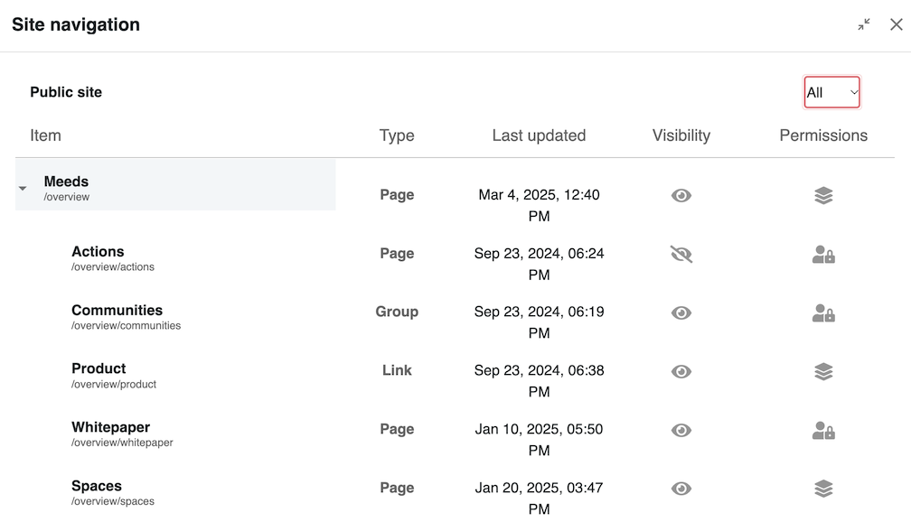
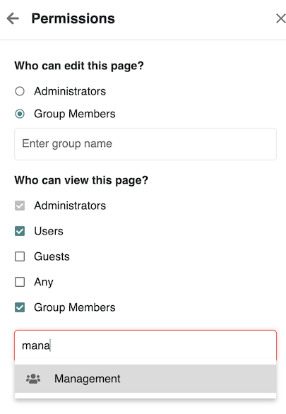

# Editing Navigation

Navigation is a fundamental aspect of structuring a Meeds site. Properly configuring navigation ensures that users can efficiently access relevant content, navigate between sections, and maintain a logical flow throughout the platform. This guide details how administrators can edit and manage site navigation, including adding, removing, and organizing navigation items.

### ▶️ Quick Video Tutorial


Edit navigation of your site


### :busts\_in\_silhouette: Who can edit navigation?

* Administrators can edit all platform's navigation
* Space Administrators can only edit navigation of their space

### &#x20;:tools: How to edit navigation?

To modify the site navigation, there are two primary methods:

1. **From Any Page on the Site:**
   * If you have the appropriate permissions, you will see a **"Site Navigation"** icon in the top bar next to the site name. .png>)
2. **From the Administration Interface:**
   * Click on the **Administration** icon in the top bar (⚙️).
   * In the Administration menu, navigate to **Development > Sites** (see [Customizing Sites](../)).
   * In the **Navigation** column, find the same **navigation edit icon** 

Clicking the navigation icon opens the **Site Navigation drawer**, where navigation can be edited similarly to the page-level editor.

<figure><figcaption>
Site Navigation Drawer
</figcaption></figure>

### 🧭 Navigation Editor&#x20;

From there, you will be able to:

* **Add Item** – Allows you to add a page.
* **Copy Link –** copy the url of the page in the clipboard
* **Edit Layout  –** Edit the layout of the page (see [Editing Page Layout](editing-pages.md))
* **Edit Properties** – Modify the page's details.
* **Cut Item / Copy Item** – Move or duplicate navigation items.
* **Permissions** – Manage access rights for the navigation entry.
* **Delete** – Remove the item from the navigation menu.

Additionally you can expand  the drawer to see a full page interface :

<figure><figcaption>
Edit Navigation in Expanded mode
</figcaption></figure>

### 🔗 Adding a Navigation Item

Continue on [Adding a Page](adding-a-page.md)

### **🛡️ Permissions**

When selecting the **Permissions** option for a navigation item, a permissions drawer opens, divided into two main sections:

<figure><figcaption>
Navigation Item Permissions
</figcaption></figure>

#### **1. Who Can Edit This Page?**

This section defines who has the right to **modify the page layout, appearance, and properties**. There are two options:

* **Administrators** – Only global administrators can edit this page.
* **Group Members** – Allows specifying a group that will have editing permissions. When selected, an autocomplete field appears where you can enter the name of a [group](../../../manage-users/add-a-user-group.md).

#### **2. Who Can View This Page?**

This section controls who has access to view the page. Options include:

* **Administrators** – Always have access to view all pages (this cannot be deselected).
* **Users** – Authenticated users with an account on the platform.
* **Guests** – Allows [guest users](../../../../user-guide/administering-a-space/inviting-users-and-guests.md) without an account to view the page.
* **Any** – Grants access to all visitors, even unidentified ones.
* **Group Members** – Allows restricting access to specific [groups](../../../manage-users/add-a-user-group.md), with an autocomplete field to select the group.

By configuring these options, administrators can ensure proper access control and visibility management for different types of users.

To modify access permissions:

1. Select the navigation item.
2. Open the **Permissions** tab.
3. Assign visibility settings based on user roles.
4. Click **Save** to enforce the new permissions.
