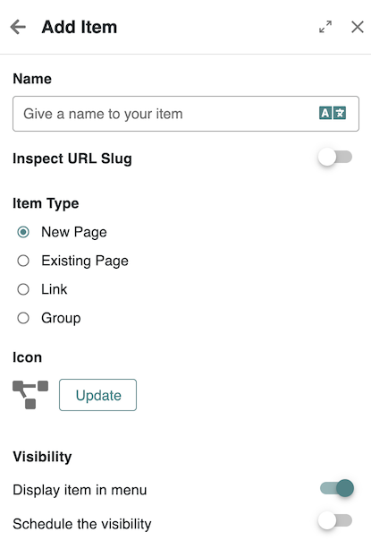
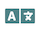

# Adding a Page

### ▶️ Quick Video Tutorial



### :busts\_in\_silhouette: Who can add pages?

* Administrators can add pages to any platform's site
* Space Administrators can add pages to their space

### &#x20;:tools: How to add a page?

* Access the [site navigation](./)
* From there, decide to add an item
* Choose to add a new page or choose from an existing page
* You also can add a group of pages, or a link

To add a new item to the navigation menu:

1. Click **“Add Item”** in the Navigation Editor.

<figure><figcaption>
Add navigation Item
</figcaption></figure>

1. **Name** : name of your menu item, click the translation icon ()  to localize the name
2. **URL slug** : the trailing part of the url ( inferred automatically from the name, but ⚠️ you can only customize it at creation time)
3. I**tem Type**: Choose the type of item among
   * **New Page** – After filling out the item proeprties form, the page editor will open immediately, allowing you to start creating the new page directly.
   * **Existing Page** – An autocompletion field appears where you can type and select an existing page. A checkbox allows restricting the autocomplete scope to the current site or expanding it to all sites. Additionally, a toggle labeled **"Open in the same tab"** lets you decide whether to open the selected page in a new tab (default is same tab).
   * **External Link** – A field appears prompting users to enter a URL. When users click this menu item, they will be redirected to the specified URL. There is also a toggle option to **open the link in a new tab**.
   * **Group** – No additional options are required. Selecting this type creates a **non-clickable navigation node**, useful for grouping menu items without linking to a page.
4. **Icon** to select a distinctive icon for this item to be displayed in the sidebar (not in the top bar)
5. **Display item in menu** lets ou control wether you want this item to be displayed in the **top bar menu**.
6. (Optional) Set a **visibility schedule**, defining when the item becomes available or when it should be hidden.
7. Click **Save** to apply the changes or **Next** to start [editing your New Page.](editing-pages.md)
