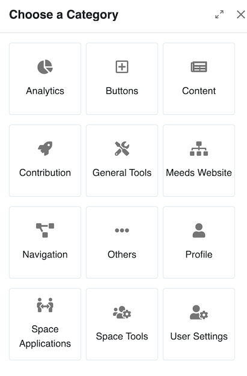
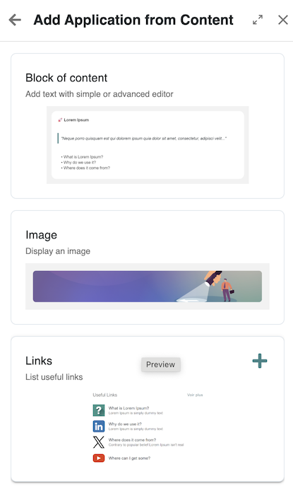
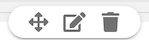
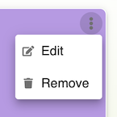
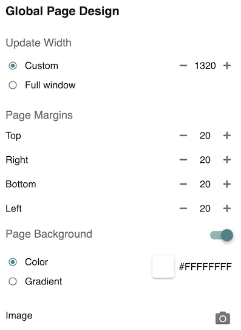
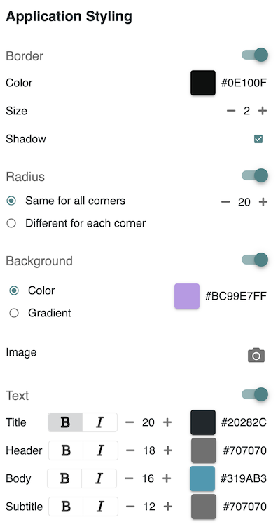
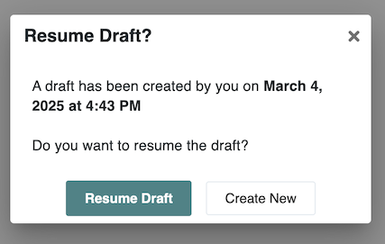
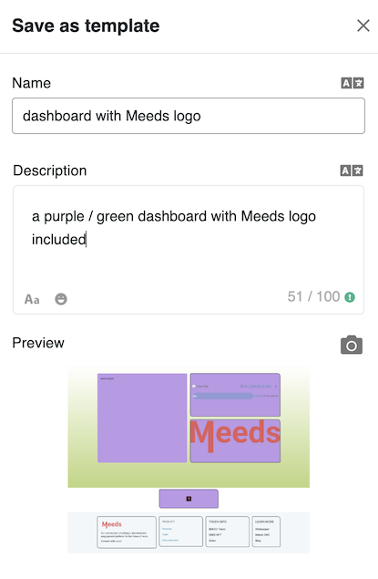

# Editing Pages

The Page Builder in Meeds allows administrators and authorized users to fully customize the layout of a page by arranging content, structuring sections, and applying styles. This guide provides a comprehensive walkthrough of how to modify the page layout, including managing sections, adding content blocks, configuring design settings, and ensuring mobile responsiveness.

### :busts\_in\_silhouette: Who can edit the layout of a page?

* Administrators can edit any page
* Space Administrators can edit pages of their space

### &#x20;:tools: How to edit the layout of a page?

To edit a page layout, users with the appropriate permissions can access the Page Builder in two ways:

1. **From Any Page:**
   * Click on the [**Edit Site Navigation**](./) icon in the top bar.
   * This opens the **Site Navigation panel**, where you can select a page to edit.
   * Click on the page name, then choose **Edit Page Layout**.
2. **From the Administration Interface:**
   * Click on the **Administration** icon in the top bar (red icon).
   * Navigate to [**Development > Sites**](../customizing-sites.md).
   * Find the site you want to modify, then click the **Edit Page Layout** icon in the Navigation column.

### 🎨 **Choosing a Page Template**

When creating or modifying a page, you can choose among **page templates**, which define the initial structure of the page. There are two default blank templates:

* **Empty Column** – Uses the **Column Layout**, providing a structured format with stacked sections.
* **Empty Grid** – Uses the **Grid Layout**, allowing flexible, dashboard-style design.

Both templates create a page containing only **one empty section** to start from. In addition to these two blank templates, users can select from **other preconfigured templates**, which are managed by the administration in a [dedicated section](../managing-page-templates.md).

**💡 Good to Know** : All [**section templates**](../managing-section-templates.md) in are derived from one of these two layout models and all [**page templates**](../managing-page-templates.md) are a combination of preconfigured sections.

Each layout model offers a different editing experience:

#### **Grid Layout**

<figure><figcaption>
A Grid Section in the Page Builder
</figcaption></figure>

* Displays a **12-column grid** where you can manually define content zones.
* Users can **draw zones** by selecting and dragging across the grid.
* Once a zone is created, a **side panel opens**, allowing you to select content blocks (applications or static content).
* Supports full **drag-and-drop customization** for flexible arrangements.
* Ideal for **dashboard-style pages** requiring more **complex layouts**.

#### **Column Layout**

<figure><figcaption>
A 3-column section in the Page Builder
</figcaption></figure>

* Provides a **predefined number of stacked columns** for structured layouts.
* Content can only be positioned within these columns and expands vertically.
* Suitable for **uniform, streamlined page layouts** where precise positioning isn’t necessary.
* Particularly useful for **building traditional web pages**.

***

### 🔲 **Adding and Managing Content Blocks**

Meeds pages are built using **blocks**, which can be content-based or application-based.&#x20;

#### **Adding a Block**

1. Select an area within the grid or column layout.
2. A **side panel appears**, and invites you to select a category &#x20;

<figure><figcaption>
Pick App Category
</figcaption></figure>

1. Within a block you can either insert&#x20;
   * **Content** : Text, images, links, or rich media.
   * **Application** : Interactive widgets like charts, analytics, or dynamic feeds.
2. After picking a category its block types (aka applications) are displayed and you can preview them or insert them by clicking on the Add (+) button
3. Click to insert the block into the selected area.

<figure><figcaption>
Choose an App
</figcaption></figure>

**💡Good to Know** : the categories as well as the list of blocks available can be managed in Administration (see [**Managing Applications**](../managing-portlets/))

#### **Managing Blocks**

Moving your mouse over a block will reveal a bunch of controls

<figure><figcaption>
Block Control Icons
</figcaption></figure>

* **Move**: Drag blocks to reposition them within the grid.
* **Edit**: Modify content, settings, or styles of individual blocks.
* **Delete**: Remove a block from the page.
* **Resize** : Adjust the block’s dimensions to fit your layout. (grid layout only)

Each block may include acess to **application settings**, allowing application-specific customization.  The Page Builder tries to apply these params so what you see while editing is as close as possible to the final result.

<figure><figcaption>
Access to Applicaiton Settings through the Page Builders
</figcaption></figure>

### 🎨 **Customizing Page Design**

In addition to structuring layout, you can customize page design elements by clicking the page design icon 

#### **Global Page Design**

<figure><figcaption>
Global Page Design Settings
</figcaption></figure>

* **Page Width:** Define a fixed width (e.g., 800px) or enable **Full Window mode**.
* **Page Margins :** Adjust external spacing around the content grid.
* **Page Background  :** Apply a **solid color, gradient, or background image**.

#### **Block Styling**

<figure><figcaption></figcaption></figure>

You can define various styling settings to be applied by default to all blocks within the page:

* **Borders:** Customize color, thickness, and shadows.
* **Corner Radius:** Adjust how rounded block corners appear.
* **Background :** Set a common background color, gradient or image for all blocks
* **Text Styles:** Control typography settings for titles, subtitles, header and body text.

#### **Edit Block**&#x20;

The **Edit** icon on blocks lets you override styling for each individual block (see above). Additionnaly,  advanced options are available:&#x20;

* **Hide on Mobile** : will not display the block on mobile device (useful when dealing with a non responsive app or when you want to lighten a page by trimming non essential content
* **Fixed Height** (Column Layout  only):  instead of letting the block expand vertically in the column, you may want to give it a fixed heigh. Convenient to align boxes, but use with caaution because side effets may occer such as in-block scrollbars and weird display on mobile

### ✅ **Finalizing and Publishing Changes**

#### **Working with drafts**

When starting to edit a page with unpublished changes, you're invited to resume from the draft or to create a new version based on the last published version.

<figure><figcaption>
Resume Draft Popup
</figcaption></figure>

The page is automatically saved as draft as you make change and you can undo/redo  each change.

#### **Previewing the Page**

* Click the **Preview** icon  to see a live preview of the page without having to publish it
* Click the **Mobile** icon  for a preview of your page in mobile

#### **Saving and Publishing**

* **Save:** The current version of the page remains unpublished and only visible to editors.
* **Publish:** Pushes the current version live, making them accessible to all users.

**Finally, save as Template icon**  let's you save the entire page setup as a template reusable for creating new pages.

<figure><figcaption>
Save as Page template drawer
</figcaption></figure>

&#x20;You're invited to give it a name and description and a preview image is generated based on the page content which you can override by your own thumbnail image.&#x20;

Once saved, the template will be available as a starting point when creating new pages (see [#choosing-a-page-template](editing-pages.md#choosing-a-page-template "mention") and [managing-page-templates.md](../managing-page-templates.md "mention").

**💡 Good to Know** : templates and current page won't be linked. meaning any change you aply to the page after you saved as template will NOT be automatically applied to the template.

