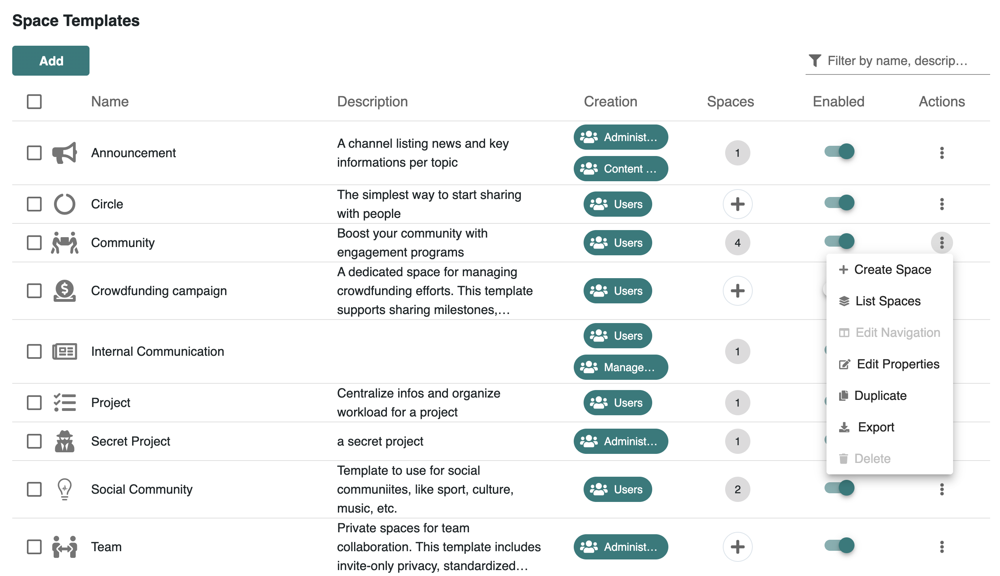
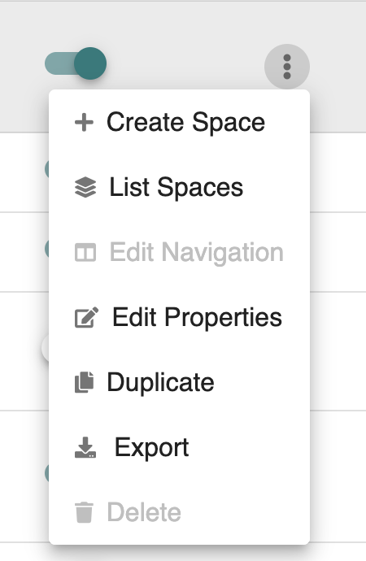
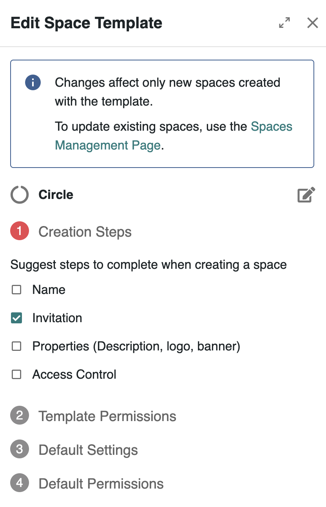
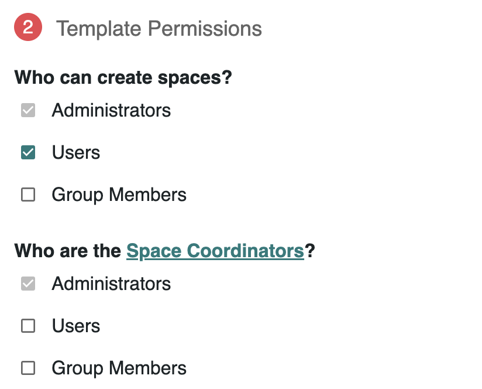
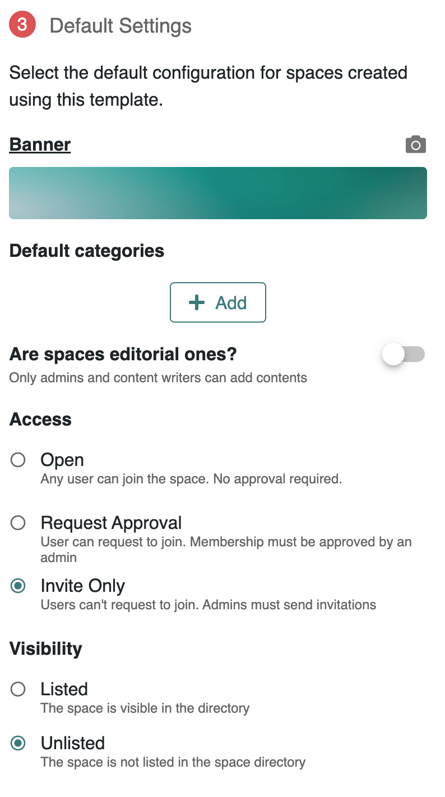
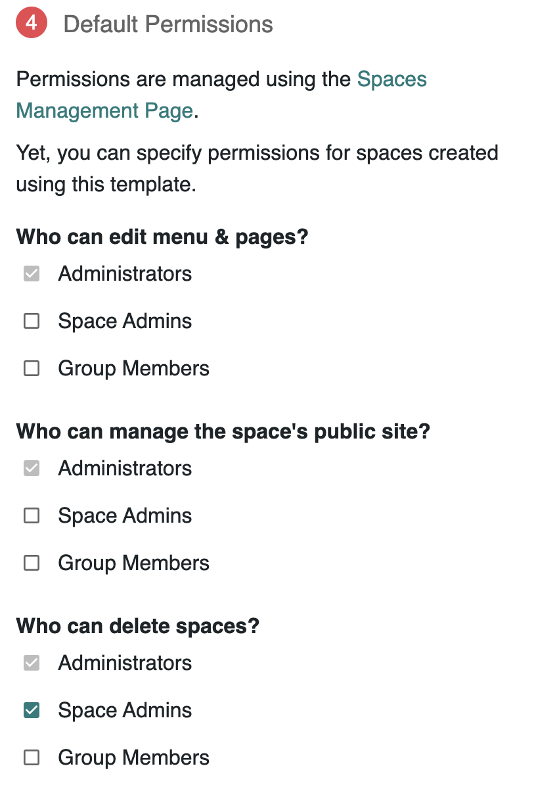
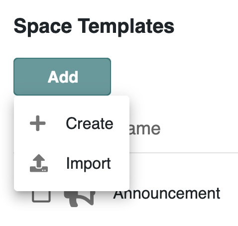

# Managing Space Templates


This page applies to the **Business** and **Enterprise** plans.  [👉 Compare all plans](https://www.meeds.io/pricing)


Space templates help streamline the creation of new spaces by predefining certain configurations. They enable administrators to specify what should be mandatory, which applications are included by default, and who can create, update, or delete spaces associated with the template.

🎥 _Watch this tutorial video to understand how space templates work._



### Acessing Space Temapltes Management

Go to your **Platform Settings** > **Development** > **Templates > Spaces**

<figure><figcaption>
<em>List of existing space templates with their status and actions.</em>
</figcaption></figure>

&#x20;You will see a list of existing templates including:

* Template name, description, and icon
* Current permissions
* Number and list of spaces using the template
* A toggle to activate/deactivate the template
* A dropdown menu with actions

🛡️ Only platform administrators can manage space templates.

### Available Actions on a Template

<figure><figcaption>
<em>Available actions on each space template.</em>
</figcaption></figure>

The dropdown menu provides the following options:

* **Create Space**: Opens the space creation drawer with the template preselected.
* **List Spaces**: Lists all spaces currently using the template.
* **Edit Navigation**: Opens the site navigation drawer used as the default layout for spaces created from this template. You can modify structure and page layout.
* **Edit Properties**: Modify the template's name, description, and icon.
* **Duplicate**: Duplicate a template to reuse its configuration.
* **Export**: Export the full template configuration for use on another server.
* **Delete**: Permanently remove the template.
  * 🚫 _Note: default templates (Announcements, Circles, Community, Projects) cannot be deleted._

### Editing a Space Template

To edit a space template, click on the 3-dot icon in the Aciotns column of that space then select Edit Properties from the dropdown.

When editing or creating a template, you can define the following:

<figure><figcaption>
<em>Editing properties and configuration of a space template</em>
</figcaption></figure>

#### 1️⃣ Creation Steps

Select which steps users go through when creating a new space:

* _Name_: Define the space's name.
* _Invitation_: Invite members.
* _Properties_: logo, banner, and description.
* _Access Control_: access permissions.

#### 2️⃣ Template Permissions

<figure><figcaption></figcaption></figure>

Choose **who can create spaces** from the template and **Space Coordinators** for spaces of this type. Coordinators have additional permissions such as :  editing navigation menus and pages, managing public sites, deleting spaces all without having to join the space.

Choices include `Administrators`, `Space Admins` and designated user `Groups`.

#### 3️⃣ Default Settings

<figure><figcaption></figcaption></figure>

Set default values that will apply when a space is created from the template:

* Banner image
* Categories
* Editorial mode (enabled/disabled)
* Access mode: _Open_, _Request Approval_, or _Invite Only_
* Visibility: _Listed_ or _Not Listed_

#### 4️⃣ Default Permissions

<figure><figcaption></figcaption></figure>

Define who can:

* Edit the menu and pages
* Manage the space public site
* Delete the space

Choices include `Administrators`, `Space Admins` and designated user `Groups`.

### Creating a New Template

Click the **Add** button and choose:

* **Create**: Start a new template from scratch.
* **Import**: Upload a previously exported template.

<figure><figcaption>
<em>Options to create or import a new space template</em>
</figcaption></figure>

💡 Alternatively, you can create a new template from and exiting space in **Administration > Organization > Spaces**.

Once created, you can configure the properties as described above.

### Applying a Template to Existing Spaces

Templates only apply to **new spaces**. To apply a template to an existing space:

1. Go to **Administration > Organization > Spaces**.
2. Select the relevant space.
3. In the action menu, choose **Apply Template**.
4. Select the template and choose which properties to update (navigation, permissions, etc.).

***

Templates are essential for structuring communities at scale. 🧩 They provide a consistent framework while allowing enough flexibility for customization when needed.

