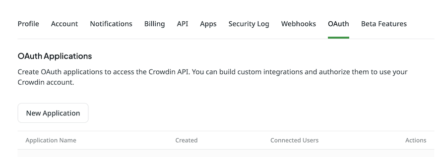
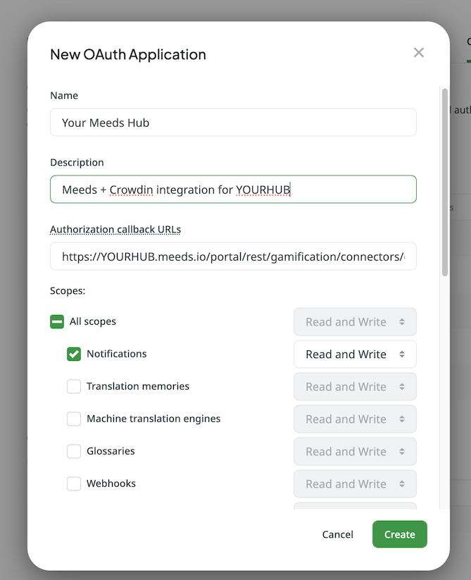
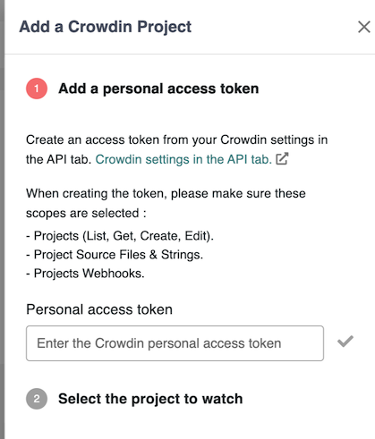
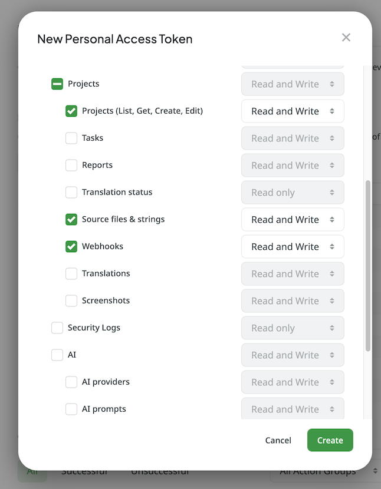
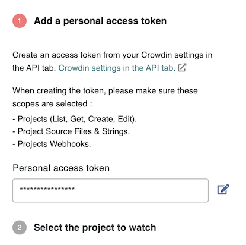
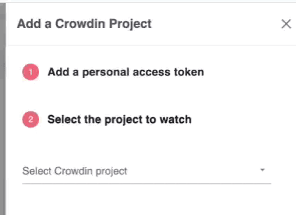
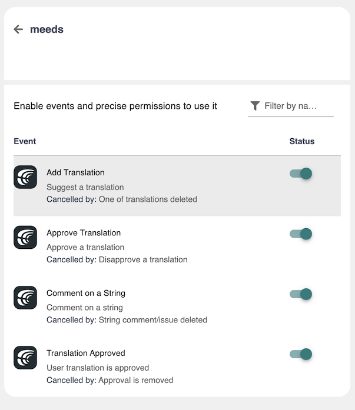

# Crowdin

### **Configure the Crowdin Connector**

If your organization uses [Crowdin](https://crowdin.com) for translation management

:point\_right: **This connector is for you!**

You can activate it to allow contributors to earn points based on their participation in your translation project on Crowdin.&#x20;



:bulb: **Note:**&#x20;

_The Crowdin integration requires your account to have high privileges on the Crowdin projects you want to integrate with Meeds. However, you don't need to own a Crowdin Enterprise subscription._

⚙️ Go to the Platform Settings  > Recognition > Connectors

<figure><figcaption></figcaption></figure>

Click the Crowdin card to start configuring the connector :

<figure><figcaption></figcaption></figure>

Events that can be captured include:

* Suggest a translation
* Approve a translation (for proofreader)
* Your translation is approved (for the translator)
* Comment or report an issue on a String

:point\_right: **Allow users to connect their Crowdin account**

Click on Configure > Allow connection

<figure><figcaption></figcaption></figure>

Access your Crowdin Account Settings > oAuth

Click  "New Application"

<figure><figcaption></figcaption></figure>

Fill in the _Name_ and _Description_, select the _Notifications_ scope.&#x20;

<figure><figcaption></figcaption></figure>

For the _Authorization callback URL_, open your Meeds tab and copy it from _Step 2_

<figure><figcaption></figcaption></figure>

Click Create, then Edit in Action to capture the Client Credentials.

<figure><figcaption></figcaption></figure>

<figure><figcaption></figcaption></figure>

Report the Client ID and Client Secret in Step 3 on the Meeds tab

<figure><figcaption></figcaption></figure>

Save, and your users can now bind their Crowdin and Meeds accounts from their user settings (see XXX).

You can temporarily disable the ability for users to connect, edit, or remove the credentials.

<figure><figcaption></figcaption></figure>

:point\_right: **Add a Crowdin project to watch**

Now you need to connect Crowdin projects that your Meeds Hub will watch.

Click on 'Add Project'

<figure><figcaption></figcaption></figure>

<figure><figcaption></figcaption></figure>

Now go to your Crowdin Settings and go to the _API_ tab, then click the _New Token_ button and select the scopes: _Projects (List, Get, Create, Edit)_, _Project Source Files & Strings_, _Project Webhooks_

<figure><figcaption></figcaption></figure>

Click Create. If requested, enter your Crowdin password and confirm, then copy the _Personal Access Token_ string&#x20;

<figure><figcaption></figcaption></figure>

and paste it in Step 2 of the Add a Crowdin project drawer in Meeds &#x20;

<figure><figcaption></figcaption></figure>

Hit the ✅ icon to verify your token&#x20;

<figure><figcaption></figcaption></figure>

Click _Next_ and select the Crowdin project to watch from the dropdown menu and Save

<figure><figcaption></figcaption></figure>

Once the project is selected, Meeds will start watching it for events. You can delete update or add another project if needed

<figure><figcaption></figcaption></figure>

By clicking on a project you can even fine-tune which events you want to enable on a per-project basis

<figure><figcaption></figcaption></figure>

**🎉 You're now done with the Connector configuration. Now, the Program owners will be able to use it to design new incentives.**
