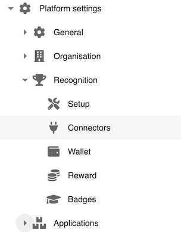

# 🧩 Integrations

⚙️ Go to the Platform Settings  > Recognition > Connectors

<figure><figcaption></figcaption></figure>

### **List Connectors**

<figure><figcaption></figcaption></figure>

* From the administration site, access connector management
* You will find a list of available connectors
* Additionally, a list of upcoming connectors is provided to inform you about our roadmap on the subject. If need an integration that is not listed, let us know by [filing a request](https://github.com/Meeds-io/meeds/issues/new?assignees=\&labels=\&projects=\&template=feature\_request.md\&title=).

### **Meeds Connector**

This is the default connector for the Meeds solution. Its goal is to engage your users in using your Hub.

You can add actions to encourage information sharing, mutual recognition, project tracking, and updating a knowledge base, such as:

* Adding posts, reactions to messages
* Sending/receiving kudos
* Task management
* Adding/modifying notes

Also, use this connector to facilitate the integration of new users on the Hub through events like:

* Profile and settings modification
* Wallet initialization

:warning: _It is no possible to deactivate this connector_
