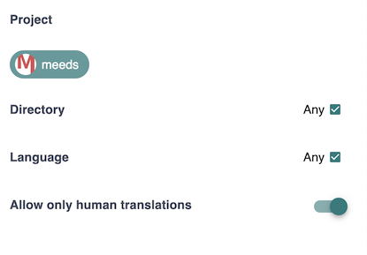
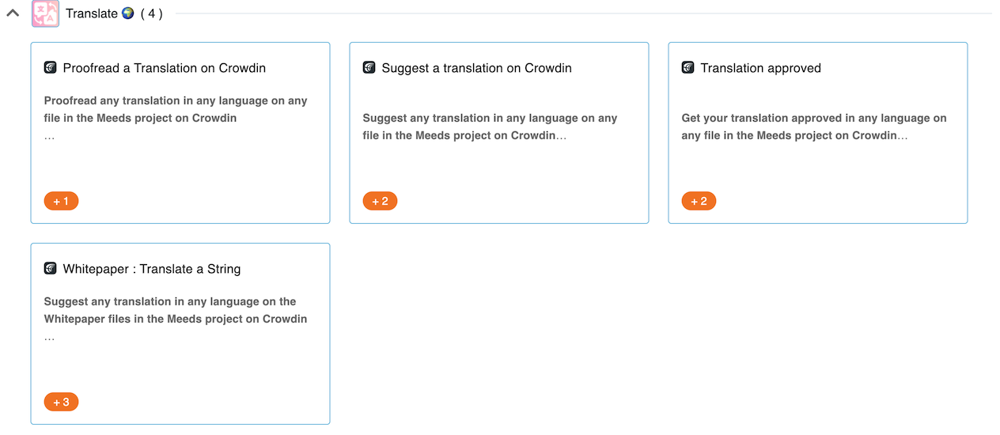

# 🌐 Translation Incentives

Thanks to the Crowdin Connector for Meeds, you can incentivize your community to participate in your [Crowdin](https://crowdin.com) translation projects.

✋ Before designing translation incentives, configure the [Crowdin Connector](../../integrations/crowdin.md) on your Hub.



Once done, your program owners can select "_Crowdin"_ from the _Applications_ pulldown when creating automatic actions.

<figure><figcaption></figcaption></figure>

Four events Events are available :

* **Add Translation:** is triggered when the user suggests a translation in Crowdin
* **Approve Translation**: is triggered when a proofreader approves a translation in Crowdin (points for the proofreader)
* **Translation Approved**: is triggered when a proofreader approves a translation in Crowdin (points for the translator)
* **Comment on a String**: is triggered when the user adds a comment or reports an issue on a string in Crowdin

Additional criteria are available to refine further when to accept a contribution or not :&#x20;

<figure><figcaption></figcaption></figure>

* **Project**: select the Crowdin projects to track
* **Directory**: restrict to specific folders within the Crowdin project
* **Language**: restrict to specific folders within the Crowdin project
* **Allow only human translations**: exclude Crowdin's [Translation Memory](https://support.crowdin.com/translation-memory/#applying-translation-memory-via-pre-translation)  and [Machine Translation](https://support.crowdin.com/pre-translation-via-machine/)&#x20;

💡 By combining these criteria, you can design fine-grained rewarding incentives where you set different priorities.&#x20;

<figure><figcaption>
Sample translation program in Meeds
</figcaption></figure>

For example, in Meeds, translators could earn 2 points for every translation they made + 1 extra point if their translation was chosen, and 1 point for the proofreader.&#x20;

In parallel, users helping translate our Whitepaper specifically would earn 3 points per translation.

