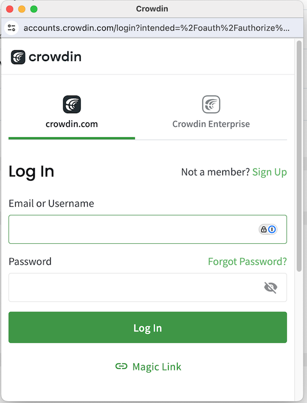
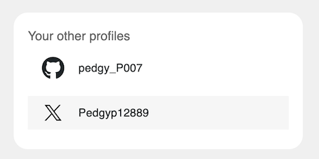

# 🌐 Crowdin



From the  _Hamburger_ menu,  click your _User Setting_s > _Other Apps_

<figure><figcaption></figcaption></figure>

1. **Click "Connect":**
   * Click the "_Connect_" button for the desired connector (GitHub, Twitter/X, etc.).
2.  **Confirm Identity:**

    * Follow the prompts to authenticate if requested

    <figure><figcaption>
Crowdin Authentication prompt
</figcaption></figure>
3.  **Authorize Connection:**

    * Authorize the connection to your Meeds profile.&#x20;

    <figure><figcaption>
Authorization screen for Crowdin
</figcaption></figure>

After a profile is connected, it will be displayed in your user profile's _Your Other Profiles_ block.

<figure><figcaption></figcaption></figure>

:bulb: **Note: If you haven't done so, this connection is suggested when the actions page is displayed**

<figure><figcaption></figcaption></figure>
