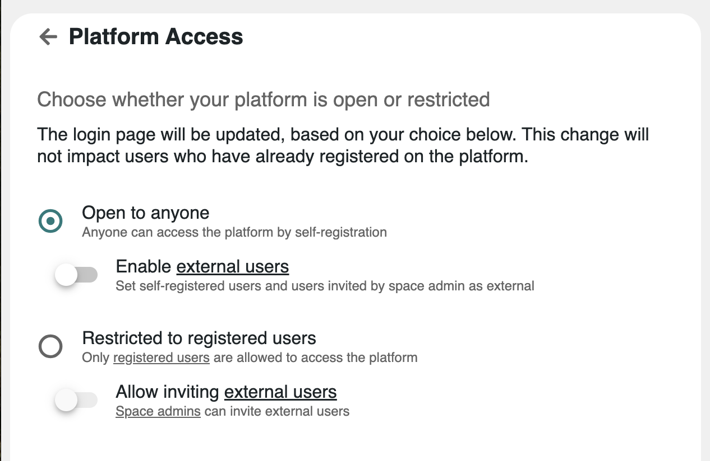

# 👥 Inviting Users & Guests

### :question: What are my options?

The way space admins can invite users depends on the global hub Access settings on the[ hub Access settings](../../admin-guide/set-up-your-hub/specifying-access-to-the-platform.md)  :&#x20;

<figure><figcaption></figcaption></figure>

* If the hub is **Open to anyone**, then :&#x20;
  * Existing users can be invited to the space
  * New users can be invited **by email a**nd will be prompted to create an account on the fly
* If the hub is **Restricted to registered** users, then only existing users can be invited to the space
* If **inviting guest users is enabled, then:**&#x20;
  * Existing users can be invited to the space
  * New users can be invited **by email** as guests

### &#x20;:tools: How to invite users?

* Access the Members app in the space and find the "Invite" button to start inviting people.
* Access the [Roles Settings](managing-space-roles.md), then click on the Member list to invite people.

As explained above, once you click on the "Invite" button, you will be prompted to either invite members or send email invitations.

* You can invite people who have been previously invited&#x20;
* You can invite users who have previously requested to join your space
* Sending an invitation to an email matching an existing user is possible. The user will get notified as well.

### :bulb: Good to know

* You can add multiple email addresses separated by a comma
* The invitation email contains a temporary token to create an account
* Pending members are listed to help you check who has been invited and who has requested to join your space

:point\_down: More details in the video below


