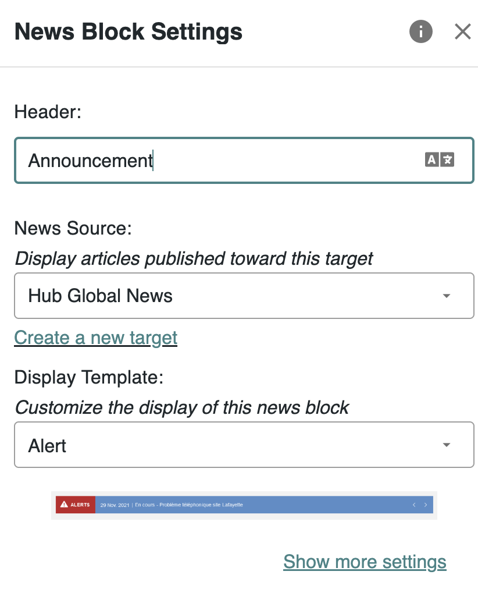
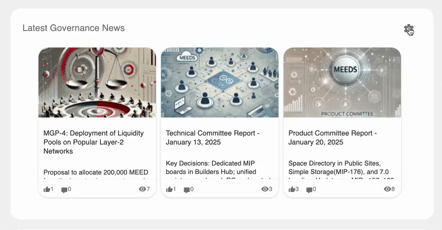
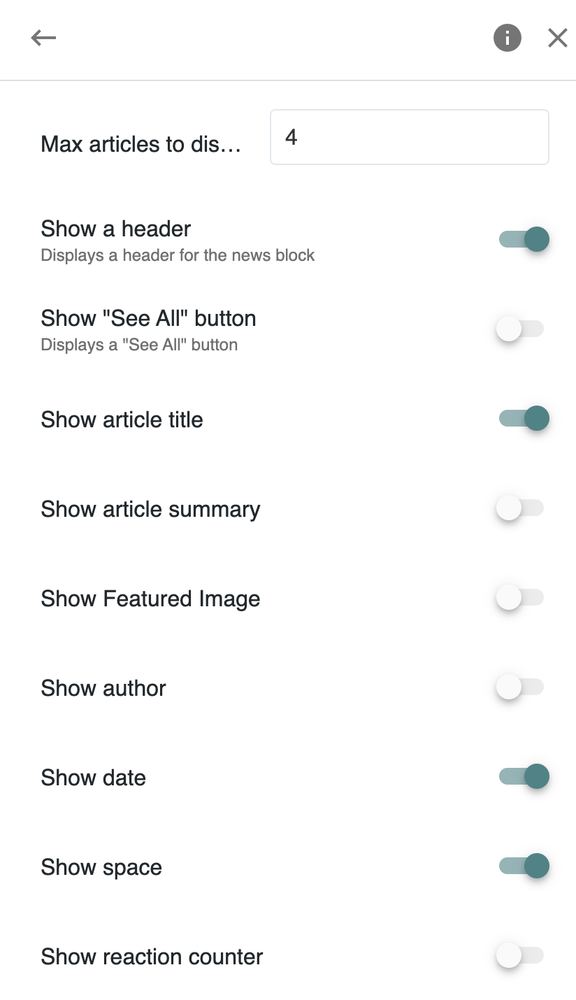

# Managing Space News


This page applies to the **Premium**, **Business** and **Enterprise** plans.  [👉 Compare all plans](https://www.meeds.io/pricing)


**Space News** enable Space Admins to configure and manage news updates within their space. It ensures important announcements are structured, visible, and effectively delivered to members.

📌 _Example: A Space Admin wants to highlight company-wide updates in a dedicated Announcements space using a customized News Block._

💡 By default, the **News block** is pre-configured on the homepage of spaces created using the **Announcement** template. For more details on space templates, refer to [**Space Templates**.](../../admin-guide/organizing-communities/managing-space-templates.md)

***

### Configuring the News Block

#### Accessing News Block Settings

1. As a Space **Administrator**, go to the **homepage of your space**.
2. Hover over the **News block** to reveal the **settings** (⚙️) **icon**.
3. Click the settings icon to open the **News Block Settings** panel.

💡 if the block has never been configured, an **Open Settings** will appear instead

#### News Block Settings

<figure><figcaption></figcaption></figure>

**1️⃣ News Block Title**

* You can rename the block (e.g., **Product News, Announcements**).
* Titles support **multiple languages**.

**2️⃣ News Source (Target Selection)**

* Choose the [**News Target**](../../admin-guide/managing-content/managing-news.md) that determines which articles will be displayed in the block.
* Only **one** news source can be selected per block.
* By default, each space has its own dedicated **target**
* If needed, a new **News Target** can be created directly from this screen

**3️⃣ Display Template**

* Choose from various **display templates** using a dropdown with live previews:
  * **Slider**
  * **Headlines**
  * **Alert**
  * **List**
  * **Mosaic**
  * **Stories**
  * **Cards**

<figure><figcaption>
The same block displayed in various news display templates
</figcaption></figure>

#### Additional Display Options

* Adjust the **number of articles** displayed
* **Show or hide the block header.**
* **Enable a "See All" button** with a custom URL to direct users to a complete news archive.
* Customize article options:
  * **Show or hide article title.**
  * **Show or hide article summary.**
  * **Show or hide cover image.**
  * **Show or hide author name.**
  * **Show or hide publication date.**
  * **Show or hide space name.**
  * **Show or hide number of reactions.**

<figure><figcaption></figcaption></figure>

***

### Related Documentation

🔗 [Sharing News in Spaces](../collaborating-in-spaces/sharing-news-in-spaces.md) – Learn how users create and publish news.\
🔗 [Exploring the News Center](../exploring-a-meeds-hub/news-center.md) – Locate published and drafted news articles.\
🔗 [Managing News Targets](../../admin-guide/managing-content/managing-news.md) – How to configure news publication across multiple spaces.\
🔗 [Space Templates](../../admin-guide/organizing-communities/managing-space-templates.md) – Learn more about different space templates and their configurations.
