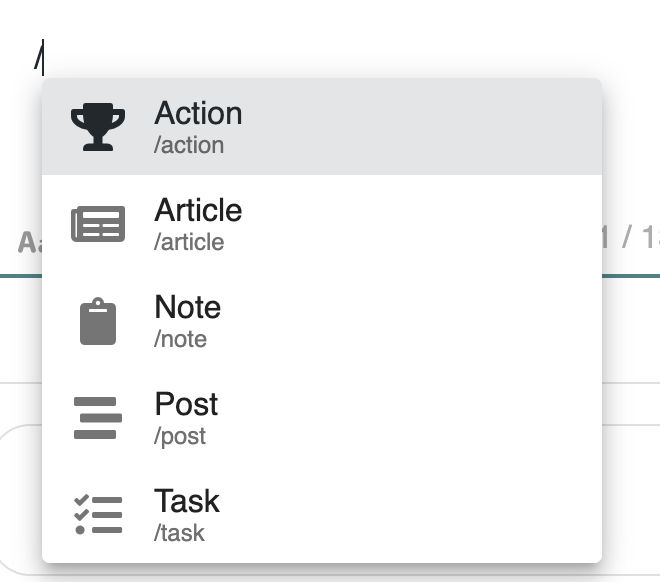
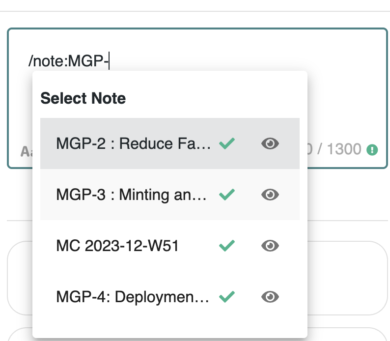

# ⭐ Referencing content

## # Hashtags

Hashtags can be inserted in posts and notes to easily mark content for easier retreival.

#### :point\_right: Share content and make it visible easily.&#x20;

Each added # tag is highlighted in your message, your content.&#x20;

Your readers will know that it is a keyword.&#x20;

#### :point\_right: Categorize your messages, your notes, and facilitate their search.&#x20;

By clicking on a # tag, users can initiate a search based on that keyword.&#x20;

By adding # tags, you simplify access to your content and initiate a categorization of your knowledge.

## / Slashelpers

In posts and contents, typing the _slash_ (/) character will trigger a link helper.

<figure><figcaption></figcaption></figure>

Hence you can easily link to an article, a note, a post, a task or a quest.

Pick the type of content you want to link to and type to searching for the content :

<figure><figcaption>
Linking to a note with a slashelper
</figcaption></figure>
