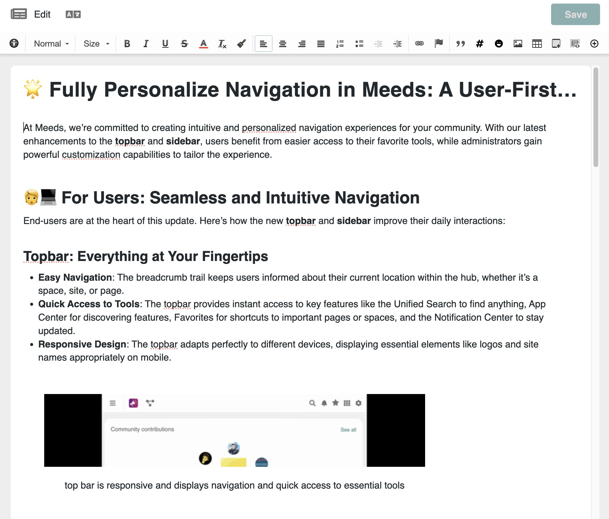
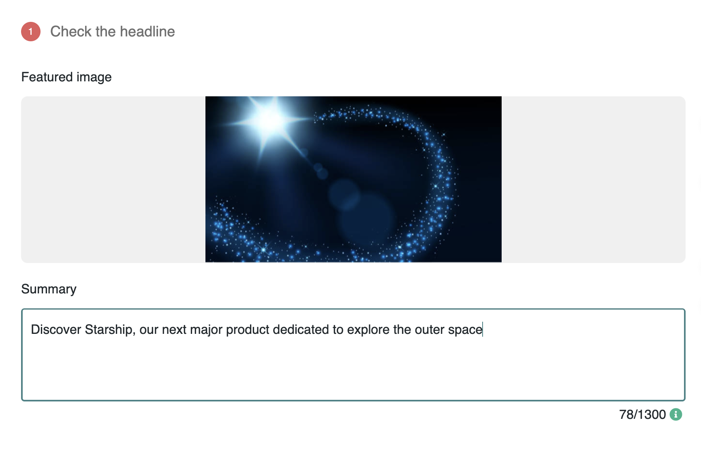
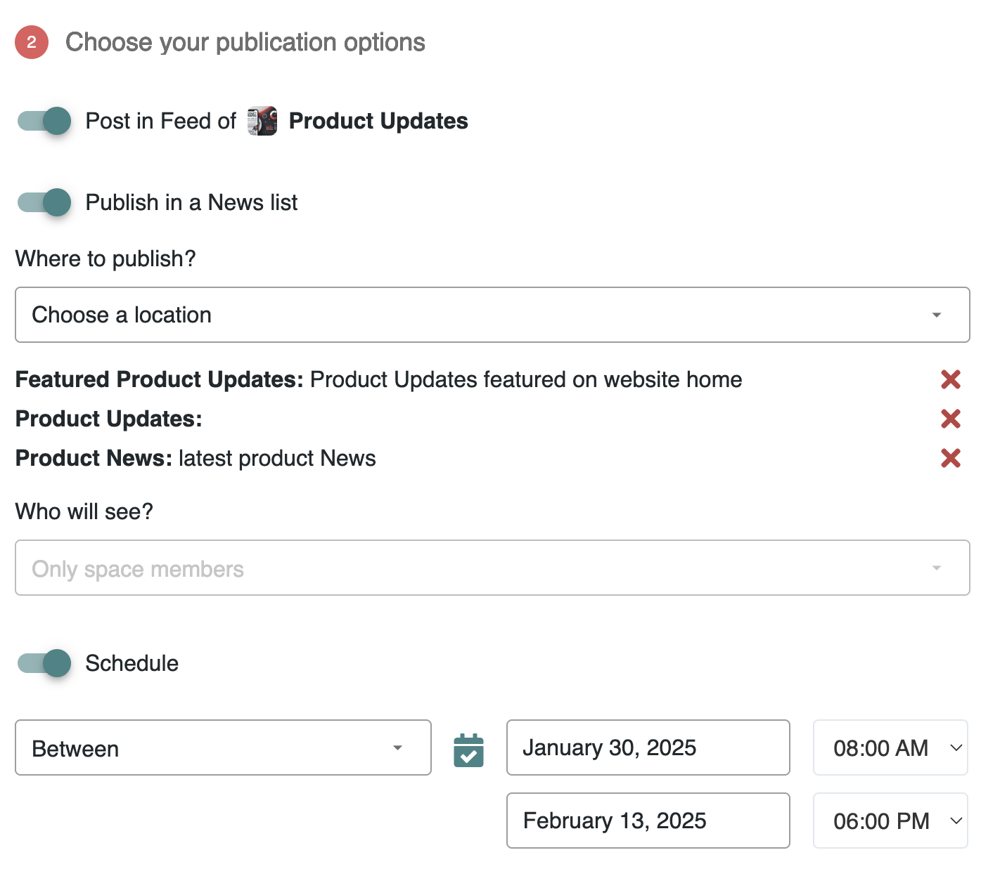
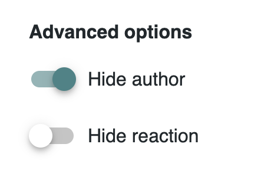
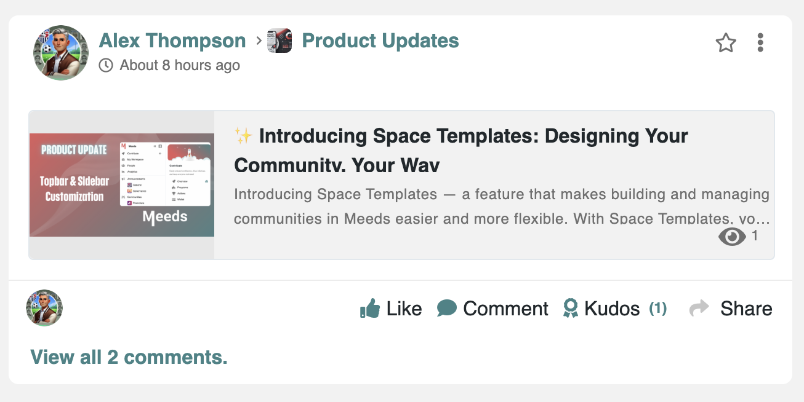
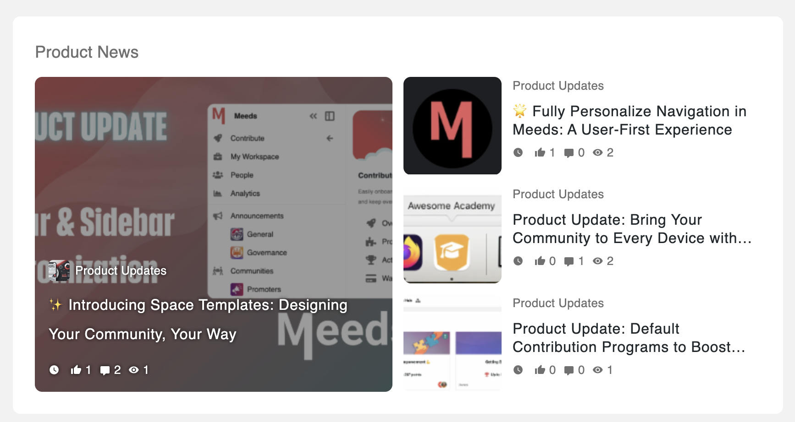
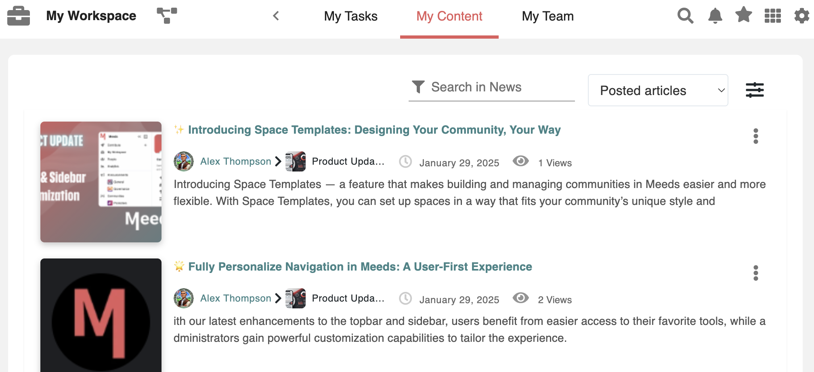
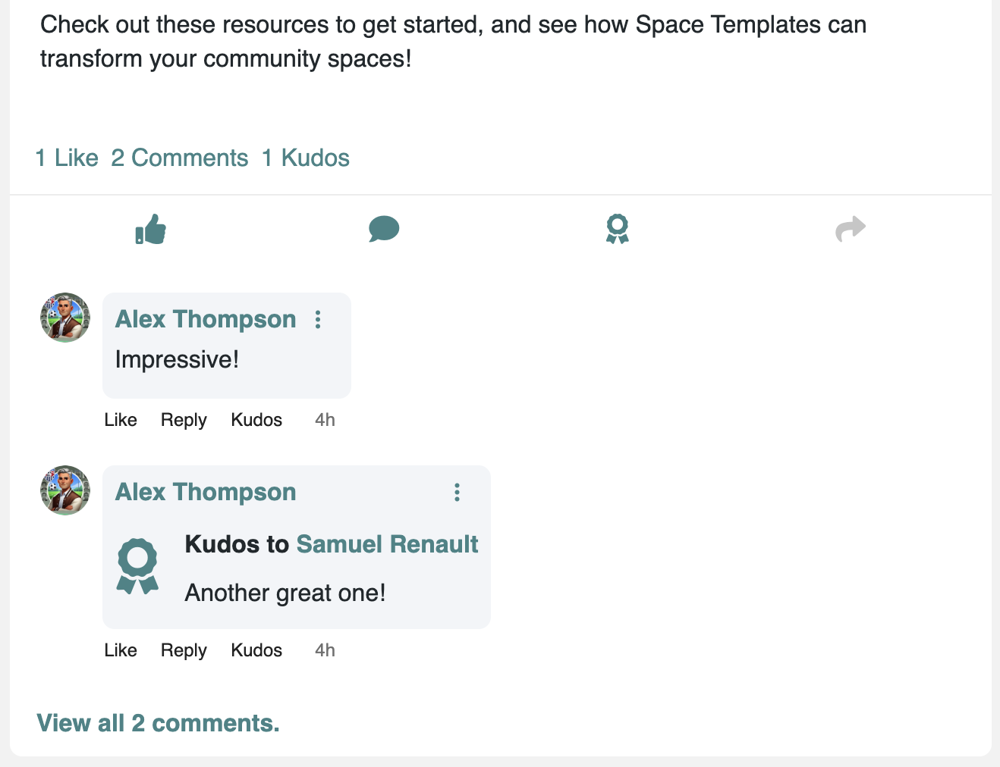

# 🗞️ Sharing News in Spaces

Space News allows you to share structured updates within a space, ensuring important information remains visible and easily accessible to all members. Unlike activity posts, news articles are **formatted, persistent, and designed for structured communication**.

📌 _Example: A product team announces a new feature update, ensuring all marketing and support teams stay informed._


Introduction to Space News


### How to Publish a News Article

#### Step 1: Start a New Article

1. Navigate to your space’s **Activity Stream**.
2. Click on the **"Article"** button.
3. A new editor window will open.

<figure><figcaption>
Create articles from the top of the activity stream
</figcaption></figure>

#### Step 2: Format Your News Articles

* **Add a title** that summarizes your news.
* **Write your content** using the rich-text editor (bold, lists, links, etc.).
* **Include images or videos** for better engagement.

💡 **Autosave & Drafts:** Your article is automatically saved as a draft and can be accessed later in [**My Content**](../exploring-a-meeds-hub/entering-your-workspace/exploring-the-news-center.md).

<figure><figcaption>
The news editor 
</figcaption></figure>

#### Step 3: Publish Your News

1. Click **"Publish"** in the top-right corner of the editor.
2. A **publication options window** will open with two steps:

**1️⃣  Check the Headline**&#x20;

* Add a **cover image** and **summary** to improve display in embeds and news blocks.
* These elements help structure the article preview in different news templates.

<figure><figcaption>
<em>headline configuration step</em>
</figcaption></figure>

**2️⃣ Choose Your Publication Options**

* **Post in Feed of (Default):** Publishes the article in the **Activity Stream** of the space (e.g., “Product Updates”). This ensures visibility to all members.
* **Publish in News List:** Allows selection of a **News Target**, defining where the article will appear and who will see it.
* **Schedule :** Choose a future **date and time** for automatic publishing. Optionally, define a start and end period for visibility.

<figure><figcaption>
publication options
</figcaption></figure>

**Advanced Options**

* **Hide Author:** Publishes anonymously, useful for organization-wide news where no individual author should be highlighted.
* **Hide Reactions:** Disables likes, comments, kudos, and shares—ideal for formal announcements where discussions are unnecessary.

<figure><figcaption></figcaption></figure>

3. Click **"Publish"** to finalize the process. Your article is now live.

💡 **Notifications:** Space members will receive notifications about the new article if they have enabled this type of notification in their settings.

***

### Where to Find Your Published Article

Once your article is published, it will be visible in different locations based on the publication options selected:

* **Activity Feed:** If the **Post in Feed** option was enabled, the article appears in the Activity Stream with an embedded preview, notifying space members.

<figure><figcaption>
news post in Feed
</figcaption></figure>

* **News Blocks:** If one or more publication targets were selected, the article will also appear in the relevant **News Blocks** across spaces and pages configured to display that target.

<figure><figcaption></figcaption></figure>

* **News Center:** The article can be accessed in **My Workspace > My Content**, where you can manage, edit, or republish it.

<figure><figcaption>
Find all articles in the News Center
</figcaption></figure>

### Interacting with News Articles

News articles are published in spaces through the F**eed** and **News Blocks**, where members can engage with them.&#x20;

Users can 👍 Like, 💬 Comment, 🏅 Send Kudos and 🔄 Share. For more details on interaction features, refer to [**Sharing and Interacting**](documenting-procedures-and-reports.md).

* Clicking on an article opens it in full view, where the **interaction panel** is displayed at the bottom of the article  **if enabled** during publication. &#x20;

<figure><figcaption>
the interaction panel at the bottom of an article
</figcaption></figure>

**💡 Interactions are synchronized**: Any engagement (likes, comments, etc.) made directly on the article page will be reflected in the feed and vice versa.

### Related Documentation

🔗 [Sharing and Interacting](documenting-procedures-and-reports.md) – Learn more about how to engage with news articles.\
🔗 [Managing Space News ](../../admin-guide/organizing-communities/managing-spaces.md)– Learn how Space Admins configure the News Block.\
🔗 [Exploring the News Center](../exploring-a-meeds-hub/entering-your-workspace/exploring-the-news-center.md) – Locate and manage your published articles.\
🔗 [Managing News Targets](../../admin-guide/managing-content/managing-news.md) – Advanced customization for platform admins.

📹 _Placeholder: Short video walkthrough demonstrating how to publish and interact with news articles._
