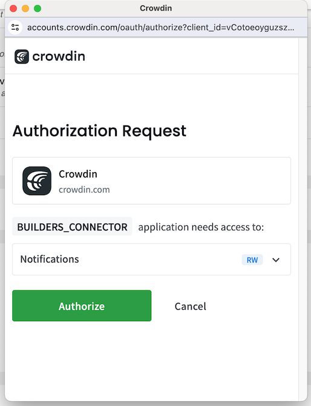

# 🌐 Crowdin


Quick video walkthrough to connect your Crwdin account


If you Hit a Crowdin action and your account is not yet connected, it will look like this. To connect your Crowdin account click _Connect your account_

<figure><figcaption></figcaption></figure>

Alternatively, you can open the _Hamburger_ menu,  access your _User Setting_s, then scroll down to _Other Apps :_

<figure><figcaption></figcaption></figure>

1. Click the "Connect" button in front of _Crowdin_
2. A popup will open, follow the prompts to _Log In_ with your Crowdin account if requested

<figure><figcaption>
Crowdin Authentication prompt
</figcaption></figure>

3. Click _Authorize_ button to let Meeds capture your Crowdin username

<figure><figcaption>
Authorization screen for Crowdin
</figcaption></figure>

4. your Crowdin username is now displayed and you can Disconnect if you want to start over or connect another account

<figure><figcaption></figcaption></figure>

After a profile is connected, it will be displayed in your user profile's _Your Other Profiles_ block:

<figure><figcaption></figcaption></figure>
