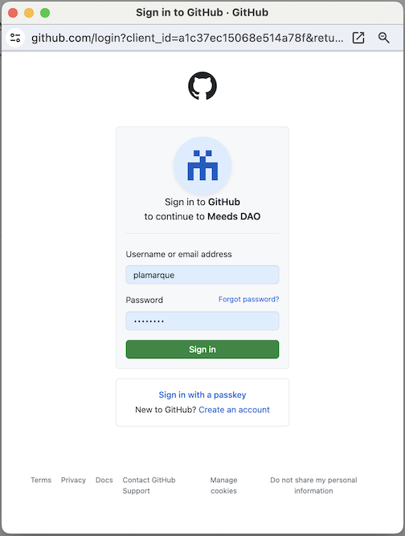
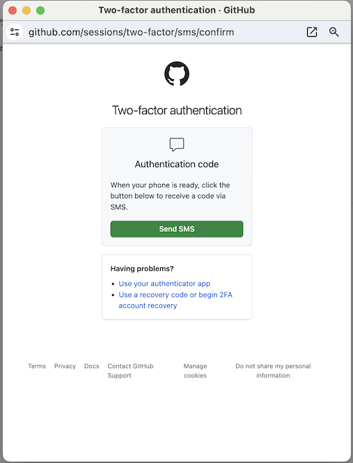
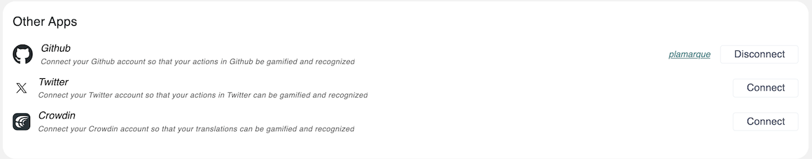
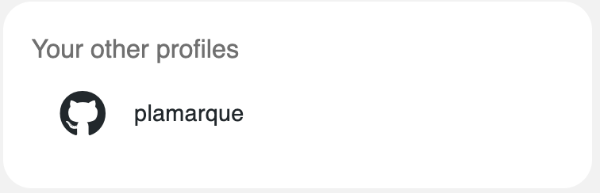

# 🐙 GitHub

If you Hit a GitHub action and your account is not yet connected, it will look like this. To connect your GitHub account, click `Connect your account`_._

<figure><figcaption></figcaption></figure>

Alternatively, you can open the _Hamburger_ menu,  access your _User Setting_s, then scroll down to _Other Apps :_

<figure><figcaption></figcaption></figure>

1. Click the `Connect` button in front of _GitHub._
2. A popup will open. If you are requested to log in with your GitHub account, follow the prompts.

<figure><figcaption>
Sign in with password
</figcaption></figure>

<figure><figcaption>
2FA prompt for GitHub
</figcaption></figure>

3. Your GitHub username is now displayed in User Settings > Other Apps, and you can `Disconnect` to start over and connect to another account.

<figure><figcaption></figcaption></figure>

After a profile is connected, it will be displayed in your user profile's _Your Other Profiles_ block:

<figure><figcaption></figcaption></figure>
