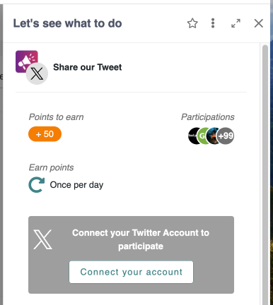
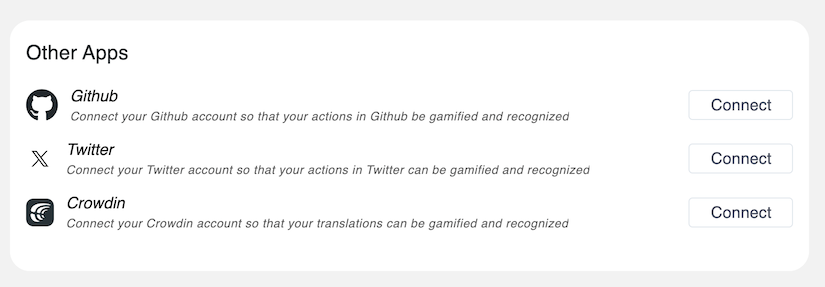
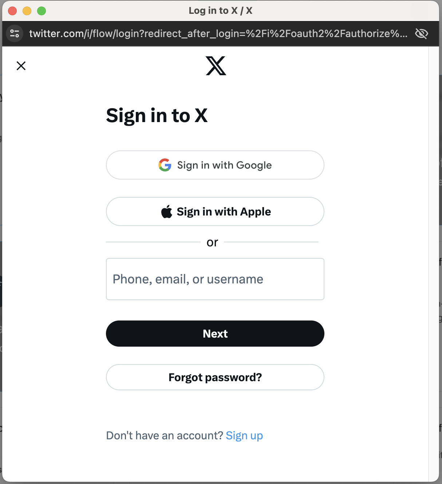
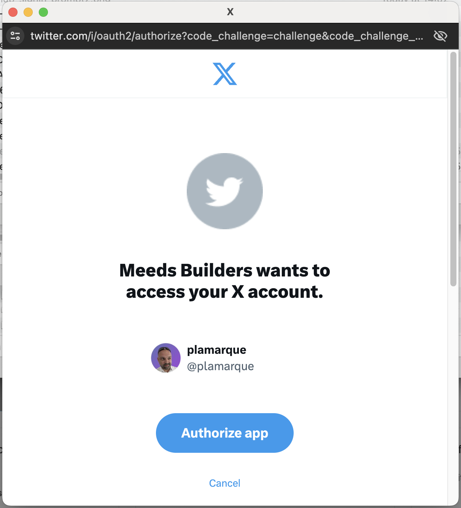
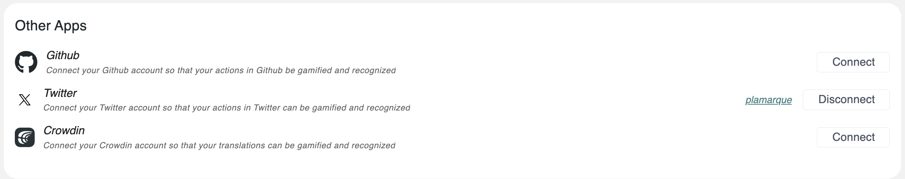
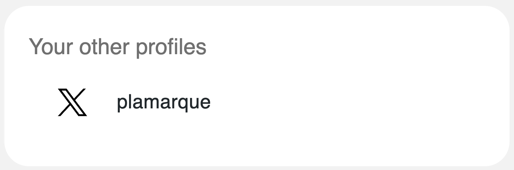

# 🐦 X (Twitter)

If you Hit an X (Twitter) action and your account is not yet connected, it will look like this. To connect your X account, click _Connect your account._

<figure><figcaption></figcaption></figure>

Alternatively, you can open the _Hamburger_ menu,  access your _User Setting_s, then scroll down to _Other Apps :_

<figure><figcaption></figcaption></figure>

1. Click the "Connect" button in front of _Twitter._
2. A popup will open. If you are requested to log in with your X account, follow the prompts.

<figure><figcaption>
Sign in to X
</figcaption></figure>

<figure><figcaption>
2FA prompt for GitHub
</figcaption></figure>

3. Your X username is now displayed in _User Settings > Other Apps_, and you can _Disconnect_ to start over and connect to another account.

<figure><figcaption></figcaption></figure>

After a profile is connected, it will be displayed in your user profile's _Your Other Profiles_ block:

<figure><figcaption></figcaption></figure>
