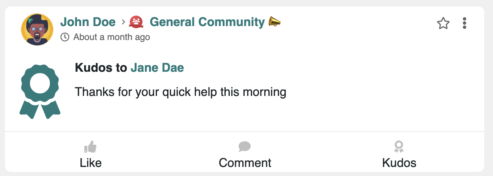
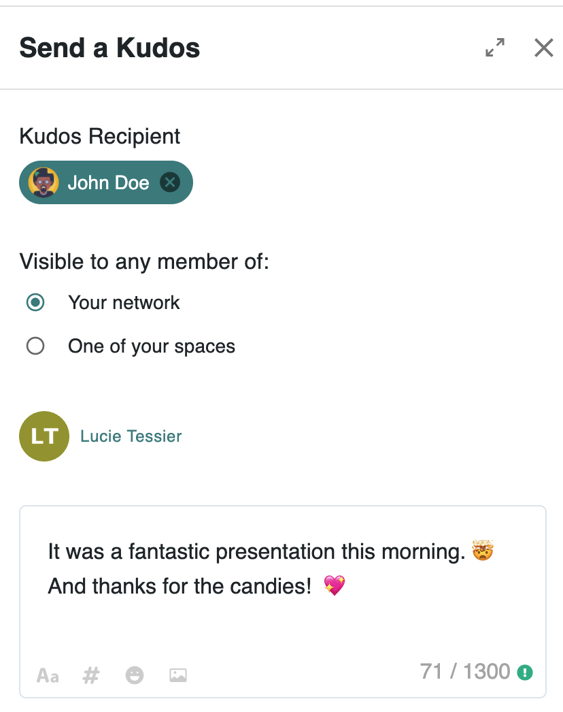
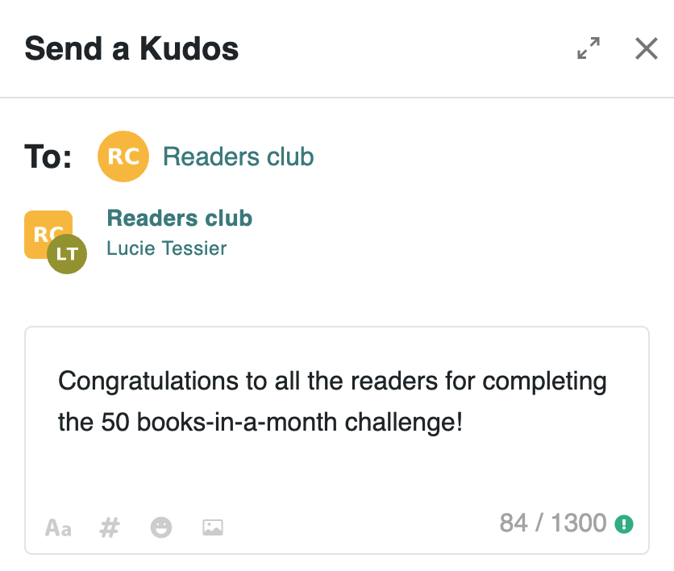
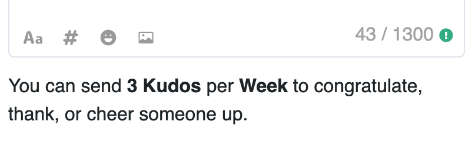

# 🙏 Praising Others with Kudos

Meeds promotes mutual recognition and encouragement through **Kudos**, public messages within the community that show appreciation for others.

<figure><figcaption></figcaption></figure>

Using Kudos is simple and has a lot of benefits :&#x20;

👉 You support taking initiatives:  _The more you are thanked for your actions, the more you are likely to take on._

👉 You value everyone's experiences and skills: _You give them more visibility by highlighting your colleagues._

### :thinking: Sending a Kudos to a user

Send Kudos to people you want to encourage, thank, or congratulate.&#x20;

<figure><figcaption></figcaption></figure>

* From a user's profile, send a Kudos and choose where this message will be published.&#x20;
* Whether by commenting on the message or a comment from the person you want to congratulate.
* When composing a message, choose to send a kudos, indicate the recipient, and select the audience.

### :bulb: Sending a Kudos to a space

You can also send a Kudos to a space to cheer a whole team up.

<figure><figcaption></figcaption></figure>

* When sending Kudos to a space, the message's target audience is the space itself and cannot be changed. This means that the Kudos will be posted on the space's feed.
* You cannot send a kudos comment to a whole space. It has to be a kudos post.
* In editorial mode, only content writers can post Kudos to the space.
* Only the sending of Kudos to a space can be gamified.

:question: **How many Kudos can I send?**

Kudos are valuable because their numbers are limited. By default, you can send 5 per week (whether for a user or a space). Your Hub admins may allocate more and change the frequency (week, month, quarter, year).

<figure><figcaption></figcaption></figure>

### 📽️ Quick Video Tour


