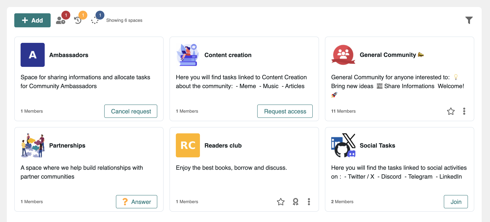
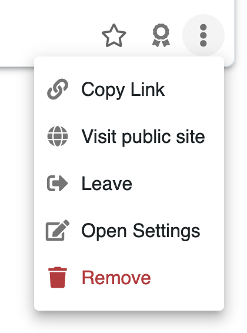
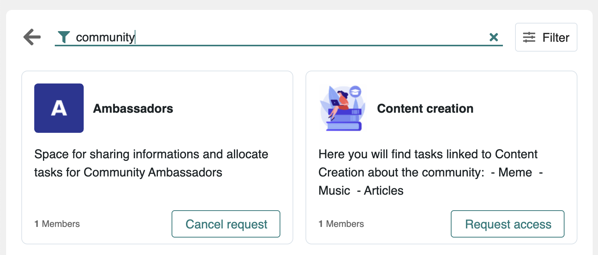
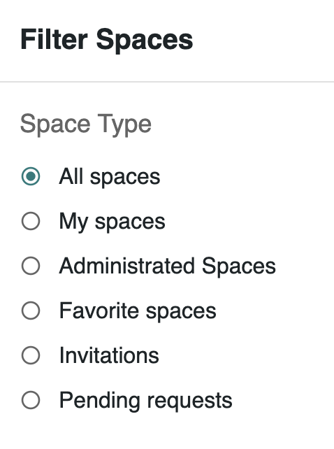

# 👤 Browsing People & Spaces

#### :question:What are we talking about?

From the left menu, access 2 key pages:

* People: Listing profiles of platform members
* Spaces: Listing spaces of your platform

Each page gives you different options.

### :busts\_in\_silhouette: People Directory

* Search for people using text filter or advanced filters
* Access to their profile
* Suggestions to invite people to join your network
* Leaderboard

### :people\_holding\_hands: Spaces Directory

The spaces director lets you browse your hub's communities, teams, and other channels.

<figure><figcaption></figcaption></figure>

#### 📽️ No time to read? What our quick video tours : [desktop](browsing-people-and-spaces.md#quick-video-tour-desktop) / [mobile](browsing-people-and-spaces.md#quick-video-tour-mobile)

#### Space Cards and Quick actions

Space cards let you check the space name, logo, description, and total members.&#x20;

Depending on its `Access` settings, you may see a `Join` or `Request Access` button on it.  You may also see an `Answer` button if it's a space where you've been invited and you need to accept or decline the invitation

Quick actions are available on cards to  [bookmark ](../discovering-helpful-features/creating-your-favorite-list.md)it, [send a kudos](../earning-recognition/encouraging-and-congratulating.md) to the whole space :&#x20;

<figure><figcaption></figcaption></figure>

Additionally, a dropdown menu provides more contextual actions depending on your permissions:&#x20;

* **Copy Link** copies a permanent link to the space in your clipboard.
* **Visit public site** redirects you to the public website of the community (if it was enabled)
* **Leave** to no longer be a member of that space
* **Open settings** to administrate the space
* **Remove** to remove the space and all of its content permanently

#### Searching in the directory

The directory can be browsed and filtered easily by name and description.&#x20;

<figure><figcaption></figcaption></figure>

Click on the `Filter` button for more filtering options&#x20;

<figure><figcaption></figcaption></figure>

:bulb: **Hidden spaces can't be found in the spaces directory except if you're already a member.**

### **📽️ Quick Video Tours**

#### :point\_down: Watch this video to see more

#### Quick Video Tour (desktop)


Browsing the Spaces Directory


#### Quick Video Tour (mobile)


