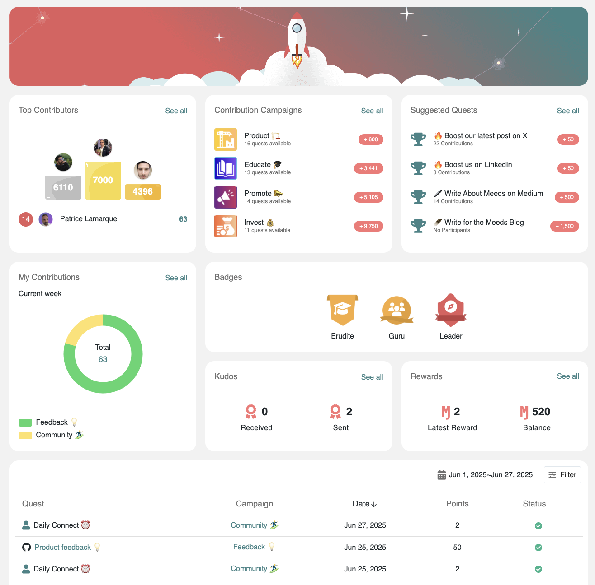

# 🚀 Contribution Center

### :question: What are we talking about?

Access the `Contribute` section from the left menu, where you will find a home page listing:

<figure><figcaption>
Contribution Dashboard
</figcaption></figure>

* Top contributors for the current period (week, month or quarter)
* Conribution Campaigns
* Suggested Quests
* Pie chart of your **completed** contributions&#x20;
* Your Badges
* Kudos you sent or received
* Latest Rewards received
* Current balance in your wallet
* List of your contributions (all)

:bulb: **Each widget provides access to a sidebar listing additional options.**

In addition to this home page, the Contribute Site gives you direct access to Programs and Actions Lists in dedicated pages

#### :point\_down: Watch this video to see more


Discovering the Contribute section



Discovering the Contribute section (on mobile)

