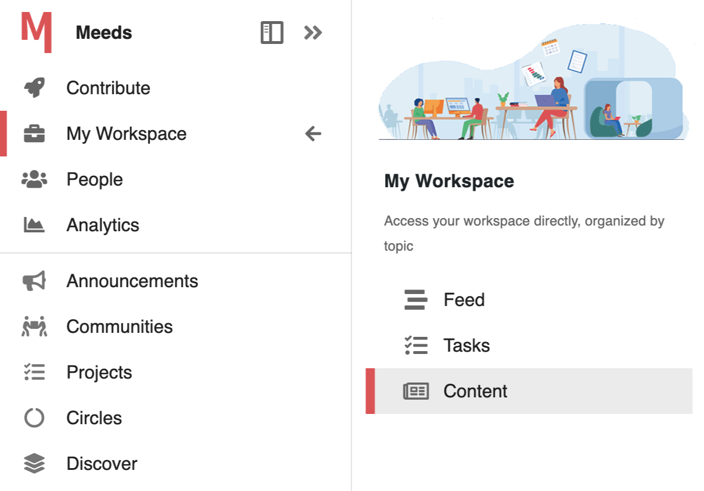
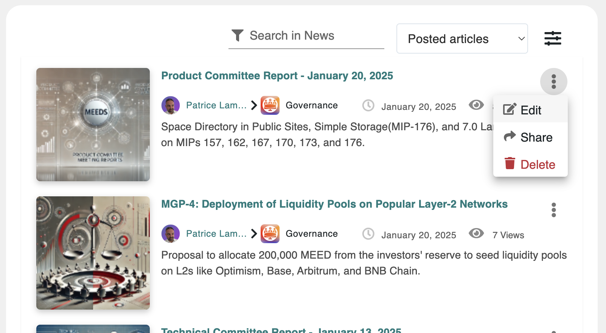

# 📰 Exploring the News Center

### What is My Content?

**My Content** is where you can find all your published and drafted news articles across different spaces. It allows you to quickly access, manage, and track your contributions in one place.

📌 _Example: You want to update a news article you published last week. Instead of searching through spaces, you can find it directly in My Content._

***

### Accessing My Content

1. Click on the **hamburger icon** in the top-left corner to open the side menu.
2. Select **"My Workspace"**.
3. Navigate to **"My Content"**, which provides access to the News Center where all news articles are listed.

<figure><figcaption>
Access the News Center through My Workspace > My Content
</figcaption></figure>

***

### Using the News Center

The News Center displays all news articles in a **list format**, offering the following tools to manage and filter content:

* **Search Bar**: Filter articles by **title** or **keywords** in the description.
* **Status Dropdown**: View articles based on status:
  * **Posted Articles**
  * **Published Articles**
  * **My Articles**
  * **My Drafts** (Unpublished articles)
  * **Scheduled**(Pending publication)
* **Filter Drawer**: Narrow results by selecting one or multiple **spaces**.

***

### Viewing and Managing News Articles

Each article in **My Content** is displayed as a **news card** containing:

* **Title**
* **Author**
* **Space**
* **Date**
* **Number of Views**
* **Summary**

#### Available Actions

Clicking on an article opens it in full view. Additionally, a dropdown menu provides these actions:

* **Edit** ✏️ – Opens the article editor to make updates.
* **Share** 🔄 – Allows reposting the article in another space’s feed with an embedded preview.
* **Delete** 🗑️ – Removes the article (if permissions allow).

📌 _For drafts, only "Resume" (to continue editing) and "Delete" options are available._

<figure><figcaption>
News Center
</figcaption></figure>

💡 The News Center **respects user permissions**. You will only see articles based on your access rights and space memberships. If an article is not visible, it may be due to **space restrictions or missing permissions**.

***

### Related Documentation

🔗 [Sharing News in Spaces ](../../collaborating-in-spaces/sharing-news-in-spaces.md)– Learn how to publish news articles.\
🔗 [Managing Space News](../../administering-a-space/managing-space-news.md) – Space Admins guide for configuring news.\
🔗 [Managing News Targets](../../../admin-guide/managing-content/managing-news.md) – Advanced settings for global news publishing.

