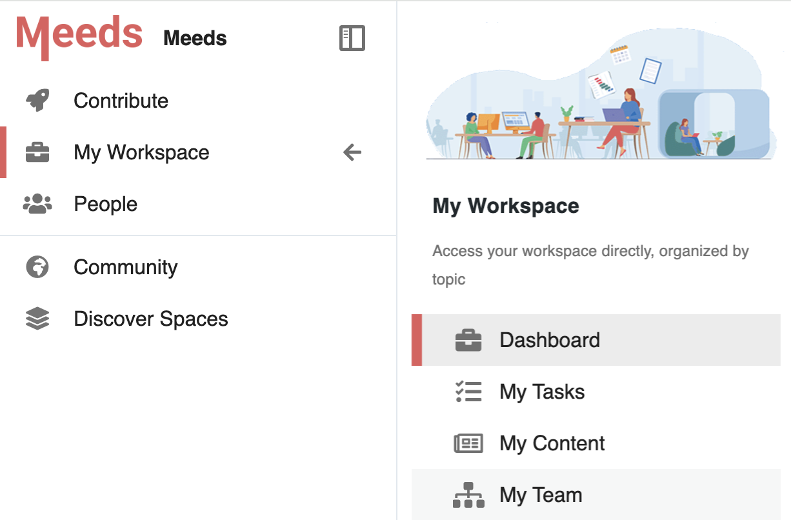

# 💼 My Workspace


This page applies to the **Business** and **Enterprise** plans. [👉 Compare all plans](https://www.meeds.io/pricing)


**My Workspace** is a dedicated space where users can access personalized information beyond their contributions. It provides an overview of personal activity, tasks, content, and team structure.

You can access **My Workspace** from the left sidebar menu by selecting **"My Workspace"**.

<figure><figcaption>
My Workspace menu in the sidebar
</figcaption></figure>

### My Workspace Pages

* [**Dashboard**](my-workspace.md#dashboard) – A personalized activity feed with an overview of tasks, spaces, and relevant actions.
* [**My Tasks**](../collaborating-in-spaces/tracking-tasks.md) – A filtered view of personal task management.
* [**My Content** ](news-center.md)– The **News Center**, where you can manage and find all their published and drafted news.
* **My Team** – Displays the user's position within the organization if the information is available.

#### :point\_down: Watch this video to see more


Exploring your Workspace



Exploring your Workspace (on mobile)


#### Dashboard

### :question: What are we talking about?

Access your Workspace from the left menu, where you will find a home page listing:

* Activity feed from your communities & network
* Who is online
* Suggested Actions to start contributing
* Tasks assigned to you with a due date
* Your spaces, the recently visited ones and the most popular

:bulb: **Access other pages of the Workspace section, and feel free to browse all tasks, projects, and content you can see**
