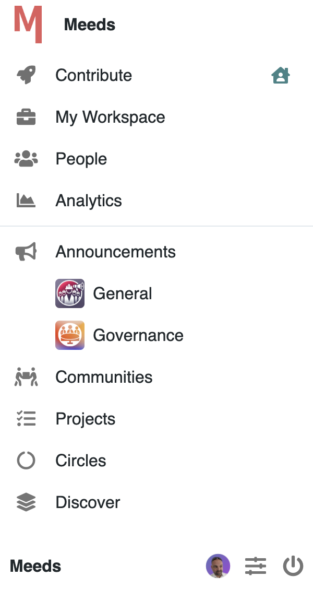
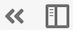

# ⚓ Navigating


The look and feel and elements of the navigation bars may vary because admins have full control to customize them (see [Admin Guide](../../../admin-guide/setting-up-meeds/advanced-setup/topbar-and-sidebar-customization.md))


#### Watch these videos to quickly learn how to find your way on a Meeds Hub&#x20;




How to browse the Meeds Hub






How to browse a Meeds Hub ( on mobile)




## The Top Bar

Top bar is a sticky panel on top of each page that helps navigating and accessing handy shortcuts.&#x20;

<figure><figcaption>
Exemple of a top bar in a space
</figcaption></figure>

It contains from left to right :&#x20;

* the logo and the site name
* the site's navigation menu
* a set of icons for various short actions:&#x20;
  * &#x20;[Search](searching-for-content.md)
  * Chat
  * Wallet
  * [Notifications](updating-your-notifications.md)
  * [Favorites](creating-your-favorite-list.md)
  * [App Center](listing-your-applications.md)
  * Pinned apps
  * Administration (admins only)

## The Left Bar

The left bar is a collapsible panel that provide entry points to selected sites and important pages of your Meeds Hub.

<figure><figcaption>
Example of a left bar
</figcaption></figure>

The left bar contains :

* the hubs' logo and name
* icons  to collapse, reduce of stick the panel  
* links to main sites such as [Contribute](../contribution-center.md) and [My Workspace](../my-workspace.md)
* link to important core pages such as [People](../people-and-spaces.md) and [Discover](../../introduction/discovering-communities.md) or any custom link
* announcements, communities, projects, and circles
* the Meeds changelog
* icons to access  your profile, settings and logout&#x20;
