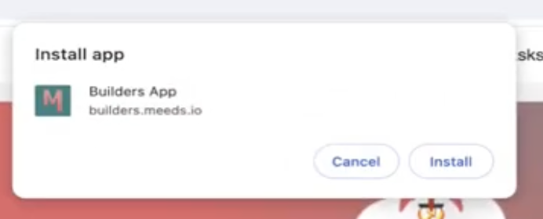
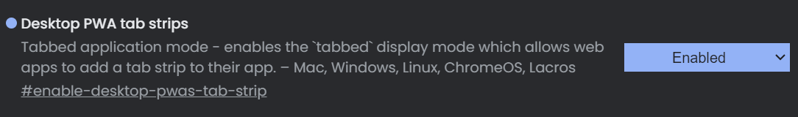
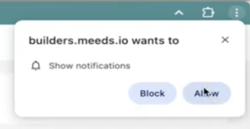
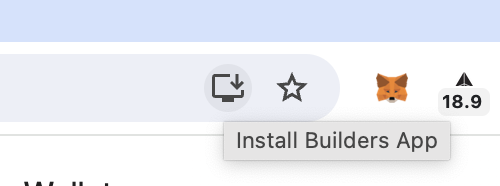

# 📳 Getting the App

Meeds can be used on the web with most browsers but also as an app on your mobile device (phone or tablet) or your computer. The main advantage is that you have a **dedicated and branded app for each of your communities** and access to system **notifications**.

## Quick steps

### Installing the App

On all platforms, the principle to install the app remains the same :&#x20;

1. On your device, start  the Chrome browser&#x20;
2. Log in to your favorite Meeds Hub
3. After 15 seconds, a snack bar will invite you to install the app. 
4. Alternatively, you can install it from `User Settings > Mobile App > Install` or `User Settings > Desktop App > Install`

<figure><figcaption>
Install the app when prompted
</figcaption></figure>

☝️ The icon's look and the app's name may vary depending on how the administrators have [branded their Hub](../../admin-guide/set-up-your-hub/customizing-the-theme.md).

### Enabling Multi-Tabs (Desktop App)

When using the app as a desktop app, you might want to open multiple tabs for editing notes, news, or for accessing the platform settings.

To do so, you need to enable an experimental flag proposed by Chromium-based browser (chrome, brave, for example).

:warning:  _Warning: Experimental features ahead! By enabling these features, you could lose browser data or compromise your security or privacy._

1. From your browser (chromium-based ones)
2. Access flags [chrome://flags](chrome://flags/)
3. Search for this flag: Desktop PWA tab strips
4. Enable it
5. Start again the browser
6. Install the app (or install it again)

<figure><figcaption></figcaption></figure>

### Enabling Notifications

1. (optional)  Another snack bar should prompt you to enable notifications. 
2. Alternatively, click `User Settings > Mobile App > Choose` or `User Settings > Desktop App > Choose`
3. Then grant permissions when prompted

<figure><figcaption>
Allow the Meeds app to show Notifications
</figcaption></figure>

Below, we provide quick video tutorials and specific instructions to install the Meeds app on:&#x20;

👉 [Android](using-meeds-on-the-go.md#android)

👉 [iOS](using-meeds-on-the-go.md#ios)&#x20;

👉 [Windows](using-meeds-on-the-go.md#windows)&#x20;

👉 [Mac](using-meeds-on-the-go.md#mac)&#x20;

**💡 Note:**  The Meeds app uses  [PWA technology](https://web.dev/explore/progressive-web-apps), which requires both browser and operating system vendors to implement open web standards. When we wrote this guide, PWA support and interoperability were good but not universal. Hence, although the Meeds app may work well through browsers like Firefox and Brave, we have mainly tested them using Chrome.

## Android


Quick tutorial to install a Meeds app on Android


## iOS


Quick tutorial to install a Meeds app on Android


## Windows


Quick tutorial to install the App using Windows


## Mac


Quick tutorial toninstall a Meeds app on a Mac


Alternatively, on Chrome for Mac, you can install the App using a dedicated icon displayed in the address bar 

To receive notifications on your Mac, make sure you have allowed notifications for `System Preferences > Notifications > Google Chrome Helper (Alerts)`&#x20;

<figure><figcaption></figcaption></figure>
