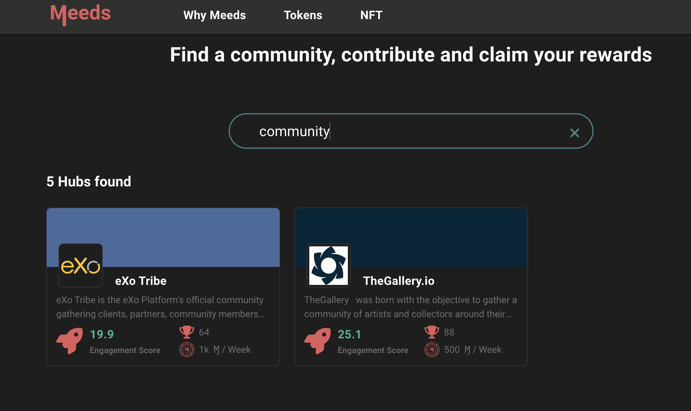
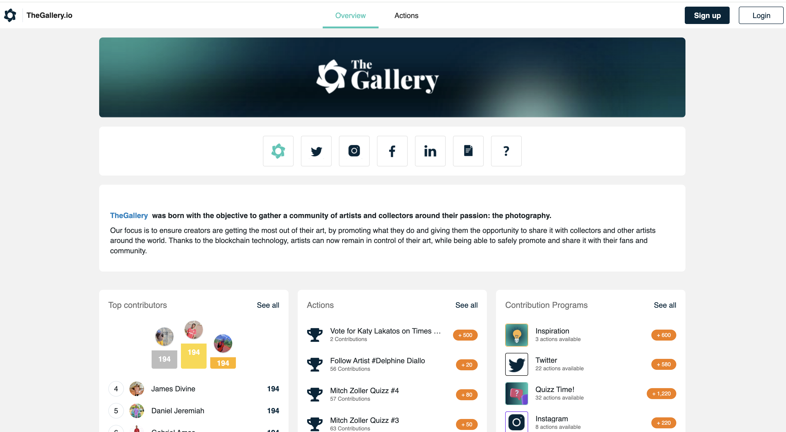

# 🌐 Exploring Community Hubs

Meeds is a platform where communities can strive by rallying their members to participate in their activities on their hub.  You can explore some communities on [meeds.io](https://meeds.io)

<figure><figcaption>
explore communities on meeds.io
</figcaption></figure>

Hub cards provide useful information, such as what they do, how many contributors they have, how many rewards they recently distributed, and a global engagement score (the higher, the better).

Before deciding to join a page, you can get a feel for what it looks and feels like by clicking on a card. This will take you to the community public page to see the current activities.

<figure><figcaption>
Public page of the-gallery community hub
</figcaption></figure>
