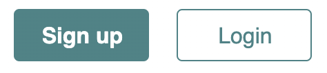
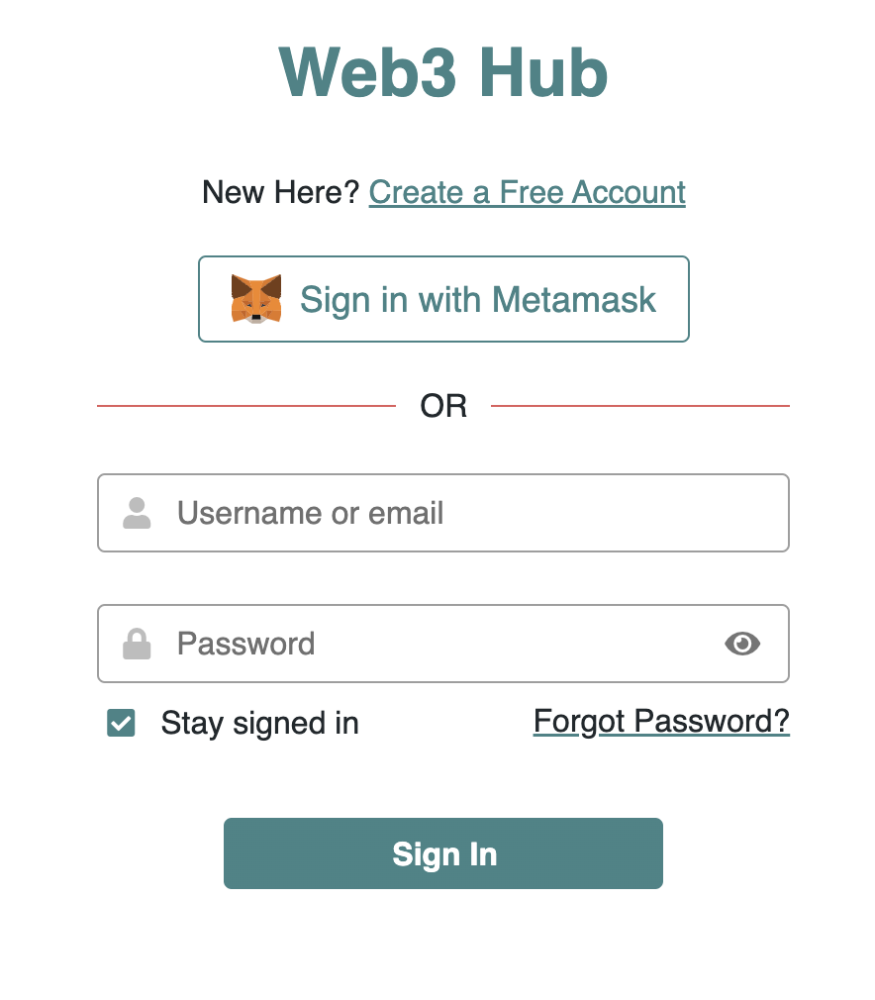
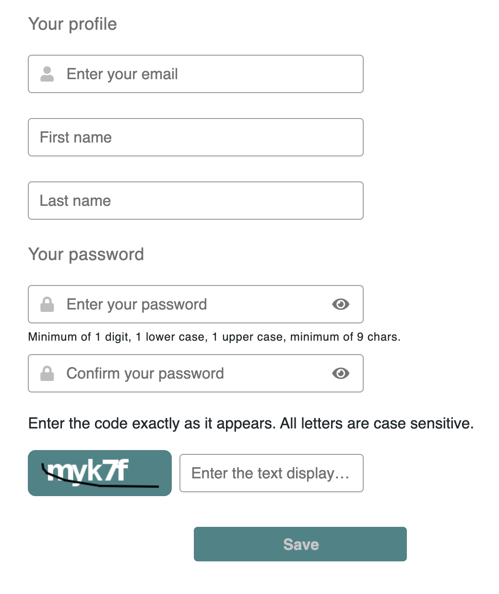
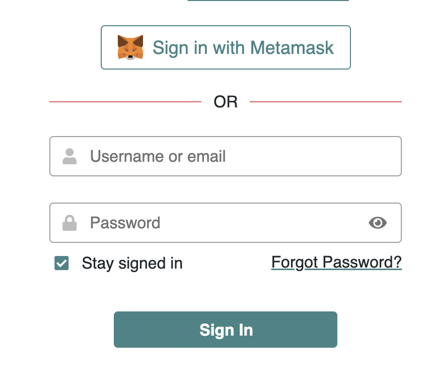

# 🚪 Joining a Hub

Once you've found your dream community and are ready to participate, you can sign up for the Hub.

Communities may have different policies regarding new members' applications. Some let anyone register, and others work only on invitations.&#x20;

The instructions below demonstrate how to enter a community hub with an open policy.

## Signing Up



When you're on a Hub's public page, you can always find two buttons ont the the top right corner of the page to either  `Login` or `Sign Up`

<figure><figcaption></figcaption></figure>

Click Sign Up to start creating an account on the Hub.

<figure><figcaption></figcaption></figure>

Alternatively, once you land on the Hub's login page, click on `Create a Free Account`

### Sign up with Metamask

This is recommended if you already have the [Metamask](https://metamask.io/) browser extension installed. It will directly configure your Meeds wallet to use your Metamask wallet.

1. Click `Sign Up with Metamask`,&#x20;
2. A Metamask popup will invite you to pick the wallet address you want to connect to the hub, review the permissions, and sign an authorization request.
3. Once done, [finalize your account creation](joining-a-hub.md#finalize-your-account-creation).

### Sign up by Email

Enter your email address, resolve the captcha, and click `Send`

You'll receive an email  to confirm your  address

Click on `Join` in the email

### Finalize your account

You should see a form like this one :&#x20;

<figure><figcaption></figcaption></figure>

Complete the information requested, resolve the new captcha, and `Save`

You now have a personal account on the hub!  You should be directly redirected inside the hub now, and you can :&#x20;

1. [Install the app](using-meeds-on-the-go.md)
2. [Explore the community](../exploring-a-meeds-hub/) hub
3. [Setup your account](../setting-up-your-account/)

## Signing In

In Meeds, you have a dedicated account on each community Hub, and you must sign in to each one separately.



You can always log in with your email and password; if you use Metamask, you can use it to sign in instead.

<figure><figcaption></figcaption></figure>

If you forgot your username or password, click `Forgot Password?` and fill in the username (if you remember it) or the email address. You'll be emailed a link to reset your password if we find a user account matching that username or email address.
