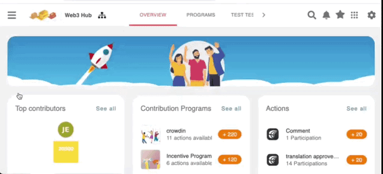

# 🔌 Linking your Accounts

### :question: To link a third-party account to your Meeds profile:

By linking third-party accounts, you enable Meeds to detect the contributions you make on these external platforms.&#x20;

From the  _Hamburger_ menu,  click your _User Setting_s > _Other Apps_

<figure><figcaption></figcaption></figure>

Each 3rd party app supported by Meeds has its particular steps to connect :&#x20;

* [X (Twitter)](x-twitter.md)
* [GitHub](github.md)
* [Crowdin](crowdin.md)

