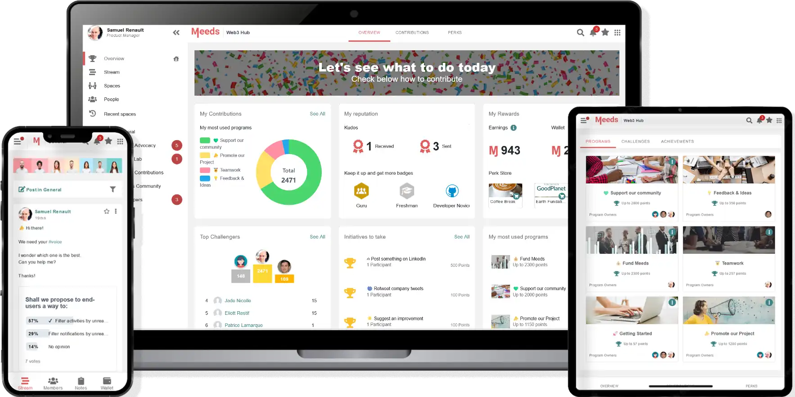

# Introduction

## À propos de ce guide

Ce guide vous donne des instructions simples sur la façon d'utiliser notre logiciel Meeds, y compris des tutoriels étape par étape.&#x20;

Nous sommes à l'écoute de vos commentaires pour nous aider à améliorer et enrichir la documentation en fonction de votre utilisation&#x20;

Par conséquent, n'hésitez pas à nous poser des questions et à nous donner votre avis si vous ne trouvez pas les réponses que vous cherchez. Votre contribution est importante pour nous aider à améliorer notre logiciel et notre documentation.

## À propos de Meeds

Meeds ambitionne de révolutionner notre façon de travailler.&#x20;

Lancé en 2020, par plusieurs sociétés de logiciels open-source, le projet Meeds s'est établi en Suisse en tant qu'association à but non lucratif.&#x20;

Après avoir publié sa vision dans un livre blanc, Meeds travaille maintenant à la réaliser à travers le web3 avec l'aide de la communauté des bâtisseurs de la Meeds DAO.&#x20;

Les différents comités de l'association Meeds supervisent le développement du logiciel open-source qui motorisent les Hubs et le WoM.

Elle réglemente également l'émission et l'allocation du jeton Ɱeed, pour lequel elle a obtenu la reconnaissance légale de l'autorité suisse des marchés financiers (FINMA).

<figure>

<figcaption>

The Meeds DAO offers software that helps any organization increase engagement.</figcaption></figure>

**Envie d'en savoir plus ? Visitez notre** [**site**](https://www.meeds.io)&#x20;
